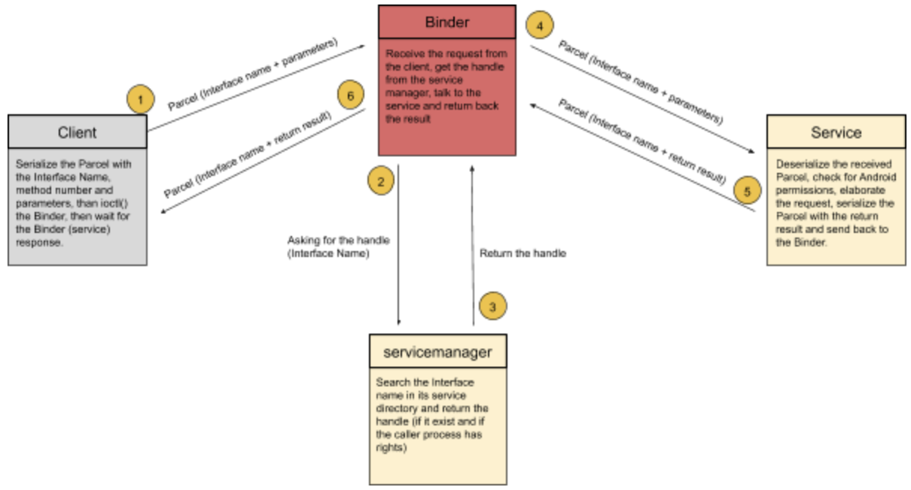
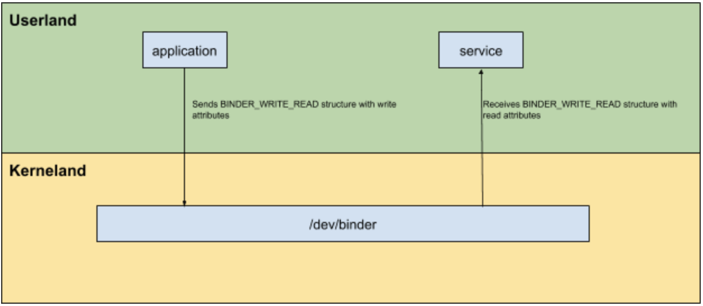
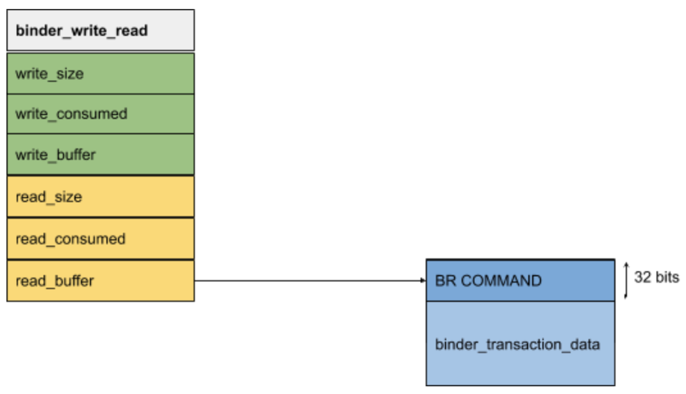
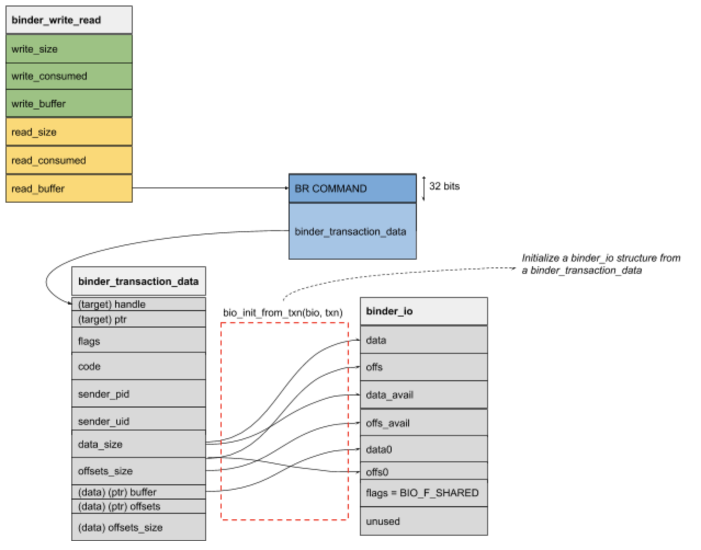
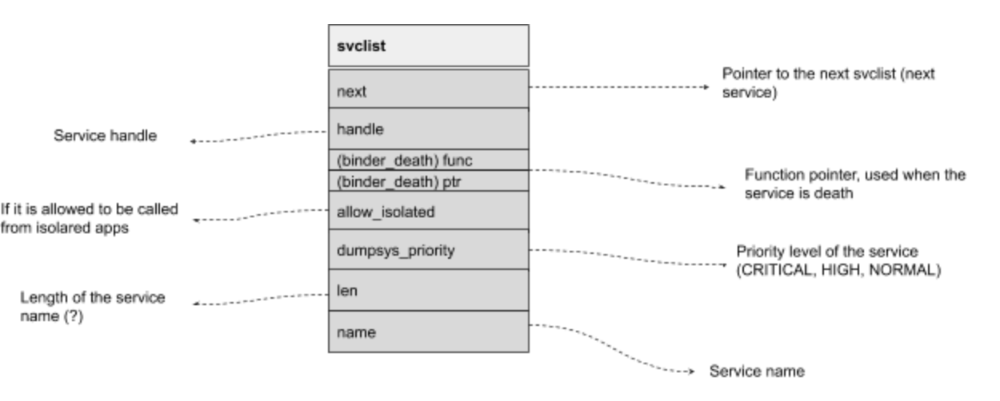
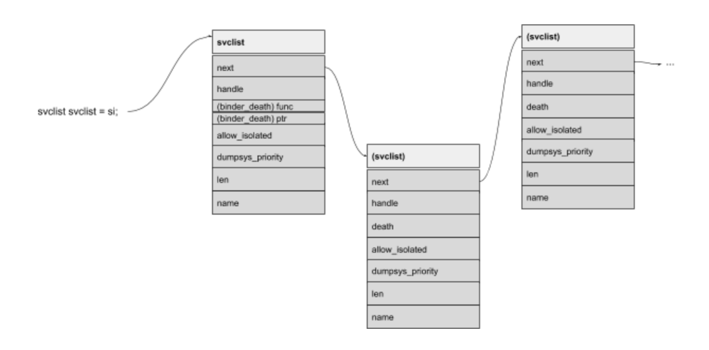

## Introduction
As mentioned in the [previous article](android-inter-process-communication-introduction-part-1.html), Android uses the Binder for IPC communications. Good to know, the Binder was not created by Google. Its initial appearance was in BeOS, an old OS for mobile devices. After some acquisitions, original developers joined Android and took the Binder with them. The OpenBinder porting to Android was more implementation specific and it is a key component of the current Android OS. The official OpenBinder website is not up anymore, but there are some mirrors like [this one](http://www.angryredplanet.com/~hackbod/openbinder/docs/html/) that contain precious documentation. 

## High level overview
Binder is a kernel module written in C, mainly responsible to let processes securely, transparently and easily communicate with each other using a client-server architecture. The simplicity on how processes can interact together is awful, a client application just needs to call a method provided by the service (that is the server in the client-side architecture) and everything in between is handled by the Binder. With ‘everything in between’ I mean **location**, **delivery** and **credentials**.

When a client needs to interact with a service, he needs to locate the target service (that is, in fact, the target process). The binder is responsible to locate the service, handle the communication, deliver the messages and check for caller privileges (credentials).**The location stage is handled by the servicemanager** that acts as the endpoint mapper, it maintains a service directory that maps an interface name to a Binder handle. So, when the Binder receives a request for a specific service, it asks to the servicemanager. The servicemanager returns a handle to the binder after some permission checks (for example the` AID_ISOLATED` mentioned in the first part) scrolling on its service list (aka service directory). If the client has permissions to interact with the requested service, the Binder will proxy the communication and deliver the message to the server, that will elaborate the request and return the result to the Binder, that will redirect it to the client as a "message". These messages are technically called "Parcels", containers that are written from both client and server in order to communicate with a serialization mechanism (parameters, return values, ..).



## Binder Introduction

Let's start with the main component of an IPC transaction, the Binder. As we said, the Binder is a small kernel module that lives in the kernel and acts as a messenger for clients and services. Every operation in Android goes through the Binder, and that's why two researchers, Nitay Artenstein and Idam Revivo, took an interesting talk at BH2014: [Man in the Binder: He Who Controls IPC, Controls the Droid](https://www.youtube.com/watch?v=O-UHvFjxwZ8&t=418s).

This research demonstrates an advanced post exploitation technique (a rootkit implant) where it is possible to sniff every data that uses IPC, in order to manipulate network traffic and sensitive information by hooking binder calls.

The character device at `/dev/binder` is read/write by everyone, any process can perform read and write operations on it using `ioctl()` calls. The `ioctl()` responsible to handle the IPC connection from clients (applications) is located in the *'libbinder.so'* shared library, that is loaded in each application process. This library is responsible for the client initialization phase, setting up messages (aka Parcel) and talking with the binder driver. We will deepen this specific library while talking, in next chapters, about the client and service implementations.

## Binder interactions (userland -> kerneland)

First to introduce more concepts, let's first take an introduction on how a basic interaction works from userland to kerneland, from a client (or a service) to the binder kernel module. As a linux based OS, the `ioctl` system call is used to talk with the kernel module using the special character file `/dev/binder`. The driver accepts different request codes:
- `BINDER_SET_MAX_THREAD`: Limit thread numbers of a thread pool.
- `BINDER_SET_CONTEXT_MGR`: Set the context manager (the service manager).
- `BINDER_THREAD_EXIT`: A thread exit the thread pool.
- `BINDER_VERSION`: Get the Binder version.
- `BINDER_WRITE_READ`: The most executed request code responsible for all client and service requests.

We will deepen all commands during these articles, but let's start with the `BINDER_WRITE_READ` request code.The binder module source code is at `drivers/android/binder.c`, here the `binder_ioctl()` is responsible to dispatch requests received from userland based on above request codes. In the case of a `BINDER_WRITE_READ` code, the `binder_ioctl_write_read()` is triggered and parameters are handled from userland to kerneland (and vice versa) using the `binder_write_read` structure:

```CPP
struct binder_write_read {
	signed long write_size;  // size of buffer by the client
	signed long write_consumed;  // size of buffer by the binder
	unsigned long   write_buffer;
	signed long read_size;  // size of buffer by the client
	signed long read_consumed;  // size of buffer by the binder
	unsigned long   read_buffer;
};
```

In this structure, we have 2 main divisions: **write and read items**. Write items (`write_size`, `write_consumed`, `write_buffer`) are used to send commands to the binder that it has to execute, meanwhile read items contain transactions from the binder to the clients that they have to execute (the ones that `ioctl` the binder).

For example, if a client needs to talk to a service, it will send a `binder_write_read` command with write items filled. When binder replies back, the client will have read items filled back. The same, a service waiting for client interactions, will receive transactions from the binder with read items.

While talking about "clients", I don’t mean only application clients that need to perform a request in an IPC context. A client, in this context, is a process that `ioctl()` the binder. For example, a service waiting for transactions from an application is a client of the binder, because it calls `ioctl()` in order to receive actions.



Note that in the case of a client, the `ioctl` is performed when it is needed from the application (for example to perform an Inter Process Communication). Meanwhile, the service process has threads waiting in a loop for transactions from the binder.

Inside these read and write attributes we have more commands, that starts with `BC_` and `BR_`. The difference is in the way that the transaction is going, to or from the Binder. **`BR`** are commands **received FROM the binder**, while **BC** are commands **SENT to the binder**. To remind me about this difference, I think of them as they are "**B**inder**C**all" (BC) and "**B**inder**R**eceive" (BR), but I don't think they are the official acronyms.

An example of a generic command that applies to both types of interactions is "TRANSACTION". we can have `BC_TRANSACTION` and `BR_TRANSACTION`. `BC_TRANSACTION` is used from clients to binder, while `BR_TRANSACTION` is used from the binder to its clients.

### The servicemanager
As was illustrated in the High Level overview, the servicemanager is responsible for the **location stage**. When a client needs to interact with a service (using the Binder), the Binder will ask the servicemanager for a handle to that service.

The servicemanager source code is located at `frameworks/native/cmds/servicemanager/`, where `service_manager.c` is responsible to initialize itself and handle service related requests. Meanwhile, in `binder.c` (inside that path, not the kernel module) we find the code responsible to handle the communication with the binder, parsing received requests from it and sending the appropriate replies. 

Servicemanager is started at boot time as defined in `/init.rc` file. This init file is part of the boot image and is responsible to load system partitions and binaries in the boot process:

```javascript
    /.../
    # start essential services
    start logd
    start servicemanager
    start hwservicemanager
    start vndservicemanager
    /.../

  # When servicemanager goes down, restart all specified services
    service servicemanager /system/bin/servicemanager
    class core
    user system
    group system
    critical
    onrestart restart healthd
    onrestart restart zygote
    onrestart restart media
    onrestart restart surfaceflinger
    onrestart restart drm
    onrestart restart perfhub
    /.../
```

When the service manager is started, the `main` function obtains a handle to the binder (`/dev/binder`) and successively call `binder_become_context_manager()` that will `ioctl` the binder with the `BINDER_SET_CONTEXT_MGR` command, in order to declare itself as the context manager.

The **context manager** is crucial for the binder as it serves as the service locator. When the binder needs to locate a service, it asks for a handle to its context manager .Once the registration with the binder it's done, it calls `binder_loop` (from `binder.c`) with a callback function parameter. This callback (`svcmgr_handler`) will be responsible to handle service related requests.

The `binder_loop` responsibility, as the name suggests, is to start an infinite loop that will receive requests from the binder. Before this loop, it will call the binder with `BC_ENTER_LOOPER` to inform the binder that a specific thread is joining the thread pool. The **thread pool** is a group of threads that are waiting for incoming messages from the binder, usually services have multiple threads in order to handle multiple requests. By the way, the service manager is a single-threaded service, so this is the first and unique thread. 

After this notification, the servicemanager starts its infinite loop that continuously calls the binder through `ioctl` waiting for actions. This is managed using the `BINDER_WRITE_READ` command (to the binder) with a `binder_write_read` structure that will be filled by the binder in its `read_*` items, this is the already mentioned structure:

```cpp
struct binder_write_read {
	signed long write_size;  // size of buffer by the client
	signed long write_consumed;  // size of buffer by the binder
	unsigned long   write_buffer;
	signed long read_size;  // size of buffer by the client
	signed long read_consumed;  // size of buffer by the binder
	unsigned long   read_buffer;
};
```

When the binder needs the service manager to perform an action (e.g. getting a handle to a service) it will return to the `binder_loop()` a `binder_write_read` structure with `read_buffer` filled with the requested transaction (and in `read_consumed` its actual size). These two values are passed over the `binder_parse` function that starts to deserialize the transaction request:

```cpp
  /* .. */
	uintptr_t end = ptr + (uintptr_t) size; // end calculated using the bwr.read_consumed
	while (ptr < end) {
		uint32_t cmd = *(uint32_t *) ptr; // the command is read from the buffer
		ptr += sizeof(uint32_t);
	// switch case on the received command
	switch(cmd) {
		case BR_NOOP:
			break;
	/* .. */
```

The first 32 bits of the `bwr.read_buffer` contains the command to be executed (`cmd`). There is a huge list of handled commands: `BR_NOOP`, `BR_TRANSACTION_COMPLETE`, `BR_INCREFS` - `BR_ACQUIRE` - `BR_RELEASE`, `BR_DECREFS`, `BR_DEAD_BINDER`, `BR_FAILED_REPLY` - `BR_DEAD_REPLY`, `BR_TRANSACTION`, `BR_REPLY`.

You can find a lot more `BR_*` commands, but these are the only ones handled by the servicemanager. For example, a normal service can receive a `SPAWN_LOOPER` command from the binder, that requests the service to spawn a new thread in order to handle more requests. We said that the servicemanager is single thread, so there is no sense to receive this type of requests, so they are not handled. We will better deepen on these commands that are used by other services in `IPCThreadState.cpp` in next articles.

After having extracted the command from the `binder_read_write` structure, this one is inserted in a switch case where above commands are managed. The most interesting one is the `BR_TRANSACTION` because it means that the binder needs to retrieve a service handle or register a new service.

### BR_TRANSACTION
Following the service manager source code we can encounter and deepen some essentials structures such as the `binder_transaction_data` that is casted from `bwr.read_buffer` (now referenced in the local function as `ptr`) + `sizeof(uint32_t)`, because the first 32 bits are meant for the command constant.

```cpp 
struct binder_transaction_data *txn = (struct binder_transaction_data *) ptr;
```



This is the `binder_transaction_data` structure:

```cpp

//https://android.googlesource.com/kernel/msm/+/android-6.0.1_r0.74/drivers/staging/android/uapi/binder.h
struct binder_transaction_data {
  /* The first two are only used for bcTRANSACTION and brTRANSACTION,
   * identifying the target and contents of the transaction.
   */
  union {
    __u32 handle; /* target descriptor of command transaction */
    binder_uintptr_t ptr; /* target descriptor of return transaction */
                // in BR_TRANSACTION this must be BINDER_SERVICE_MANAGER or the service_manager return -1
  } target;
  binder_uintptr_t  cookie; /* target object cookie */
  __u32   code;   /* transaction command. */ // e.g. SVC_MGR_GET_SERVICE
  /* General information about the transaction. */
  __u32         flags;
  pid_t   sender_pid;
  uid_t   sender_euid;
  binder_size_t data_size;  /* number of bytes of data */
  binder_size_t offsets_size; /* number of bytes of offsets */
  /* If this transaction is inline, the data immediately
   * follows here; otherwise, it ends with a pointer to
   * the data buffer.
   */
  union {
    struct {
      /* transaction data */
      binder_uintptr_t  buffer;
      /* offsets from buffer to flat_binder_object structs */
      binder_uintptr_t  offsets;
    } ptr;
    __u8  buf[8];
  } data;
};

```

This structure contains necessary information about the incoming request, such as the sender `PID` and `UID` to check permissions for a service, the target descriptor (`handle`) and the transaction command (`code`) for the service manager (for example `PING_TRANSACTION` or `SVC_MGR_CHECK_SERVICE`).

This `binder_transaction_data` structure initializes a new `binder_io` (binder I/O) structure using `bio_init_from_txn()`, that will copy data and offsets from `binder_transaction_data` to this new one.

```cpp
struct binder_io
{
    char *data;            /* pointer to read/write from */
    binder_size_t *offs;   /* array of offsets */
    size_t data_avail;     /* bytes available in data buffer */
    size_t offs_avail;     /* entries available in offsets array */

    char *data0;           /* start of data buffer */
    binder_size_t *offs0;  /* start of offsets buffer */
    uint32_t flags;
    uint32_t unused;
};
```



`bio_*` functions refers to operations on the `binder_io` structure, here is an example on how the that structure is filled from `binder_transaction_data`:

```cpp
void bio_init_from_txn(struct binder_io *bio, struct binder_transaction_data *txn)
{
    bio->data = bio->data0 = (char *)(intptr_t)txn->data.ptr.buffer;
    bio->offs = bio->offs0 = (binder_size_t *)(intptr_t)txn->data.ptr.offsets;
    bio->data_avail = txn->data_size;
    bio->offs_avail = txn->offsets_size / sizeof(size_t);
    bio->flags = BIO_F_SHARED;
}
```

As we can see, `buffer` and `offsets` (including their size) of `binder_transaction_data` are filled in their relative `binder_io` structure, and both structures are passed over the service manager callback function (the `svcmgr_handler` function defined in `service_manager.c` while calling `binder_loop`):

```cpp
res = func(bs, txn, &msg, reply);
  // func  -> binder_handle defined in service_manager.c - binder_loop(bs, svcmgr_handler);
  // bs    -> binder_state
  // txn   -> binder_transaction_data
  // msg   -> binder_io initialized from binder_transaction_data
  // reply -> an empty binder_io that will contain the reply from the service manager
```

Now, the `BR_TRANSACTION` is inside the `svcmgr_handler`.

The `binder_transaction_data.ptr` must contain `BINDER_SERVICE_MANAGER` in order to continue (otherwise it returns `-1`) and `binder_transaction_data.code` contains the service manager command. These service commands (dispatched in a switch condition) can be:
- `PING_TRANSACTION`: It is a ping to the servicemanager and returns 0.
- `SVC_MGR_GET_SERVICE` - `SVC_MGR_CHECK_SERVICE`: Get a handle to a service. They follow the same switch path.
- `SVC_MGR_ADD_SERVICE`: Add a new service
- `SVC_MGR_LIST_SERVICES`: List all available services

Let's start to dig into `SVC_MGR_GET_SERVICE`.

### SVC_MGR_GET_SERVICE

This service command occurs when the binder needs a service handle based on a service name (requested from a client).

The service name is taken from the `binder_io` structure (referred as `msg` in the source code) using `bio_get_string16`. 

We have different functions in the format of `bio_get_*` (`bio_get_uint32`, `bio_get_string16`, `bio_get_obj`, `bio_get_ref`) and they are all primitives of `bio_get()` that retrieves the requested data type from `(binder_io*) bio->data`. The same for `bio_put_*` functions in order to insert data in a `binder_io` structure while replying to a command.

`do_find_service()` is called with the service name and the caller `UID` and `PID` from the `binder_transaction_data` structure and immediately calls `find_svc()` that will iterate its service single linked list and return an `svcinfo` structure if match the requested service name:

```cpp
{
    struct svcinfo *next; // pointer to the next service
    uint32_t handle;
    struct binder_death death;
    int allow_isolated;
    uint32_t dumpsys_priority;
    size_t len;
    uint16_t name[0];
} svcinfo;
```



The `svcinfo` structure mainly contains information about the target service.

If the service matches the `svcinfo.name` item, the structure is returned to the `do_find_service` function that is responsible to perform extra checks.

The first check is about process isolation. As we were talking in the first part of this series, some services are not allowed to be called from isolated apps (such as web browsers):

```cpp
  if (!si->allow_isolated) {
        uid_t appid = uid % AID_USER;
        if (appid >= AID_ISOLATED_START && appid <= AID_ISOLATED_END) {
            return 0;
        }
    }
```

In this piece of code, the UID retrieved from `binder_transaction_data` struct (coming from the binder) is verified against the range between `AID_ISOLATED_START` and `AID_ISOLATED_END`. These UIDs (a range from 99000 to 99999) are associated with isolated processes and they can interact only with services with `svcinfo.allow_isolated` set to `true`.

If this check is passed, a selinux permission checks if the sender is allowed to retrieve the service and the handler is returned to the main switch case in the service handler. The returned handle will be put inside the `binder_io` reply using `bio_put_ref()` and returns 0, meaning everything was fine. Later on we will see how the message is sent back to the binder.

### SVC_MGR_LIST_SERVICES
We can also list available services with the `SVC_MGR_LIST_SERVICES` command, that will iterate through the service list (`svclist`) and put the result in the `binder_io` reply message using `bio_put_string16`. There is also an interesting condition on `dumpsys_priority`. The priority, that can be defined while registering a new service, can be of three levels: CRITICAL, HIGH and NORMAL. While listing all services, we can choose to dump only services with a specific priority (specified in the `svclist` structure). 

For example, using the `dumpsys` utility in Android, we can specify the desired level:

```bash
adb > dumpsys -l --priority CRITICAL
Currently running services:
  SurfaceFlinger
  activity
  cpuinfo
  input
  notification
  window

dumpsys -l --priority HIGH
Currently running services:
  connectivity
  meminfo

adb > dumpsys -l --priority NORMAL
Currently running services:
  activity
  connectivity
  notification
```

### SVC_MGR_ADD_SERVICE

If the requested command from the binder is `SVC_MGR_ADD_SERVICE`, the binder is proxying a client request to register a new service. Details about the new service are taken from the `binder_io` message (`binder_io->data`). Service attributes are the service name, the priority level (`dumpsys_priority`), the handle and if it is permitted to interact with the service from isolated apps (`allow_isolation`). The function `do_add_service()` is called with these information and the caller UID and PID from the `binder_transaction_data` message.

This function is responsible to check for caller permissions (the process that requests the registration), starting by checking its UID to avoid the creation of a new service from standard applications. This is accomplished by checking if the `AID_APP` is over 10000.

In Android, installed applications start from UID 10000, so the condition is aimed to prevent an user application from installing a new service (or override an existing one). That also means that the privileged *system* user (with UID 1000) can register a new service. 

If this condition is satisfied, a selinux check controls that the caller process has `add` permissions. If the caller process has rights to register a new service, `find_svc()` checks if the service name has been already registered. If it already exists, the service handle is overridden with the new one and `svcinfo_death()` called. 

Before going in depth with this function behaviour, let's introduce the scenario where the service does not exist:

```cpp
struct svcinfo *si;
    /../
      si->handle = handle;
        si->len = len;
        memcpy(si->name, s, (len + 1) * sizeof(uint16_t));
        si->name[len] = '\0';
        si->death.func = (void*) svcinfo_death;
        si->death.ptr = si;
        si->allow_isolated = allow_isolated;
        si->dumpsys_priority = dumpsys_priority;
        si->next = svclist;
        svclist = si;
        /../

```




The code is pretty self-explanatory, it is populating the new structure with input values and updates its service list with `si->next = svclist` and `svclist = si` (linked list behavior). And here, we are back with the death that we were talking some lines above.

The `binder_death` structure, part of the `svclist`, contains two items, `func` and `ptr`. The `ptr` is a pointer to its service structure (itself), and the `func` is a function pointer pointing to `svcinfo_death()`. 

This death function sets the service handle to 0 and informs the binder that the service is dead using a `BC_RELEASE` with the service handle as parameter, so the binder can release this reference. The binder can use this information to also inform associated clients that the service is down using `BR_BINDER_DOWN` if clients requested for it (by sending to the binder a `BC_REQUEST_DEATH_NOTIFICATION` for that service). 

On the other side, when a service is registered or overridden, a `BC_ACQUIRE` with the service handle as parameter is sent to the binder, also with the `BC_REQUEST_DEATH_NOTIFICATION` in case the service goes down (for example if its crashes).

### Comeback to the service handler
When one of these described commands are executed, the Binder usually expects a reply back. While handling commands, `SVC_MGR_ADD_SERVICE` puts 0 in reply message if success (`bio_put_uint32(reply, 0);`) or simply return `-1` if something fails and the binder will receive an empty reply (that was previously initialized using `bio_init()`).

`SVC_MGR_GET_SERVICE` and `SVC_MGR_LIST_SERVICES` act in the same way if something goes wrong (`-1` and empty reply packet) or they return 0 to the function after have filled the reply packet with necessary values (the handle in case of the get service and a list of services in case of a service list command).

When the service handler returns, the execution flow comes back inside the `binder_parse` function (in the `BR_TRANSACTION` switch case) with the reply packet and the result value of the servicemanager handler. Based on the `binder_transaction_data.flags`, if `TF_ONE_WAY` is set it means that is an asynchronous call and the binder does not expect a reply, so the servicemanager will inform the binder to free the `binder_transaction_data.ptr.buffer` with a `BC_FREE_BUFFER` command (internally using the `binder_free_buffer` function). If it's not an asynchronous call, it will send the reply back to the binder using `binder_send_reply()` that will send a `BC_REPLY` command.

Also, as you could notice, all these functions (`binder_send_reply`, `binder_free_buffer`, ..) are meant to be easily called inside the source code, and will perform all setup operations to interact with the binder with the final `ioctl` operation. Let's take a simple example of the `binder_free_buffer` mentioned before.

```cpp
void binder_free_buffer(struct binder_state *bs,
                        binder_uintptr_t buffer_to_free)
{
    struct {
        uint32_t cmd_free;
        binder_uintptr_t buffer;
    } __attribute__((packed)) data;

    data.cmd_free = BC_FREE_BUFFER;
    data.buffer = buffer_to_free;
    binder_write(bs, &data, sizeof(data));
}
```

This function, previously used by the service manager handler to inform the binder to free a buffer, will setup, using a `data` structure, a `cmd_free` with `BC_FREE_BUFFER` on it and the buffer to free, then call `binder_write`. `binder_write` is the final function that will put received input inside a `binder_write_read.write_buffer` structure before performing the `ioctl` to the binder with the `BINDER_WRITE_READ` command:

```cpp
int binder_write(struct binder_state *bs, void *data, size_t len)
{
    struct binder_write_read bwr;
    int res;

    bwr.write_size = len;
    bwr.write_consumed = 0;
    bwr.write_buffer = (uintptr_t) data;
    bwr.read_size = 0;
    bwr.read_consumed = 0;
    bwr.read_buffer = 0;
    res = ioctl(bs->fd, BINDER_WRITE_READ, &bwr);
    if (res < 0) {
        fprintf(stderr,"binder_write: ioctl failed (%s)\n",
                strerror(errno));
    }
    return res;
}
```

We can note the differences on the usage of the `binder_write_read` structure now and before. When we were expecting an action from the binder (in the `binder_loop`) the received action was inside the `read_buffer` (that contains the `BR_*` command). Now, the binder needs to perform actions based on our input, so we are using the `write_buffer` (with a `BC_*` command).

Said that, we can come back inside the `binder_send_reply` that is responsible to send the reply of performed actions to the binder. This is the source code:

```cpp

void binder_send_reply(struct binder_state *bs,
                       struct binder_io *reply,
                       binder_uintptr_t buffer_to_free,
                       int status)
{
    struct {
        uint32_t cmd_free;
        binder_uintptr_t buffer;
        uint32_t cmd_reply;
        struct binder_transaction_data txn;
    } __attribute__((packed)) data;

    data.cmd_free = BC_FREE_BUFFER;
    data.buffer = buffer_to_free;
    data.cmd_reply = BC_REPLY;
    data.txn.target.ptr = 0;
    data.txn.cookie = 0;
    data.txn.code = 0;
    if (status) {
	    // the svcmgr_handler return -1
		data.txn.flags = ;
		data.txn.data_size = sizeof(int);
		data.txn.offsets_size = 0;
		data.txn.data.ptr.buffer = (uintptr_t)&status;
		data.txn.data.ptr.offsets = 0;
    } else {
        // the svcmgr_handler return 0
        data.txn.flags = 0;
        data.txn.data_size = reply->data - reply->data0;
        data.txn.offsets_size = ((char*) reply->offs) - ((char*) reply->offs0);
        data.txn.data.ptr.buffer = (uintptr_t)reply->data0;
        data.txn.data.ptr.offsets = (uintptr_t)reply->offs0;
    }
    binder_write(bs, &data, sizeof(data));
}

```

Note the declared `data` structure, it contains an integer `cmd_free` (that will be `BC_FREE_BUFFER`), the `buffer`, the `cmd_reply` (that will be `BC_REPLY`) and a `binder_transaction_data` structure. 

The buffer to free is `binder_transaction_data.data.ptr.buffer` (previously casted in `binder_io` and contains parameters like the service name for the servicemanager) and then the structure is filled based on the `status` value. 

The `status` value is the return value from the servicemanager handler (`svcmgr_handler`) that can be 0 if everything was fine (and the reply was filled) or `-1` if something went wrong. 
If the result is `-1` it is copied inside the `data.txn.data.ptr.buffer` (so inside the `binder_transaction_data` of the data structure). 

If the result of the service manager handler was fine (0), the `binder_transaction_data` is filled with reply's data/offsets buffers and passed over the `binder_write` function, that, as explained before, will take the data structure and put it in `binder_write_read.write_buffer` before calling `ioctl` with the `BINDER_WRITE_READ` command.

## Little resume
The servicemanager is started by the init process (as defined in `/init.rc`) and first of all it becomes the context manager for the binder. Then he notices the binder that will enter an infinite loop (`BC_ENTER_LOOPER`) and starts to read and parse operations delivered from the binder. When such events are related to service lookup or service registration (`SVC_MGR_GET_SERVICE` and `SVC_MGR_ADD_SERVICE`) the binder requests the servicemanager for a `BR_TRANSACTION` with one of these commands inside its `binder_transaction_data` structure. The servicemanager checks for necessary rights on the caller process (information sent from the binder) and, in case of a service lookup, returns a handle to the binder. When it's done, the reply is sent to the binder using `ioctl` with `BINDER_WRITE_READ` with the reply inside the `write_buffer` and the `BC_REPLY` command.

## Conclusions
In this post, we concentrated on transactions between the Binder and the servicemanager, a crucial component for IPC.
