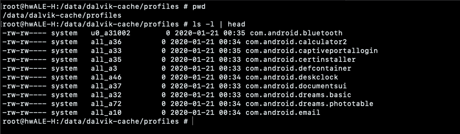
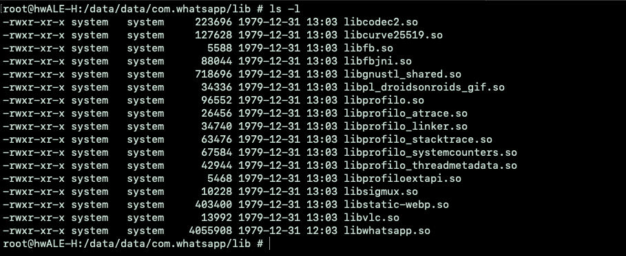
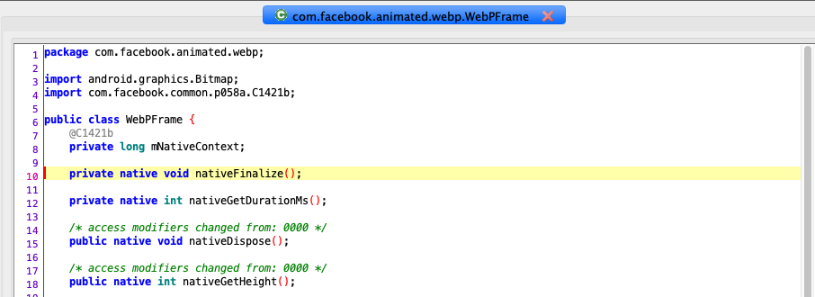
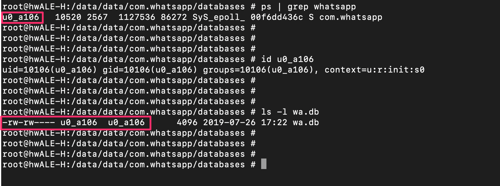
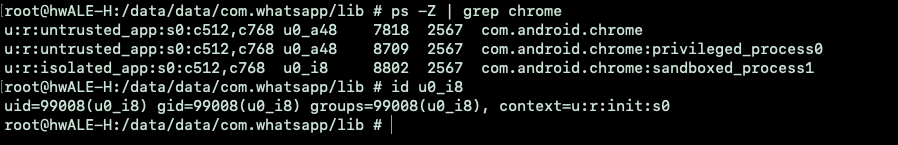

## Introduction
In the last few months I was studying Android Internals in order to perform some security research in the future. I first tried to focus myself in its architecture and fundamentals components, starting from the bootloader stage to the Framework, in order to have an initial high level picture. Then, I focused on the Binder component for two reasons:
- It is one of the main Android components, vital for its functionalities, as it is the IPC core.
- In that period Google P0 discovered a 0day in the wild used in a chain to compromise the Android System. The Binder was impacted allowing LPE as root also from an isolated process (that means it is for sure a good attack vector)


During this studying process, I took a lot of messy notes, so after 1/2 months of not working anymore on Android, I took them back, put them in order, studied again (adding more messy notes) and decided to write this little series of articles. So, especially the second and the third sections contain theory concepts, high level functionalities and a lot of source code references. Parts of these articles can be considered as a ‘Code Walkthrough’, so having the actual Android Source Code (the online Android repository is enough) is highly suggested to understand the flow.
I didn’t want to repost other people's work, so this "code walkthrough" is something different that honestly could help me when I was starting on it, so I hope it can help others too. However, all references are at the bottom of each article.

In this first section, I will introduce some basic Android concepts that will be useful for next chapters. The second will deepen Binder interactions and the servicemanager. And last, but not least, the client and service IPC implementation and usage.

## IPC Introduction
Inter-Process Communication is a necessary and indispensable feature for every Operating System in order to let processes communicate with each other. That means, if Process A needs to communicate with Process B (synchronize, share data, .. ), the OS must provide capabilities to do that.
We have multiple and different solutions that we can apply depending on the underlying OS, they can be through Pipes, Sockets, Shared Files, Shared Memory and more. These implementations are out of scope of this article’s series, so these are well-written reference:

- Linux: [https://www.geeksforgeeks.org/inter-process-communication-ipc/](https://www.geeksforgeeks.org/inter-process-communication-ipc/)
- OSX: [https://developer.apple.com/documentation/uikit/inter-process_communication](https://developer.apple.com/documentation/uikit/inter-process_communication)
- Windows: [https://docs.microsoft.com/en-us/windows/win32/ipc/interprocess-communications](https://docs.microsoft.com/en-us/windows/win32/ipc/interprocess-communications)

In order to go over the IPC implementation in Android, let’s make a short introduction to Android functionalities and some security aspects that will be useful during the reading.

## Android and Linux
Starting from the classic. Android is a Linux kernel based distribution aimed for mobile devices. I cannot explain better than how was explained in *‘Android Internals’* by ‘Jonathan Levin’:

*“Android's novelty arises from what it aims to provide -**not just another Linux distribution** - but a full software stack. The term "stack" implies several layers. **Android provides not just the basic kernel and shell binaries, but also a self-contained GUI environment, and a rich set of frameworks**. Coupled with a simple to use development language - Java - Android gives developers a true **Rapid Application Development (RAD) environment**, as they can draw on prewritten, well-tested code in the frameworks to access advanced functionality - such as Cameras, motion sensors, GUI Widgets and more - in a few lines of code”*

One of the biggest differences with Linux is **Bionic** has its core runtime C library, instead of the standard GNU libC (Glibc). Bionic is lighter and more focused on Android’s needs. There are a lot of changes between them. Today we are focused on IPC, so the difference in our interest is the omission of the System-V IPC (message queues, shared memory and semaphores), that are omitted because Android chooses its own IPC mechanism, the **Binder**. The Binder is a kernel component, the core component of IPC, that enables different processes to communicate with each other using a client-server architecture. It’s the core theme of this series, so we will deppen in later chapters.

## Dalvik and ART
Just to be aligned, let’s spend some words about the Dalvik Virtual Machine and ART, which are the core of Android.
If you know how Java works, you also know that in order to execute the code you need the JVM (**J**ava **V**irtual **M**achine) that will execute the compiled bytecode, translating it to machine code.
Well, Dalvik follows the same concept, but it’s not the same!
The Dalvik VM runs a different type of bytecode, called DEX (**D**alvik **E**xecutable) that is more optimized for efficiency in order to run faster on low performance hardware as it is for mobile devices. It is a Just In Time (JIT) compiler, that means that the code is compiled dynamically when it needs to be executed.
**A**ndroid **R**un**T**ime (ART) is used for the same purpose: translate bytecode to machine code and execute it.
By the way, it uses a different approach instead of JIT compiling , it uses **A**head **O**f **T**ime (AOT) that translates the whole DEX into machine code (dex2oat) at installation time when the APK is installed or when the device is idle. That means that is much more faster at execution time, but also requires more physical space.

Dalvik is the predecessor of ART. ART has been introduced in Android 4.4 (KitKat) and started to use hybrid combination of AOT and JIT from Android 7.0 (Nougat), starting to follows a different compilation approach, synthesizing:

- The first few times the application runs, the app is executed through JIT compilation.
- When the device is idle or charging, a daemon performs compilation using AOT on frequently used code, based on a profile compilation generated from the first run

You can find these profiles for each installed application inside */data/dalvik-cache/profiles/*:



## Android Framework and abstraction
Developers can access complex functionalities with few lines of code using pre-written code that resides in the Framework, delivered in packages that start with com.android.\* . These packages can be for different scopes, such as location and application support (*android.location* and *android.app*) Network (*android.net*) and in our interest, IPC support and core OS services from android.os. ([developer.android.com/packages](https://developer.android.com/reference/packages.html) for more).
This is a high advantage from the Security Perspective. Usually, developers do not have to bother with native languages (avoiding common memory corruption issues) and instead use a well tested code, also when they need to perform advanced or low level functionalities (such as access an hardware peripheral) they can stay in an High Level, Memory Safe language.

Let’s take a quick example on how to interact with the WiFi component, supposing we need to retrieve the actual WiFi state:

```
import android.net.Wifi 
// Get an handle to the WiFi Service
[..]
WifiManager Wifi_manager = (WifiManager) GetApplicationContext().getSystemService(Context.WIFI_SERVICE);
// Get the WifiState
Wifi_manager.getWifiState();
[...]
```

With these 2 lines of code we have completed our task:
- Get a handle to the WiFi service. The return result of getSystemService() is a generic Object (the handle to the service) that needs to be casted based on the desired service.
- From the retrieved manager, we can directly call the desired function, that will perform an IPC and return the result back.

That’s how Android abstract service interactions, enhancing security by simplifying application’s code.

By the way sometimes, due to performance reasons too, there is the necessity to run native code inside an application. This is performed using JNI, that permits to call native functions inside a shared library in the application context. This is pretty common for messaging applications (for example, whatsapp uses [PJSP](https://www.pjsip.org/), a C library, for video conferences).

## Java Native Interface
As we said, sometimes there is the necessity to use native code such as C/C++ from standard applications. This is permitted using the JNI (Java Native Interface) that lets Java call native functions without drastic differences. The native code is exported in shared libraries inside the lib/ folder (of the APK) where we have binaries compiled for multiple architectures (32/64 bit ARM, x86/x86-64 ), and the the underline system will choose the appropriate one (based on its hardware).
Let’s take an example with Whatsapp:



In this case, inside the lib/ folder there is only the armeabi-v7a folder. That’s because my test device is a 32 bit ARM (https://developer.android.com/ndk/guides/abis) and the system optimized physical space removing unused binaries compiled for other platforms.
These native functions are interesting from a security perspective because they can include **memory corruption issues**.
In order to track native calls, we can search through the Java code (decompiled) for native declarations:



That’s how a native function is declared, with the native keyword, and later on called as it is a normal Java function.
If you want to extract exported symbols from shared libraries, the nm utility can be come handy (*nm -D * | grep \<func_name\>* inside the specific ABI folder can be enough).

If you find an exploitable memory corruption in one application, you also have to consider the application sandbox. If you successfully compromise an application through a remote code execution, you are closed in a sandbox, where you can interact only with application’s related files and functionalities (and its declared android permissions). Of course, this can be part of a chain, with a foothold inside the system you have more attack surface in order to elevate privileges and compromise the system.

## Application Sanbox
CVE-2019-11932 is a Whatsapp Remote Code execution caused by a memory corruption while handling GIF animations ([here is a demo POC](https://www.youtube.com/watch?v=loCq8OTZEGI)). This was a critical issue because, also if you are in a sandbox, you can access all whatsapp files (chat databases, backup, media , ..) and, as we know, nowadays whatsapp is the main messaging application.
As we said, Android is a Linux based OS and inherits a lot of its concepts. In this way, Android uses kernel-level Application Sandbox using the UID (Unique User ID). Every application on Android has its own UID and GUID for file permissions and running application process (UID starts from 1000). All applications have a dedicated workspace in */data/data/\<app_name\>* created at the installation time where permissions permits only the application user to read and write in these files:



As you can see, only the user u0_a106 (10106, the UID for the WhatsApp application in my Droid) can access these files, meaning that any other application cannot read its content (only him and the root user).
For some applications (like browsers) there is an additional isolation that literally ‘isolates’ the application using a different UID. These IDs are referred in the Kernel source code as AID_ISOLATED_START (which is 99000) and AID_ISOLATED_END (99999) and limit service interactions. For example, the following snippet is part of the Android Kernel in order to obtain an handle to a service:


```
uint32_t do_find_service(const uint16_t *s, size_t len, uid_t uid, pid_t spid)
{
   //find_svc will retrieve a service info structure
   struct svcinfo *si = find_svc(s, len);
/.../
   //check if the requested service allow interaction from isolated apps
   if (!si->allow_isolated) {
       // If this service doesn't allow access from isolated processes,
       // then check the uid to see if it is isolated.
       uid_t appid = uid % AID_USER;
       if (appid >= AID_ISOLATED_START && appid <= AID_ISOLATED_END) {
           return 0;
       }
   }
/../
return si->handle

```

We will deepin in next chapters about the full process to obtain a service handle, but from this snippet you can see where the isolation check is performed. A check is done in the svcinfo structure (structure with service information such as the name, the isolation level and more) and if the target service is not allowed to be called from isolated processes (the caller UID is between AID_ISOLATED_START and AID_ISOLATED_END) the service handle is not returned.

For example, this is the chrome browser inside an isolated process:



You can note that the user id is 99008 (>99000), meaning it is an isolated application process.

## Conclusion
In this first article, we introduced basic Android concepts and security aspects that will become handy for next chapters. In the next article, we are going to talk about the Binder, its transactions and the servicemanager.

## References
[http://newandroidbook.com/](http://newandroidbook.com/)
[https://source.android.com/devices/tech/dalvik](https://source.android.com/devices/tech/dalvik)<
[https://source.android.com/security/app-sandbox](https://source.android.com/security/app-sandbox)