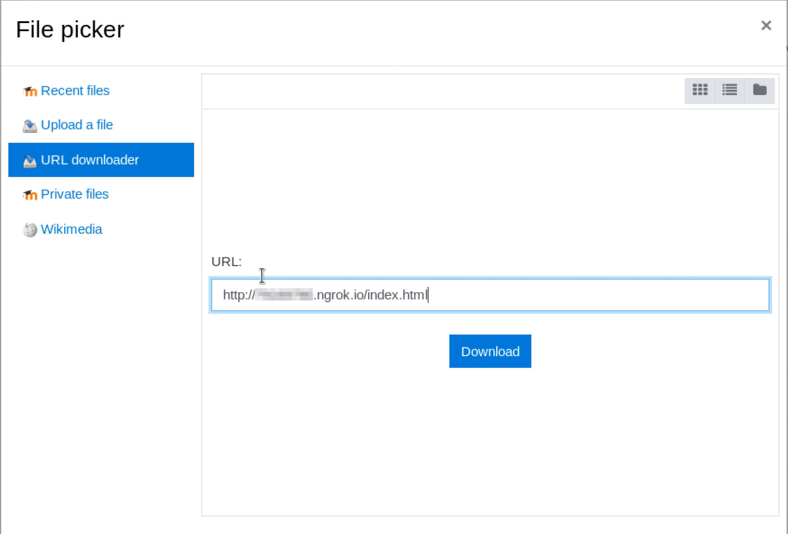
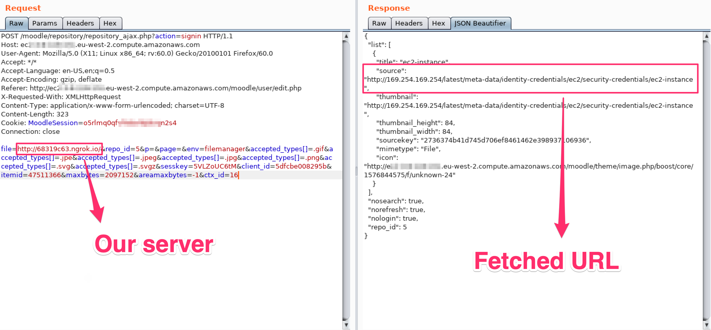
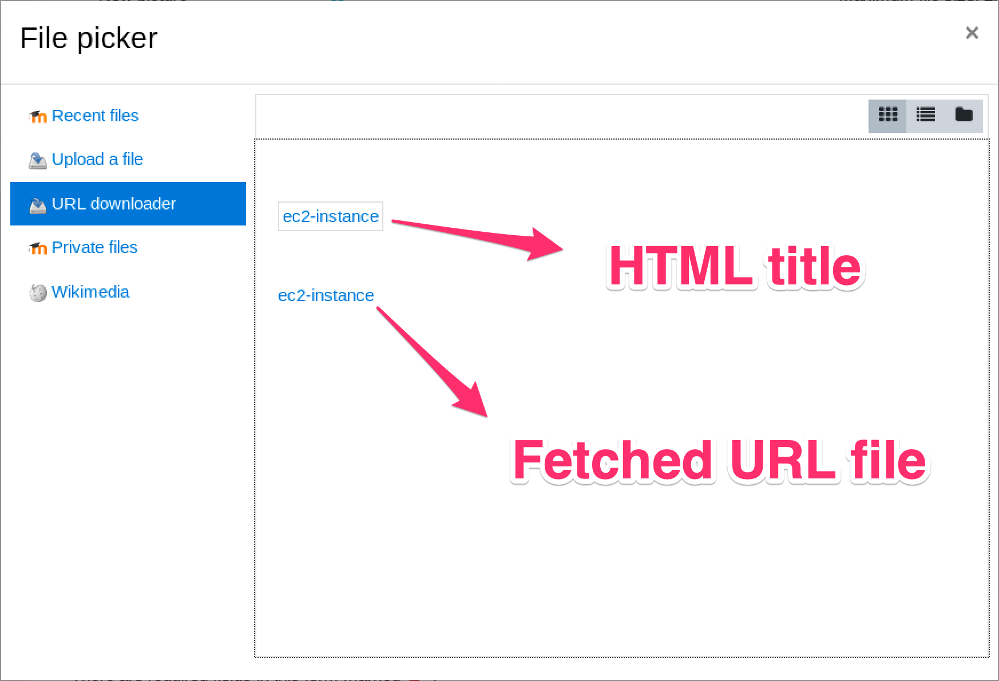
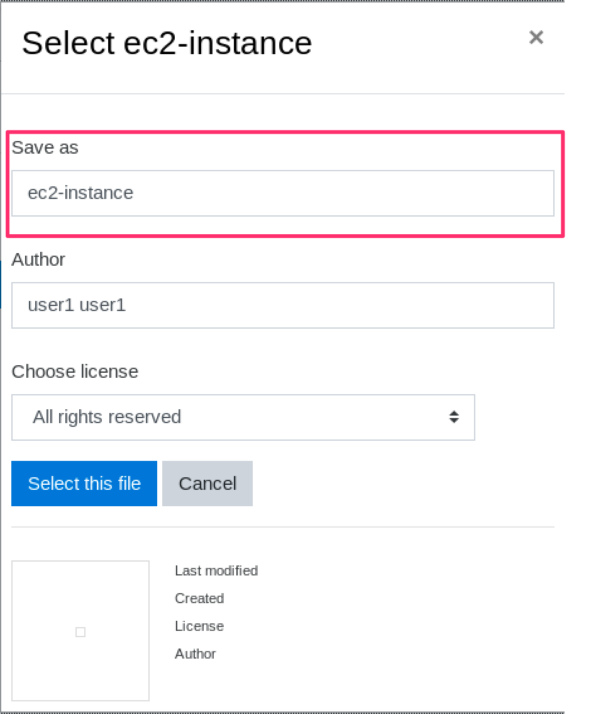
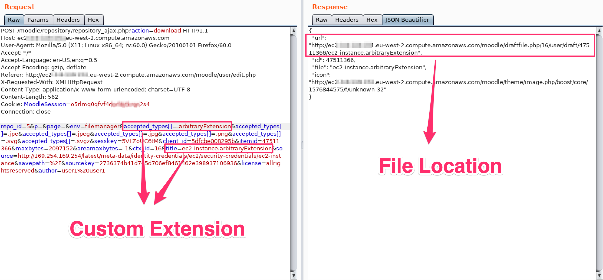
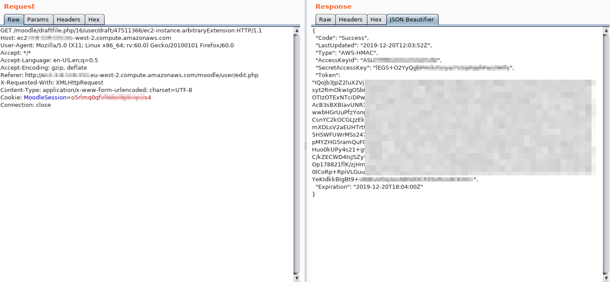
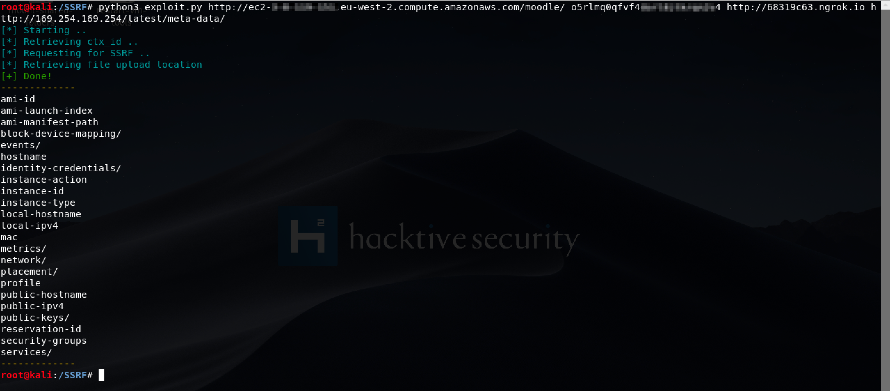
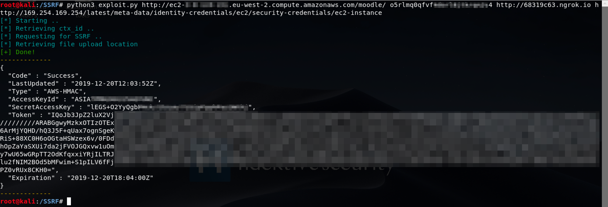
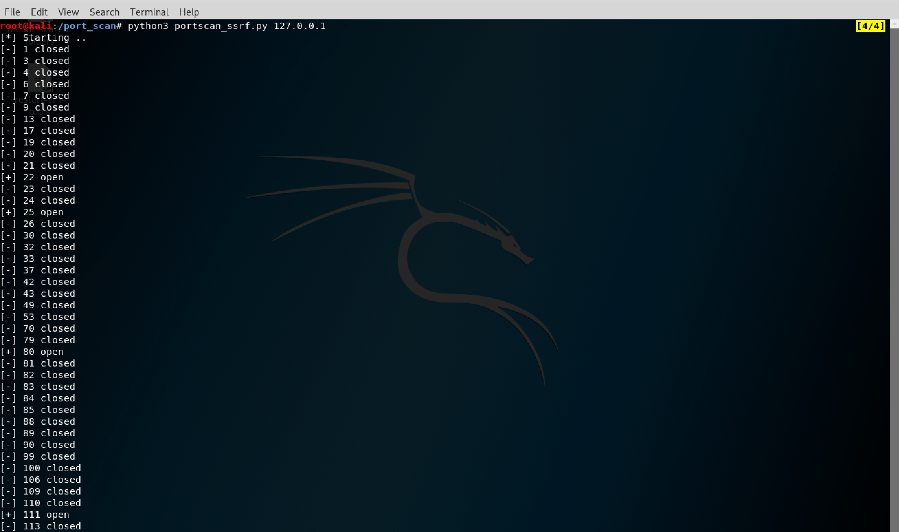

During the research time in Hacktive Security I found 2 Server-Side Request Forgery on Moodle. The first one is a Blind SSRF already discovered in 2018 and tracked as CVE-2018-1042 without a proper patch, the other one is a fresh SSRF while parsing image tags inside the same component (**File Picker**). 

**They are currently not patched and both working on the latest Moodle version** because the Moodle Team, as they said from emails, leaves the responsibility to protect network interactions to system administrators. I personally do not agree with this statement because it leaves a dangerous vulnerability in a vanilla installation that can lead critical scenarios especially on cloud based hosting. So, in order to protect your Moodle installation, check out the Workaround section at the end of the article.

Let's deppen these vulnerabilities starting from the impacted component, the File Picker.

## File Picker

The File picker is a core Moodle component used to handle file uploads for multiple scopes. For example, it is used in the user's profile picture handling or in 'Private Files', a dedicated area for any authenticated user. You can easily upload a file, but also retrieve an image from an **arbitrary URL(!)**.

As it is used for multiple purposes, it is by default accessible to any authenticated user (also low privilege ones).

## The fresh SSRF

The vulnerability resides on image parsing from an arbitrary URL (when an user choose to retrieve an image using the URL, as mentioned before).
If you request an HTML page, Moodle will fetch all `` tags inside it and ask you to choose which image you want to download. It extracts the `src` attribute for all image tags in the page and directly downloads the image, without further checks. That means that if we request the image from a server we control, we can request an HTML page with an arbitrary URL inside an image tag and Moodle will perform this arbitrary request for us. Then we can save the fake image (that contains the response for the SSRF) and display its result.

### POC

From the 'URL Downloader' action inside the File Picker, we can put a URL to our server that points to /index.html, that will contains the following payload:

``

``

The request will catch our `src` attribute as follow:

That will result, in the UI, in the following selection:

We can click on the box, and choose to download the fetced 'image'

In order to download the response, we have to provide a custom extension in the title name and customize the accepted_types[] parameter according to it (for example .arbitraryExtension)

he returned JSON response will contain the path to the result file (with the arbitrary request's response), that we can download with a GET request:

By automating this whole process with an exploit, we can now easily interact with local services.

For example, in a AWS EC2 instance we can interact with the Meta and User Data API internal endpoint at 169.254.169.254 (You can find more about this API at [AWS Documentation](https://docs.aws.amazon.com/AWSEC2/latest/UserGuide/ec2-instance-metadata.html).

## The old Blind SSRF
The unpatched Blind SSRF vulnerability (CVE-2018-1042) was already described here: [exploit-db/exploits/47177](https://www.exploit-db.com/exploits/47177). The patch did not applied any fix, so it is still exploitable and more suitable for internal port scans (as it is blind):

You can find both exploits in the Reference section.

## Conclusions and Workaround
As we said, these SSRF are actually working on the latest Moodle release and their impact can be pretty critical for cloud based instances. Moodle has an open issue that plans to restrict most common restriction scenarios [MDL-56873](https://tracker.moodle.org/browse/MDL-56873) from 2016.

To fix these issues, from 'Site Administration > Security > HTTP Security' it is possible to restrict allowed hosts and ports (cURL blocked hosts and cURL allowed ports). You can customize these configurations based on your environment (such as restricting the loopback, internal network and allowing only HTTP ports to avoid port scans also to external sources).

## Timeline

- 02/02/2020 - Moodle contacted
- 03/02/2020 - They received the request and handle the case
- 06/02/2020 - Blind SSRF vulnerability rejected (System Administrators should fix it)
- 11/03/2020 - We replied to some questions
- 25/03/2020 - Also the SSRF vulnerability is rejected (System Administrators should fix it)
- 25/03/2020 - Tried to emphasize the risk
- 30/03/2020 - Issues closed without a fix
