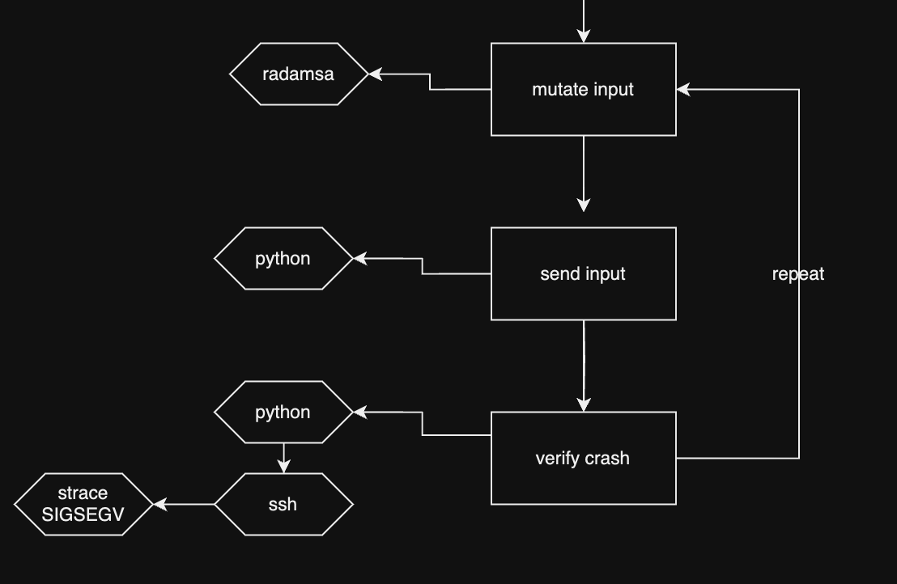
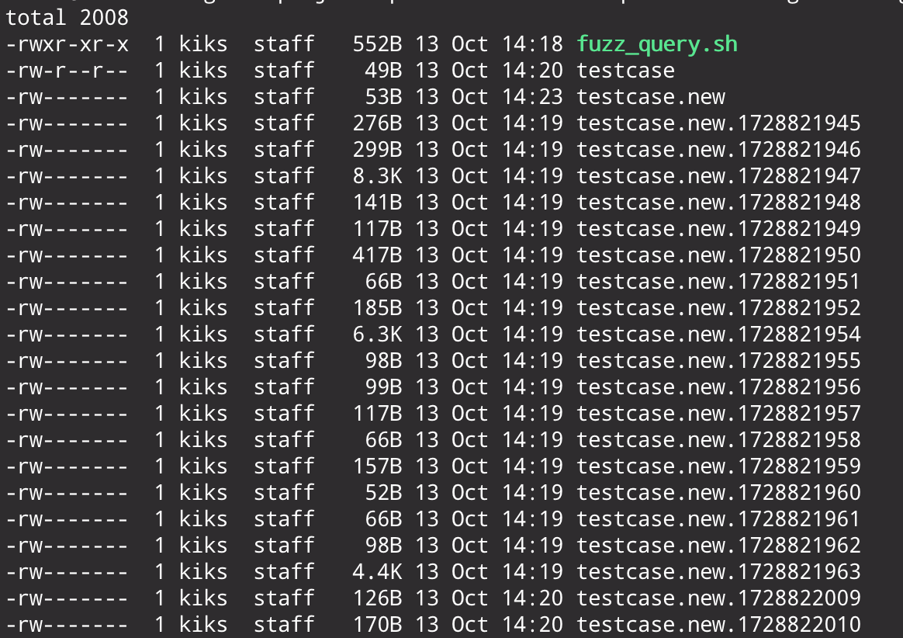
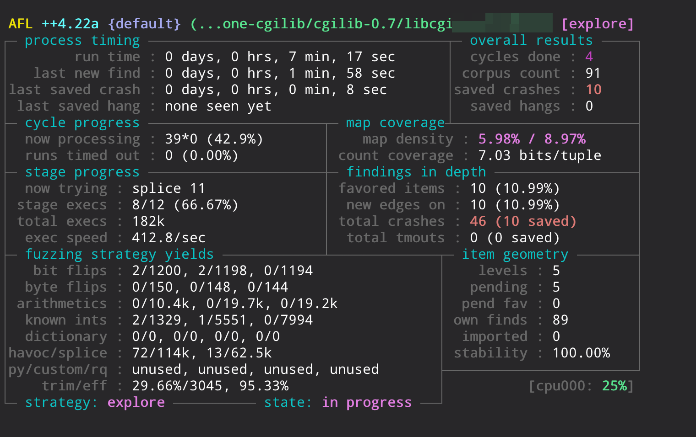
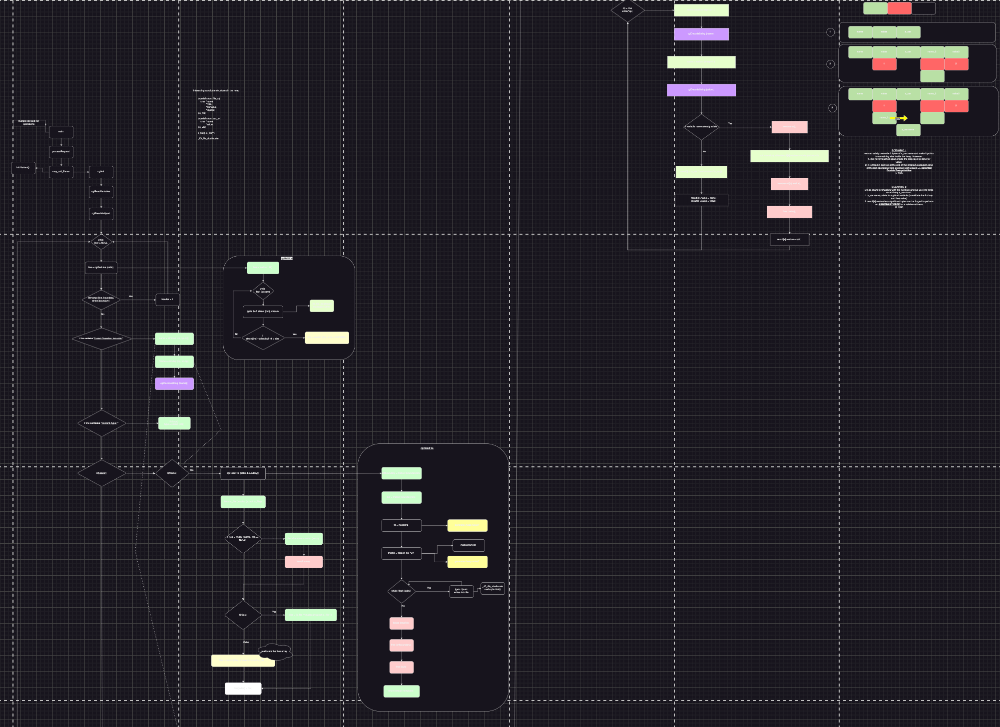

## Introduction
In the previous parts of the series ([Part 1](not-all-roads-lead-to-pwn2own-hardware-hacking-part-1.html) and [Part 2](not-all-roads-lead-to-pwn2own-firmware-reverse-engineering-part-2.html)) we have targeted the Lorex IP Camera. As discussed, we put too much effort on the initial phase without doing actual vulnerability research on it. We had few days left and another target available, the Ubiquiti AI Bullet. We are going to discuss  our fuzzing approaches, bug triaging and, unfortunately, some false hopes. So, without any further ado, let's go straight into it.

## Target overview
The Ubiquiti is a totally different target compared to the Lorex IP Camera, it targets a totally different type of consumers due to its high price of 500$. Due to the enterprise nature of the camera, it is only powered through PoE and it exposes three main services: SSH, a web service and a discovery utility. The very first interesting thing was the SSH service with default credentials discovered with some OSINT operations. These credentials, `ubnt:ubnt` and `ui:ui`, are intended for privileged console access and web service logon. The console access is an interesting point from a research point of view since it permits to firmly identify exposed network services and their binaries and have access to the camera firmware directly, also offering debugging capabilities. The camera is an ARM64 device with a pretty recent kernel version (5.4) and busybox.

## Network Attack Surface
Since the allocated time was rapidly coming to an end, we decided to focus on the network attack surface only. It is fair to appoint that this is not the only attack surface available for a camera embedded device. For example, in previous PWN2OWN edition, the Wyze Cam v3 was pwned with a command injection vulnerability ([CVE-2024-6247](https://www.zerodayinitiative.com/advisories/ZDI-24-838/)) through a QR code scanned from the camera itself. However, we had few days left and we had to optimize our choices. As previously mentioned, we have three exposed services:

```bash
UVC AI Bullet-4.64.113# netstat -atnpu
Active Internet connections (servers and established)
Proto Recv-Q Send-Q Local Address           Foreign Address         State       PID/Program name
tcp        0      0 0.0.0.0:443             0.0.0.0:*               LISTEN      982/lighttpd
tcp        0      0 0.0.0.0:80              0.0.0.0:*               LISTEN      982/lighttpd
tcp        0      0 0.0.0.0:22              0.0.0.0:*               LISTEN      983/dropbear
udp        0      0 0.0.0.0:10001           0.0.0.0:*                           1086/infctld
```

We excluded the path to find 0days in the dropbear service and, for that reason, we only had two possible targets. 

## The UDP infctld service
The UDP service binary exposed on the 10001 port is a simple and minimal binary containing only the `main` function. Its purpose is pretty simple: it parses a simple input and returns information about the camera device. It is an Ubiquiti common utility and there are a tons of open source clients that communicate with that service. For example, this is a sample output from the [ubnt-discover](https://github.com/guerrerocarlos/ubnt-discover/tree/master) tool (from the repository itself):

```bash
$ ubnt-discover
╔═════════════╤═════════════╤════════════════╤═══════════════════╤═══════════════════════════════════════╗
║ Device Type │ Name        │ Host           │ Mac               │ Firmware                              ║
╟─────────────┼─────────────┼────────────────┼───────────────────┼───────────────────────────────────────╢
║ NVR         │ UniFi-Video │ 192.168.10.XXX │ 68217XXXXX523XXXX │ NVR.x86_64.v3.2.2.8ff52ec.160415.0002 ║
╚═════════════╧═════════════╧════════════════╧═══════════════════╧═══════════════════════════════════════╝
Waiting for more... (Ctrl+C to exit)
```

We performed reverse engineering and black-box fuzzing with an ad-hoc written tool based on [radamsa](https://gitlab.com/akihe/radamsa) mutation. The tool was similar to the public [fuzzotron](https://github.com/denandz/fuzzotron) solution, that we have discovered at the end of the activity, with an additional mechanism to find potential crashes through `strace`.

### A straight and simple network fuzzer


The fuzzer architecture was quickly scratched with this diagram and can be resumed with some points:
- **Initial corpus**: first of all, we needed an initial corpus to starts the mutation process with `radamsa`. After some reverse engineering, we were able to identify that a simple payload was requested (`01 00 00 00`).
- **Input mutation**: starting from the initial first simple packet, the python tool generates new input using radamsa. Radamsa has been choose for its ability to mutate binary input and is perfect for our network protocol fuzzing needs.
- **Input sending**: once the input has been generated, few lines of python sends the input to the target.
- **Crash identification**: once the input is sent, a possible crash needs to be verified, of course. Since we had SSH access, we decided to achieve the crash identification using `strace`. Before starting the fuzzer, we execute `strace` (with child tracing) from an SSH session and redirect the output to a temporary file in `/tmp/`. After the input is sent, the python script verifies (using `paramiko` and some wrappers) the content of the `strace` to verify potential crashes.

We really wanted to explore that option also if we knew that the input parsing was pretty minimal and, for that reason, we were not able to crash the service after few sessions.

## The CGI web service
While our tool was fuzzing the UDP service, we were also understanding the web surface. The web service, exposed on 80 and 443, is a `lighthttpd` web server that redirect all API requests to a CGI binary, while the web root only contains front-end code. CGI is an "exotic" and for most, an old school standard. However, it is highly adopted in embedded devices and its main job is to gateway HTTP requests *mostly* to binary applications.

### The CGI interface
The Common Gateway Interface (CGI) standard documented in [RFC 3875](https://datatracker.ietf.org/doc/html/rfc3875) is described as "a simple interface for running external programs, software or gateways under an information server in a platform-independent manner". Its main function, as the name suggest, is to provide the ability to execute external programs (e.g. binaries) directly from an HTTP request, translating HTTP parameters (URI, headers and body) to environmental and standard input/output interfaces. HTTP data and meta-data are "proxied" from the web server (`lighthttpd` in this case) directly to the program transforming the HTTP request into environmental variables in order to be retrieved from the other side with functions like `getenv`. In the case of the body instead, `stdin` is used and `stdout` for the HTTP response. The CGI RFC standard precisely describes how to handle and parse the input request properly (e.g. how to deal with the Content-Length and so on). 

After carefully reading the RFC and getting familiar with this standard, we started to develop some ideas on how the fuzz the CGI binary itself without passing through the web server, since it can returns generic "500 Internal Server Error" for invalid input without being an actual interesting crash. For example, the HTTP POST request for the login operation can be translated with the following cli command:

```bash
echo '{"username":"ubnt","password":"ubnt"}' | REQUEST_METHOD=POST REMOTE_ADDR=127.0.0.1 QUERY_STRING="id=1.1/login" CONTENT_TYPE="application/json" CONTENT_LENGTH=37 /usr/www/rest.cgi
```

We can now approach in two different ways: black-box and gray-box fuzzing. Let's start with the simplest one, the black-box approach.

### CGI black-box fuzzing
In an infinite life, things could be done perfectly without worrying about time limits or efficiency. However, the first sentence is false, and efficiency is an essential characteristic of good or bad decisions. Upon this "philosophical" concept, the talk [Fuzzing from First Principles](https://zerodayengineering.com/research/discussion-fuzzing-from-first-principles.html) ([video](https://www.youtube.com/live/9U-FK_Qi1XQ?si=KsalpgiuZS-6aCB_)) from Alisa, it well intersperse it in the fuzzing area. For that reason, a straight black-box fuzzing setup can still be effective and *sometimes* also more efficient than a more complex setup (e.g. gray-box or white-box) that uses instrumentation, coverage feedback and so on. Similarly to the previous described network UDP fuzzer based on radamsa, we used it again but this time using bash scripting instead of python, due to the easier, and command line oriented, nature of the target.

```bash
#!/bin/sh

echo "CGI black-box fuzzer .."
echo '/id=1.1/version?test=param1&test2=param3&test3=0' > testcase
while true; do
  /tmp/radamsa testcase -o testcase.new
  REQUEST_METHOD=GET REMOTE_ADDR=127.0.0.1 QUERY_STRING=$(cat testcase.new) /usr/www/rest.cgi
  if [ $? -eq 139 ]; then
    file_size=$(wc -c < testcase.new)
    # Avoid testcases with size 0
    if [ $file_size -ne 0 ]; then
      echo $?
      echo "Crash!!"
      cp testcase.new testcase.new.$(date +%s)
    fi
  fi
done
```

The script is pretty tiny and simple. First, an initial testcase is generated based on the targeted surface (the URI string, in this case). An infinite loop first mutates the original testcase using a statically ARM64 manually compiled version of [radamsa](https://gitlab.com/akihe/radamsa) and then use it against a specific environmental variable (e.g. `QUERY_STRING`) as input. The return code is then verified for a potential crash. If a segmentation fault is triggered, the testcase is stored locally if it's not empty (since it would be not externally reproducible and exploitable). We executed the script directly on the target and had multiple crashes:



We had also emulated (extracting key binaries from the target) parts of the target itself in qemu (as described in the [previous part](not-all-roads-lead-to-pwn2own-firmware-reverse-engineering-part-2.html) for the Lorex Camera) and fuzzed from there with similar results. However, with some bug triaging, crash points were similar to the gray-box results that were also easier to debug. For that reason, also if we had a lot of crashes from that black-box fuzzing session, we decided to focus more on the other results instead.

### CGI gray-box fuzzing
By reverse engineering the CGI binary responsible to handle API requests, we found an interesting call from an external library: `cgiInit`. As we have just briefly mentioned, CGI parsing is not that easy and can be complex in some of its parts since a lot of things needs to be properly handled and taken in consideration. Fuzzing and *complex* parsing are two (/three) words that loves each other, or hate, depending on the point of view. From our point of view, it could be a really interesting attack surface, without the need to go into specific application logic. However, we did not directly landed here. We did an intense reverse engineering activity to understand the binary logic, rename functions, deepen the authentication process and workflow, API handlers and so on. However, since we had only few days left, we made a bet on the CGI *implicit* parsing library. 

#### CGI parsing library
The mentioned `cgiInit` function is defined in an external system library called `libcgi.so.1`. We had some initial thoughts that it was a custom made CGI parser (*interesting*), but most of developers actually don't want do reinvent the wheel from scratch (*understandable*) and we started to search for common public C/C++ CGI parsers (without any luck) and more *unique* function names that were exported, hoping to find some matches with OSINT. Actually, the second approach turned out with good results using the Github "Code" search. We searched for less generic exported function names like `CgiGetFiles` or `CgiFreeList` and we stumbled in a lot of open-source projects that were actually embedding a library named `cgilib` (e.g. this [project](https://github.com/airhorns/codejam2/tree/7618ee5c9cb34bec57ec77eea6817b31d010eafc/C_server/cgilib-0.7)). More google searches led us to the following, deprecated, [Lightweight CGI Library](https://www.infodrom.org/projects/cgilib/index.php) project. To confirm that it was it, and to identify the exact version (actually the *latest* one, 0.7), we did reverse engineering to identify new features across different versions, vendor changes in the code or new functions. Apart of some new introduced functions, the rest of the code was actually the same (without further validations).

At first, it was really encouraging from our point of view: we had a really old library that parses an interesting CGI standard and we also had the source code of it. The first idea, after a quick code review, was to use AFL against it and wait for the fruits! The code, without offending anyone, is really a mess. Two letters and non descriptive variable names made the review of the code really painful, but that was keeping us aware of the fact that this could also lead to interesting, and not intended, [*weird*](https://youtu.be/Dd9UtHalRDs?si=AVt2RWXJq5KngJvn&t=1431) behavior.

#### AFL setup and library customizations
Compiling and setting up [AFL++](https://github.com/AFLplusplus/AFLplusplus) is quite easy and out of scope of this article (you can even [use docker](https://github.com/AFLplusplus/AFLplusplus?tab=readme-ov-file#building-and-installing-afl), if you desire). The target we are facing is a library, and for that reason we have to do some modifications and adjustments to make it compatible with a fuzzer like AFL++ that uses the standard input (`stdin`) as a vector. The previously mentioned `cgiInit` function (defined in `cgi.c`), upon other things, calls two interesting functions: `cgiReadVariables` and `cgiReadCookies`.

```C
s_cgi *cgiInit()
{
    s_cgi *res;
    res = cgiReadVariables ();
    if (res)
		res->cookies = cgiReadCookies ();
	// ..
}
```

The first one is responsible to handle the HTTP request and parse fields based on its content type, while the second one, as name suggests, is responsible to parse HTTP cookies. As explained before, all these variables are directly taken from environmental variables with the `getenv` syscall and, in case of the HTTP body, `stdin`. Note that in the "real" scenario, these values come directly from `lighttpd` web server that translates HTTP requests to CGI compatible commands.

```C
s_cookie **cgiReadCookies()
{
    char *http_cookie;
    char *curpos, *n0, *n1, *v0, *v1, *cp;
    s_cookie **res, *pivot = NULL;
    int count;
    int len;

    if ((curpos = http_cookie = getenv ("HTTP_COOKIE")) == NULL)
		return NULL;
    count = 0;
    if ((res = (s_cookie **)malloc (sizeof (s_cookie *))) == NULL)
		return NULL;
    res[0] = NULL;
    // ..
}
```

The initial corpus has been generated with a set of possible cookie formats.

##### Cookie Parsing customizations
To fuzz the cookie parser logic, the input from the environmental variable `HTTP_COOKIE` needs instead to be passed as `stdin`. To achieve that, we can modify the `getenv` part of the code and instead read from standard input: `read(0, afl_input_buffer, AFL_BUF_SZ - 1);`. In this line of code, `afl_input_buffer` is a global `char*` variable that is allocated just before entering the `cgiReadCookies` function with a size of double a page size (`4096 * 2`) defined in the `AFL_BUF_SZ` constant.

Now that we have a way to make the target compatible with AFL++, we just need to compile it and let it run. First of all, the `Makefile` was not working and led to a lot of dependency issues. After some struggles on that, we directly put everything inside a single file, with the only exception of headers, and directly compile it with GCC. We made "vanilla" and sessions with [ASAN](https://github.com/google/sanitizers/wiki/AddressSanitizer) enabled in the following way: `gcc -g -fsanitize=address libcgi-afl.c -o libcgi-afl-asan`. The `-g` options for symbolization and `-fsanitize=address` to enable the address sanitizer.

This is the result of the main function that permits to fuzz HTTP cookies through standard input:
```C
#define AFL_BUF_SZ 4096 * 2
char* afl_input_buffer;

s_cookie **cgiReadCookies()
{
  char *http_cookie;
  char *curpos, *n0, *n1, *v0, *v1, *cp;
  s_cookie **res, *pivot = NULL;
  int count;
  int len;

  // read STDIN for AFL
  read(0, afl_input_buffer, AFL_BUF_SZ - 1);
  curpos = http_cookie = afl_input_buffer;

  //if ((curpos = http_cookie = getenv ("HTTP_COOKIE")) == NULL)
  //  return NULL;
  
  count = 0;
  if ((res = (s_cookie **)malloc (sizeof (s_cookie *))) == NULL)
    return NULL;
  res[0] = NULL;
  // ..
}

void fuzz_cookie(){
  afl_input_buffer = malloc(AFL_BUF_SZ);
  cgiReadCookies();
}

int main (int argc, char **argv, char **env)
{
  //fuzz_cookie();
   return 0;
}
```

##### Request parsing customizations
`cgiReadVariables` is instead responsible to parse whole HTTP requests: `REQUEST_METHOD`, `QUERY_STRING`, `CONTENT_LENGTH` and `CONTENT_TYPE`. The `CONTENT_TYPE` option parsing immediately took our attention due to the more complex logic that needs to be considered during the parsing of `multipart/form-data` requests, implemented in the `cgiReadMultipart` function:

```C
#define MULTIPART_DELTA 5

char *cgiGetLine (FILE *stream)
{
    static char *line = NULL;
    static size_t size = 0;
    char buf[BUFSIZE];
    char *cp;
    
    // ..
    while (!feof (stream)) {
      if ((cp = fgets (buf, sizeof (buf), stream)) == NULL))
		// ..
    }
}
s_cgi *cgiReadMultipart (char *boundary)
{
    char *line;
    char *cp, *xp;
    // ..
    while ((line = cgiGetLine (stdin)) != NULL) {
	    // ..
    }
}
```

The good point here is that, as we can see from the function `cgiReadMultipart` extract above, input is directly taken from standard input and less customizations need to be done for AFL++. However, to be coherent with the program logic and the HTTP standard, and to precisely focus the fuzzing effort in the multi part processing logic, we have to set the `CONTENT_TYPE` environmental variable to something like that: `multipart/form-data; boundary=dcaf18a0-0d20-4dc9-9f87-7a863dd4df02`. The boundary identifier here is really important to match the one in the input testcases in order to avoid early rejections of the input during the fuzzing session.


```C
s_cgi *cgiReadVariables (){
	// original code
}

void fuzz_multipart_formdata(){
  cgiDebug(0, 0);
  setenv("CONTENT_TYPE", "multipart/form-data; boundary=dcaf18a0-0d20-4dc9-9f87-7a863dd4df02", 1);
  cgiReadVariables();
}

int main (int argc, char **argv, char **env)
{
  fuzz_multipart_formdata();
  return 0;
}
```

The initial input corpus has been taken from some big Burp projects that we had locally. We extracted multi part HTTP requests and fed them directly into `afl-cmin` to minimize it before the first session.

### Results and crash triaging
We run both described solutions through different sessions (with and without ASAN), and ...



We got crashes!

We now have multiple crashes, little time and few brain cells left (keep in mind the introduction from the [first article](not-all-roads-lead-to-pwn2own-hardware-hacking-part-1.html)) but still, a lot of excitement. To first minimize crashing testcases, [`afl-tmin`](https://manpages.ubuntu.com/manpages/xenial/man1/afl-tmin.1.html) can be used inside a bash loop and is really useful to have a smaller reproducible input that still generates the original crash:

```bash
for f in $(ls ./sess1/default/crashes/); do afl-tmin -i ./sess1/default/crashes/$f -o ./minimized-crashes/$f /<redacted>/libcgi-afl; done
```

After `afl-tmin`, ASAN can be really useful to identify the root cause of specific crashes. It can be, similarly to the previous snippet, integrated inside a for loop to generate the crashing report:

```bash
# Compile the binary with ASAN
gcc -g -fsanitize=address libcgi-afl.c -fsanitize-recover=address -o libcgi-afl-asan

for f in $(ls ./minimized-crashes); do ASAN_OPTIONS=halt_on_error=0 /<redacted>/libcgi-afl-asan < ./minimized-crashes/$f 2> asan/$f; done
```

You can also note particular a command line option (`-fsanitize-recover=address`) that tells ASAN to not exit after the first crash report. This is useful since it naturally follows that program logic without interrupting anything, and for our case it was particularly useful because there was a *not interesting* OOB read of one byte at the first stages of input parsing. Chained with the `ASAN_OPTIONS=halt_on_error=0` environmental variable before executing the binary, it doesn't interrupt anything and reports all memory violations that it encounters.

### "Hey look, ~~water~~ bugs!"
Among all crashes, one in particular caught our attention, and this is its report:

```plain
ERROR: AddressSanitizer: heap-buffer-overflow on address 0xffff88b00ef8 at pc 0xffff8e2ea464 bp 0xffffc237bb40 sp 0xffffc237bb88
WRITE of size 2 at 0xffff88b00ef8 thread T0
    #0 0xffff8e2ea460 in __interceptor_memset ../../../../src/libsanitizer/sanitizer_common/sanitizer_common_interceptors.inc:799
    #1 0xaaaad60a62a8 in cgiDecodeString /<redacted>/cgilib-0.7/libcgi-afl.c:414
    #2 0xaaaad60a7888 in cgiReadMultipart /<redacted>/cgilib-0.7/libcgi-afl.c:719
    #3 0xaaaad60a7dcc in cgiReadVariables /<redacted>/cgilib-0.7/libcgi-afl.c:770
    #4 0xaaaad60aae90 in fuzz_multipart_formdata /<redacted>/cgilib-0.7/libcgi-afl.c:1152
    #5 0xaaaad60aaef0 in main /<redacted>/cgilib-0.7/libcgi-afl.c:1163
    #6 0xffff8e1273f8 in __libc_start_call_main ../sysdeps/nptl/libc_start_call_main.h:58
    #7 0xffff8e1274c8 in __libc_start_main_impl ../csu/libc-start.c:392
    #8 0xaaaad60a2cac in _start (/<redacted>/cgilib-0.7/libcgi-afl+0x2cac)

0xffff88b00ef8 is located 0 bytes to the right of 40-byte region [0xffff88b00ed0,0xffff88b00ef8)
allocated by thread T0 here:
    #0 0xffff8e308e30 in __interceptor_strdup ../../../../src/libsanitizer/asan/asan_interceptors.cpp:454
    #1 0xaaaad60a787c in cgiReadMultipart /<redacted>/cgilib-0.7/libcgi-afl.c:718
    #2 0xaaaad60a7dcc in cgiReadVariables /<redacted>/cgilib-0.7/libcgi-afl.c:770
    #3 0xaaaad60aae90 in fuzz_multipart_formdata /<redacted>/cgilib-0.7/libcgi-afl.c:1152
    #4 0xaaaad60aaef0 in main /<redacted>/cgilib-0.7/libcgi-afl.c:1163
    #5 0xffff8e1273f8 in __libc_start_call_main ../sysdeps/nptl/libc_start_call_main.h:58
    #6 0xffff8e1274c8 in __libc_start_main_impl ../csu/libc-start.c:392
    #7 0xaaaad60a2cac in _start (/<redacted>/cgilib-0.7/libcgi-afl+0x2cac)

SUMMARY: AddressSanitizer: heap-buffer-overflow ../../../../src/libsanitizer/sanitizer_common/sanitizer_common_interceptors.inc:799 in __interceptor_memset
Shadow bytes around the buggy address:
  0x200ff1160180: fa fa fa fa fa fa fa fa fa fa fa fa fa fa fa fa
  0x200ff1160190: fa fa fa fa fa fa fa fa fa fa fa fa fa fa fa fa
  0x200ff11601a0: fa fa fa fa fa fa fa fa fa fa fa fa fa fa fa fa
  0x200ff11601b0: fa fa fa fa fa fa fa fa fa fa fa fa fa fa fa fa
  0x200ff11601c0: fa fa fa fa fa fa fa fa fa fa fa fa fa fa fa fa
=>0x200ff11601d0: fa fa fa fa fa fa fa fa fa fa 00 00 00 00 00[fa]
  0x200ff11601e0: fa fa 00 00 00 00 02 fa fa fa 00 00 00 00 00 fa
  0x200ff11601f0: fa fa fa fa fa fa fa fa fa fa fa fa fa fa fa fa
  0x200ff1160200: fa fa fa fa fa fa fa fa fa fa fa fa fa fa fa fa
  0x200ff1160210: fa fa fa fa fa fa fa fa fa fa fa fa fa fa fa fa
  0x200ff1160220: fa fa fa fa fa fa fa fa fa fa fa fa fa fa fa fa
=================================================================
```

ASAN immediately tell us that we are dealing with an "heap-buffer-overflow" with "WRITE of size 2". From the stack trace, we can also identify the exact location where it happens. The `__interceptor_memset` (the ASAN hooked version of `memset`) is the latest reference called function from `cgiDecodeString`. Let's see this function:

```C
char *cgiDecodeString (char *text)
{
    char *cp, *xp;

    for (cp=text,xp=text; *cp; cp++) {
	if (*cp == '%') {
	    if (strchr("0123456789ABCDEFabcdef", *(cp+1))
		&& strchr("0123456789ABCDEFabcdef", *(cp+2))) {
		if (islower(*(cp+1)))
		    *(cp+1) = toupper(*(cp+1));
		if (islower(*(cp+2)))
		    *(cp+2) = toupper(*(cp+2));
		*(xp) = (*(cp+1) >= 'A' ? *(cp+1) - 'A' + 10 : *(cp+1) - '0' ) * 16
		    + (*(cp+2) >= 'A' ? *(cp+2) - 'A' + 10 : *(cp+2) - '0');
		xp++;cp+=2;
	    }
	} else {
	    *(xp++) = *cp;
	}
    }
    memset(xp, 0, cp-xp);
    return text;
}
```

We can immediately correlate the crashing location in the function code, and we can quickly identify that we are dealing with an heap overflow of some sort of calculated size (`cp-xp`) starting from `xp`. However, we can only write `0x0`. Not the best primitive ever, but quite interesting, especially for the `cgiDecodeString` usage across the program. The function is responsible to decode URI encoded strings (e.g. `%41`) to their decoded form (e.g. `A`). Due to this useful utility, it is called from multiple locations, multiple times, and inside for loops that are, in some way, affected from user input. This made, for us, this bug potentially exploitable and interesting to deep in. 

However, we were the result of the temporary burnout mentioned in the [first part](not-all-roads-lead-to-pwn2own-hardware-hacking-part-1.html). Working too much, without breaks and with too much excitement led us to the mirage of the ~~water~~ bug in the ~~desert~~ target. Actually, the bug was there, but not what we thought. It was the last available night before the pwn2own deadline. I bought two redbulls and spent the *almost* whole night thinking and theorizing about possible side effects that could enhance the primitive into something more powerful (I had some double free ideas on mind) based on some custom heap shaping with the program logic and public known techniques targeting glibc 2.31. This was the resulted mind map of the night:



What's funny about that? That I was actually thinking to have a controlled NULL byte overflow, while I only had 2 NULL bytes overflow in the best case. This extreme scenario highlighted the key importance and the necessity of mental and physical breaks, that can be more productive and effective than just working no stop.

However, the subtle bug(s) inside the `cgiDecodeString` function are left as an exercise to the reader.

## Conclusion
As with all journeys, this one also came to an end. Not the expected and hoped-for result (an RCE), but for sure we learned an incredible amount of technical, but most importantly mindset, skills. The importance of resting is sometimes underestimated and seen as lack of proper motivation or intention, but it's clearly not (in positive terms, of course). This pure hacking experience, combined with intense team collaboration, is one of those things that you don't easily forget in life. 

## References
- https://datatracker.ietf.org/doc/html/rfc3875
- https://zerodayengineering.com/research/discussion-fuzzing-from-first-principles.html
- https://youtu.be/Dd9UtHalRDs?si=p8ygDU9eR8ZIVaLS
