> **I have not personally written this blog post** but it was the result of a collaboration done in [Hacktive Security](https://www.hacktivesecurity.com/). For the sake of completeness with the other two parts (which you can find in this blog), I have also uploaded this first part.

## Introduction
Not all stories end with the expected and hoped-for results, and this story is one of them. We’re releasing a three-part series detailing our unsuccessful [Pwn2Own](https://en.wikipedia.org/wiki/Pwn2Own) 2024 attempt targeting two IP cameras. The contest forces you into a completely different mindset compared to standard security assessment activities. Here, you have only one objective: compromise the target with an unauthenticated RCE exploit. This creates the purest hacking vibes that with a mix of passion and challenge flows directly into pure excitement.

That excitement, however, led to one of the key causes of our failure: a temporary “burnout.” For several reasons, we lost too much time (~75%) and effort stuck in the initial phase of obtaining the first interactive shell on just one device (we had purchased two devices). This left us with insufficient time to focus on the core phase: finding vulnerabilities, despite the unstable shell we had via a customized firmware.

However, this two-week journey (not much time for this kind of activity) proved incredibly valuable, providing numerous lessons we’ve since shared internally to maximize the positive impact. Along the way, we delved into hardware hacking, reverse engineering, firmware and kernel module patching, fuzzing and crash triaging (**yes, we have discovered some non-exploitable bugs**). If you’re intrigued by these hacky things, hope you will find this hardware hacking article interesting and, stay tuned for the upcoming parts too!

Most of our initial effort focused on the Lorex 2K IP camera. We highly encourage you to also explore the published work of other teams that successfully participated in the Pwn2Own contest: [Pwn2Own IoT 2024 – Lorex 2K Indoor Wi-Fi Security Camera](https://www.rapid7.com/globalassets/_pdfs/research/pwn2own-iot-2024-lorex-2k-indoor-wi-fi-security-camera-research.pdf) and [Exploiting the Lorex 2K Indoor Wi-Fi at Pwn2Own Ireland](https://blog.infosectcbr.com.au/2024/12/exploiting-lorex-2k-indoor-wifi-at.html).

## Hardware Teardown: Laying the Foundation
Every good reversing process begins with understanding the target. Disassembling the Lorex 2K IP Camera was the first step in uncovering its attack surface. Carefully dismantling the camera’s enclosure (pro tip: a precision screwdriver toolset is your best friend) by disconnecting the unnecessary/unwanted accessories (IR, LED, Microphone, ..), provided access to key components and revealed crucial interfaces.

A **System-on-Chip (SoC), Micro-SD Card slot, Wi-Fi SoC and two Unknown Entry Points:** from the label we got a Sigmastar SSC337D as the device’s processing core managing all device operations and Realtek RTL8188E as the WiFi chipset. Some unknown entries test points on the PCB suggested accessible UART, SPI, and Ethernet pinouts – prime candidates for hardware exploitation.

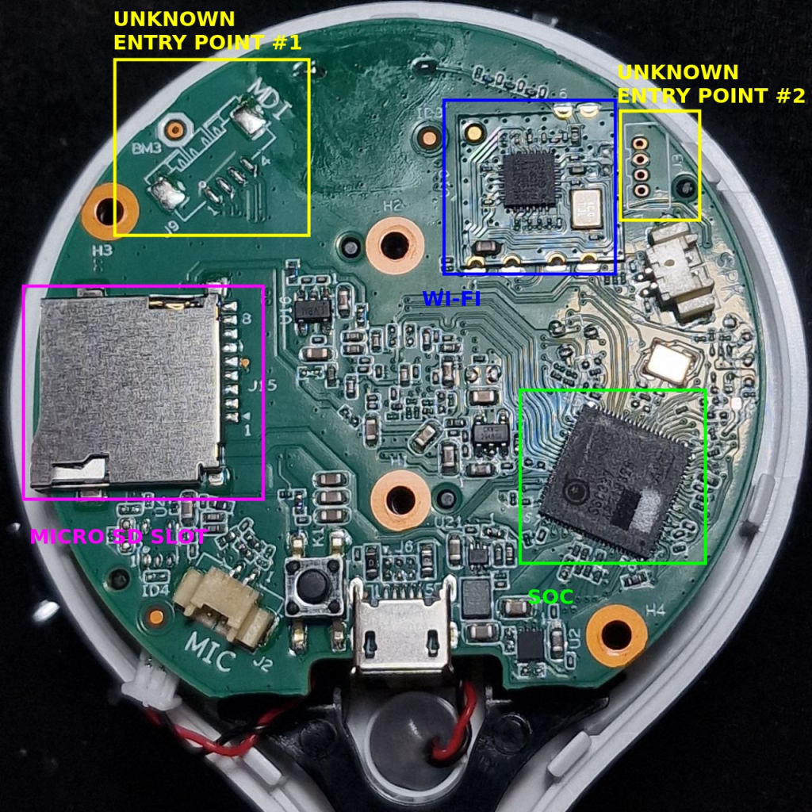

**SPI Flash:** Winbond W25Q64JV, a 64Mb memory chip storing the firmware.


## Step 1: UART Discovery


The **Universal Asynchronous Receiver-Transmitter (UART)** is a simple two-wire protocol for exchanging serial data. Asynchronous means no shared clock, so for UART to work, the same bit or baud rate must be configured on both sides of the connection. This interface is often a go-to entry point for hardware hackers. The first interface we tackled was the **UART**, a common hardware debugging tool that could give us direct access to the camera’s system logs. UART is like a debug interface that manufacturers leave open during development, often exposing a wealth of information about the device. On the Lorex 2K, this interface presented a direct way to interact with the device’s console output – it was not the case, but this could potentially lead to command injection vulnerabilities during the boot process.

### Probing process
The probing was a four step process:

1. **Locating the UART Pins:** Using a multimeter, we identified the UART TX, RX, and GND pins on the PCB test pads (figure below).
2. **Connecting the FTDI-232 Adapter:** This adapter converts UART signals to USB, enabling communication via a computer terminal (second figure below).
3. **Terminal Configuration:** We used tools like `minicom` to set the correct baud rate and establish a serial connection.
4. **Capturing the Output:** The terminal displayed detailed boot logs, including kernel messages and filesystem information.

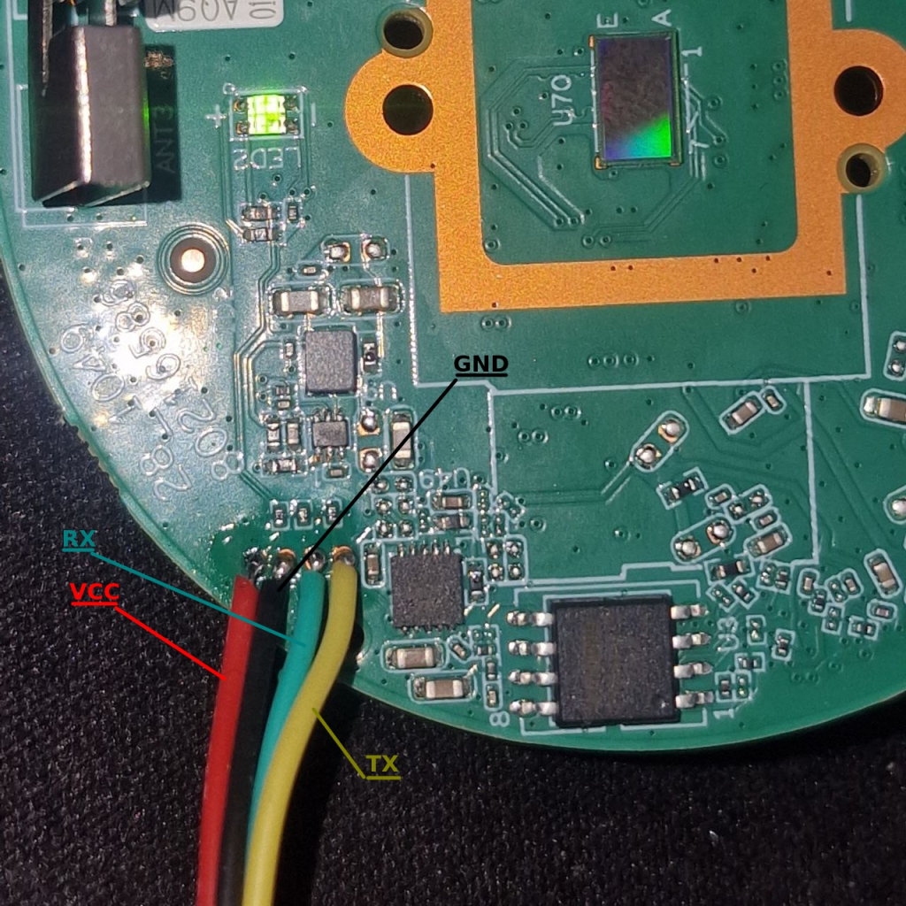

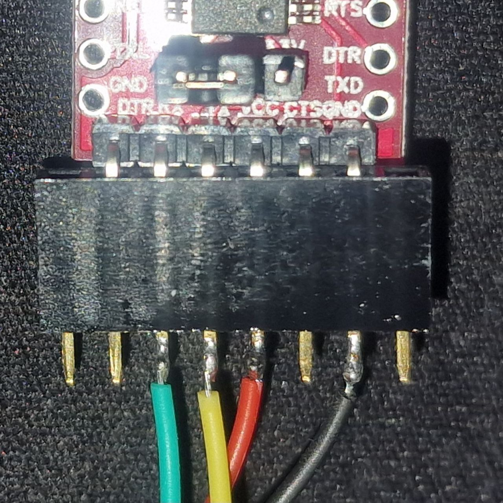

### Dumped serial output

```
IPL g7d092ed
D-15

HW Reset


mount: mounting none on /proc/bus/usb failed: No such file or directory

keyboard = 1
/usr/etc/imod: line 1: #!/bin/sh: not found
sensor Adaptive matching over
real SensorType:
real aewCfg:IPC-SC401AI-MIPI
======================IPCimod=====================
sysbackup_value =Fail
US
[: 1: unknown operand
appauto=1

IPL g7d092ed
D-15

WDT Reset
SPI 54M
64MB

BIST0_0001-OK

MXP found at 0x0000a000

offset:00004800

Checksum OK


IPL_CUST g7d092ed
MXP found at 0x0000a000

offset:00010000

XZ decomp_size=0x0003c52c

U-Boot 2010.06-svn9272 (Aug 13 2021 - 18:52:24)


mount: mounting none on /proc/bus/usb failed: No such file or directory

keyboard = 1
/usr/etc/imod: line 1: #!/bin/sh: not found
sensor Adaptive matching over
real SensorType:
real aewCfg:IPC-SC401AI-MIPI
======================IPCimod=====================
sysbackup_value =Fail
US
[: 1: unknown operand
appauto=1

IPL g7d092ed
D-15

WDT Reset
SPI 54M
64MB

BIST0_0001-OK

MXP found at 0x0000a000

offset:00004800

Checksum OK


IPL_CUST g7d092ed
MXP found at 0x0000a000

offset:00010000

XZ decomp_size=0x0003c52c

U-Boot 2010.06-svn9272 (Aug 13 2021 - 18:52:24)


mount: mounting none on /proc/bus/usb failed: No such file or directory

keyboard = 1
/usr/etc/imod: line 1: #!/bin/sh: not found
sensor Adaptive matching over
real SensorType:
real aewCfg:IPC-SC401AI-MIPI
======================IPCimod=====================
sysbackup_value =Fail
US
[: 1: unknown operand
appauto=1
```

The UART output offered a glimpse into the inner workings of the Lorex 2K IP Camera revealing its initialization routines and system behavior. The camera used U-Boot, a widely used bootloader for embedded Linux systems. This confirms a modular, Linux-based architecture, providing flexibility for developers but also potential entry points for attackers. The U-Boot sequence is particularly noteworthy because this bootloader often includes commands for recovery, diagnostics, and firmware updates. If improperly secured, these features can allow attackers to bypass protections and load malicious firmware or extract sensitive data. In our case it was not possible to access the U-Boot menu by rapidly sending “*” characters to the serial, while the system’s booting.

Although the UART logs provided information about the hardware peripherals and boot initialization, the device was configured in a way to lock the UART in order to be “read-only” and do not accept any input from the outside world. We could not send any characters to the device to get an interactive shell and, while this didn’t directly expose to a vulnerability, it laid the groundwork for understanding the system’s behavior.

## Step 2: Extracting Firmware via SPI Flash
If UART is the gateway to the device’s behavior, the SPI Flash chip is the vault holding its most prized possession: the firmware. By extracting and analyzing the firmware, the inner hope is to uncover hardcoded credentials, exploitable binaries or outdated libraries that could be used as attack vector to gain unlimited and/or remote access to the camera over the network.

### Extraction Process
Our target was the **Winbond W25Q64JV**, a 64Mb chip. Using its datasheet as a guide, we connected the chip to a **Raspberry Pi 2** via jumper wires.

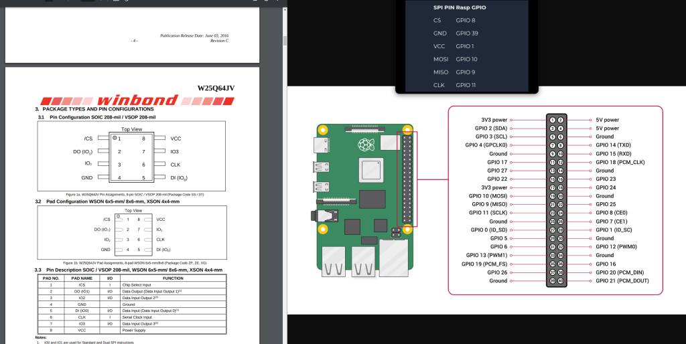

The Raspberry Pi’s GPIO pins were configured to match the SPI chip’s MOSI, MISO, CLK, CS, and GND pins:\

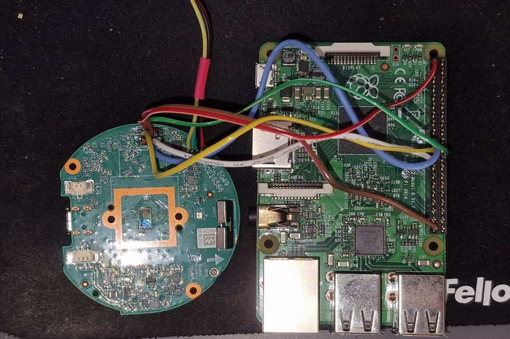

A baremetal Debian distro has been loaded in the RPI2 Micro-SD card in order to start with a clean env:

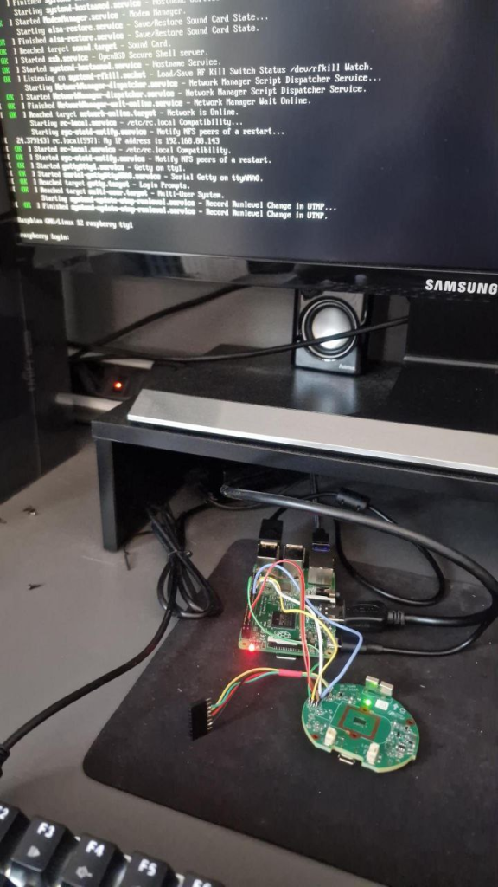

Once the connections were secured, we used the open-source tool `flashrom` to interact with the chip.

```
sudo flashrom -p linux_spi:dev=/dev/spidev0.0 -c "W25Q64JV-.Q" -r firmware_dump.bin
```

Executing the command above initiated the dump. Within minutes, we had a binary file containing the camera’s firmware:

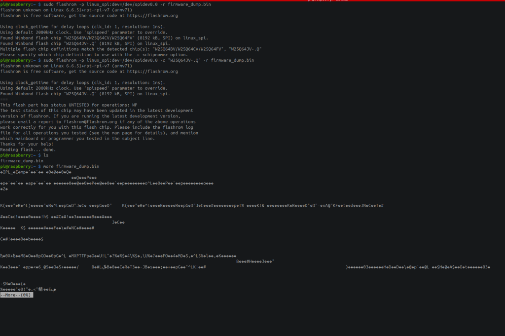

A quick validation with `hexdump` confirmed the dump’s integrity:

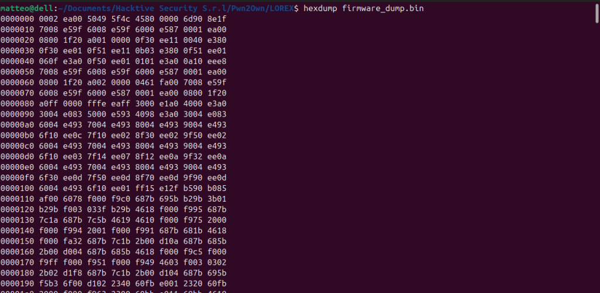


This validated our dumping process and ensured that the binary was ready for analysis with the well known `binwalk` . With this tool is possible to identify and extract files, filesystems and data that are embedded in the dumped firmware image. A quick look into it shows all the firmware sections without any extra steps related to some sort of encryption (luckily).

_If you are particularly interested into encryption/decryption mechanisms of firmwares, the following resource goes into further details: [MindShaRE: Dealing with encrypted router firmware](https://www.zerodayinitiative.com/blog/2020/2/6/mindshare-dealing-with-encrypted-router-firmware)._

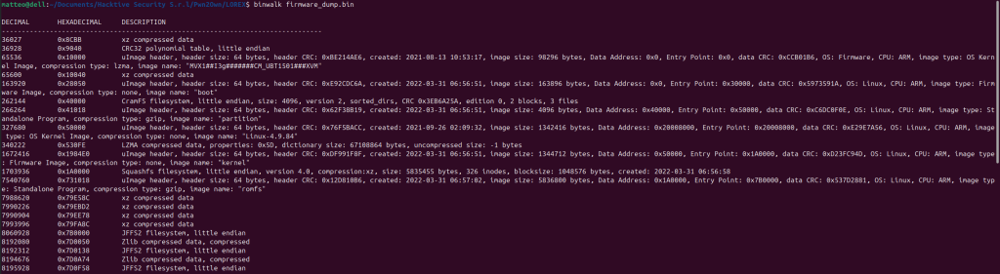

Also, with BinVis ([https://binvis.io](https://binvis.io/)) is possible to generate a nice and useful visual analysis canvas of the binary file:

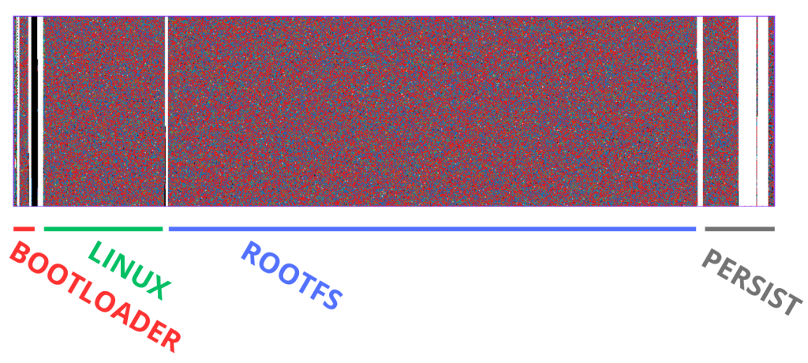

The whole firmware reverse engineering process, however, will be the core topic of the Part 2 of the series.

## Step 3: Soldering into the Ethernet Pinout (Extra)
The Lorex 2K doesn’t feature a traditional Ethernet port but its PCB includes test points for Ethernet signals. Could this be another interesting surface? We decided to find out.

Using an Ethernet pinout diagram as a reference, we identified the TX, RX, and GND test points on the PCB.

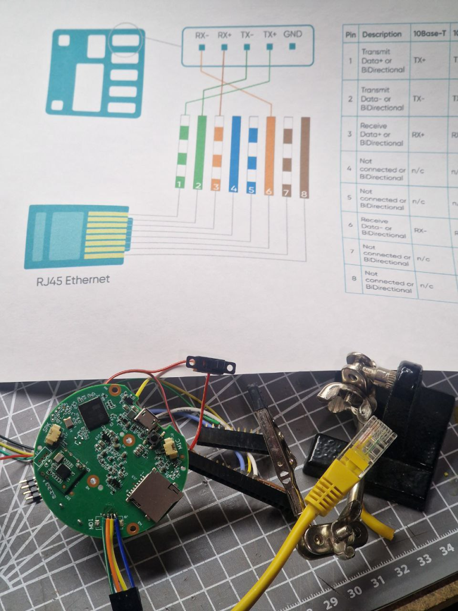

After carefully soldering a peeled Ethernet cable to these points, we connected the other end to a laptop and began probing the network interface.

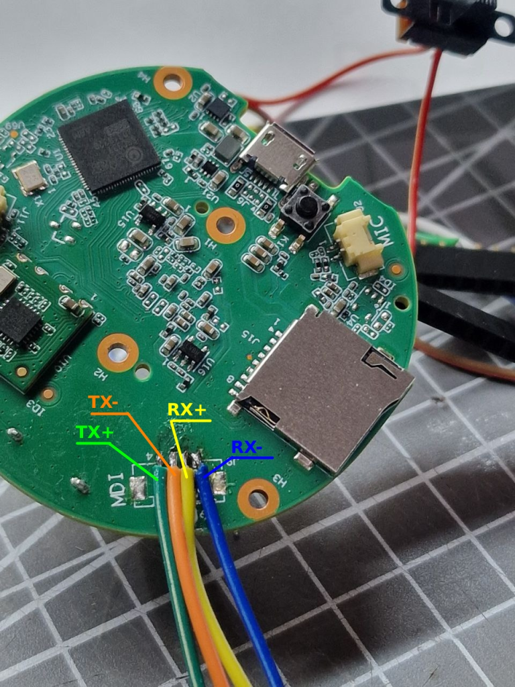

## Conclusion
Our hardware deep dive into the Lorex 2K IP Camera revealed both widely accessible and poorly secured interfaces that lead us to gain full firmware access opening scenarios to a wider attack surface. By methodically probing exposed pinpoints, it was possible to detect and abuse UART, SPI, and Ethernet connections, plus we could demonstrate how attackers can exploit even minor oversights. This research serves as a reminder to stay vigilant. For manufacturers, the challenge is clear: embed security into every stage of the product lifecycle, from design to post-deployment support. For security researchers, opportunities abound to collaborate and raise the bar for IoT safety. Ultimately, this underscores a fundamental truth: IoT security is only as strong as its weakest link. In an era where connected devices are ubiquitous, the stakes have never been higher.

Stay tuned for the upcoming parts!

## References
- [Pwn2Own IoT 2024 – Lorex 2K Indoor Wi-Fi Security Camera](https://www.rapid7.com/globalassets/_pdfs/research/pwn2own-iot-2024-lorex-2k-indoor-wi-fi-security-camera-research.pdf)
- [Exploiting the Lorex 2K Indoor Wi-Fi at Pwn2Own Ireland](https://blog.infosectcbr.com.au/2024/12/exploiting-lorex-2k-indoor-wifi-at.html)
- [MindShaRE: Dealing with encrypted router firmware](https://www.zerodayinitiative.com/blog/2020/2/6/mindshare-dealing-with-encrypted-router-firmware)
