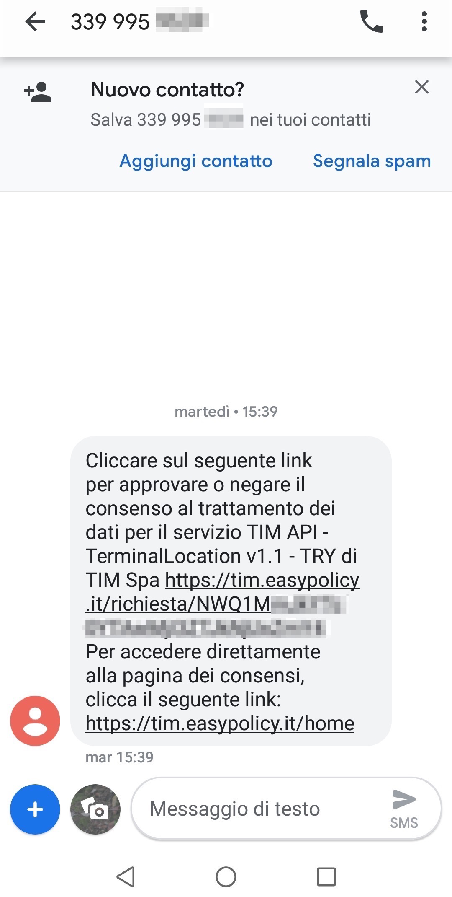
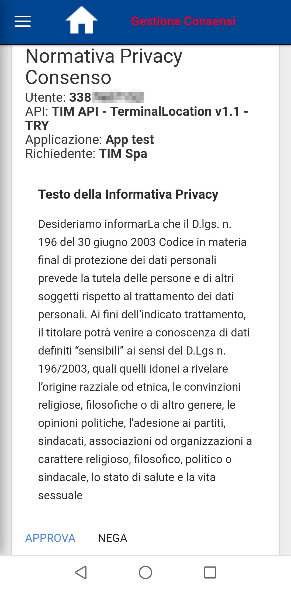
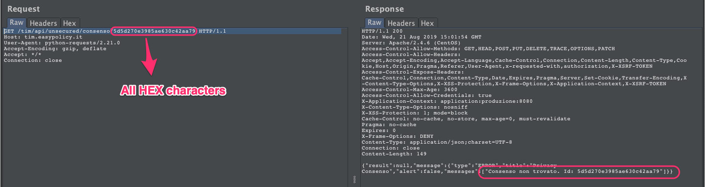
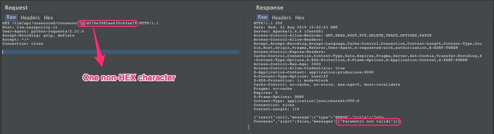
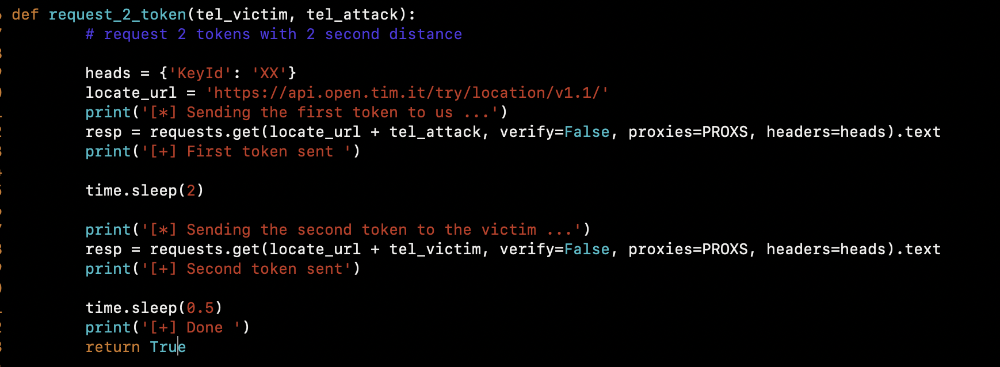
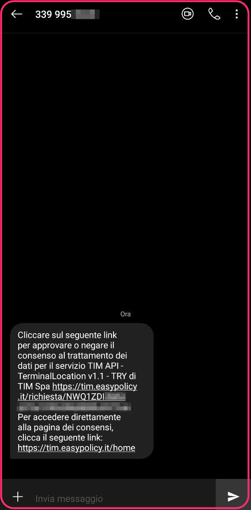
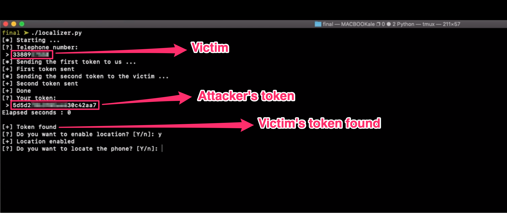
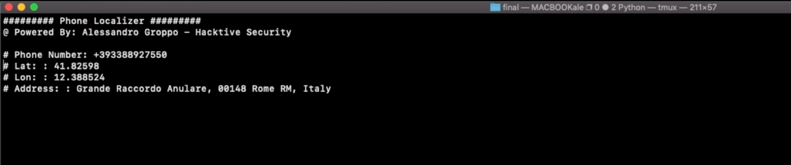

During the monthly research activity in [Hacktive Security](https://hacktivesecurity.com/), we found and went in depth with an interesting security issue allowing geolocation of mobile devices using TIM, an Italian communication provider. A malicious user could find the TIM customers geo-position by forcing the approval mechanism to allow the geopositional tracking. 

The research has been focused on TerminalLocation API service provided by TIM on its API Store.
TerminalLocation lets retrieve location of arbitrary devices by their phone numbers.
Below a service description provided by TIM:

With TIM API - TerminalLocation track and monitor the location of mobile devices using geographic coordinates (latitude and longitude), date and time. Location information are valid for TIM customers.“

Let's see how it works.

## Overview of the service

In order to use the API service, we needed to sign up and then create a test application to retrieve an API key.
Hence, you can make a GET request to `/try/location/v1.1/<PHONE_NUMBER>` including the API key in the request header. If this is the first request targeting the phone number, an SMS is sent asking for an authorization approval to notify the current position at any time.




In order to accept being geolocalized, the user has to click on the link in the message, which contains a base64 encoded user-token, and then click the confirmation button.



This action triggers a GET request to /tim/api/unsecured/consenso/\<user-token\>.
Everything seems ok, users have to agree in order to use this service. But things turned out for the best, almost...

## Vulnerability

We started to collect multiple tokens and we were surprised about their low entropy.
The base64 string sent within the link hides a 24 character token with both static and at first glance random values. If we break up some tokens, obtained within the same day and with few hours of delay, we noticed the following schema:  

```

XXXX AAAA YYYYYYYYYYYYYYY D  
XXXX BBBB YYYYYYYYYYYYYYY E  
XXXX CCCC YYYYYYYYYYYYYYY F  
```
(next day) 
```

XXXX GGGG ZZZZZZZZZZZZZZZ H  
```

The schema may be decoded as follows:
- First part: the 4 Xs are always the same, they may be a static value
- Second part: the 4 As, Bs, Cs and Ds are random characters
- Third part: the 15 Ys and Zs are constants changing day by day; it may be related to the current date
- Fourth part: the E, F, G, H are random characters

We have confirmed that these tokens are not randomly generated and they have pretty easylogic behind.

The crucial test consisted to send requests for 2 tokens in a very short period of time (2 seconds):

```
XXXX XXDD YYYYYYYYYYYYYYY A  
XXXX XXFF YYYYYYYYYYYYYYY B
```


Bingo!
They differ for just 3 characters and they are incremental!

At this point, we could easily guess with more confidence how tokens are generated: The first 4 characters are always the same, then 4 characters could be related to a timestamp, because they are consecutive, then 15 characters related to the current day and finally 1 random character in the last position.
With this insight we could create an enumeration tool, but another key point was reducing the character set:
A request with a syntactically correct token returns an error message containing "agreement not found":



With a malformed token (invalid length or invalid character set) it says Invalid parameters:



After few fuzzing requests we could determine that all characters were in a hexadecimal format, reducing a lot the enumeration (16 characters instead of 36 characters of all lowercase alphabet plus numbers).

## Exploitation

The exploitation has been pretty easy:
- Receive a token on our phone via SMS
- Send the second token to the victim after few seconds
- Deduce victim’s token from our one.
- Localize the phone!

In order to automate this process, we wrote a few lines in python.
First, request two tokens with two seconds of delay (the first token to us and the second to the victim).
The timing is crucial because of its consecutive logic based on some sort of timestamp.



Attacker’s token:





Now we have the token generated before the victim’s one and we can easily predict it with an enumeration with 2 characters starting at the 6th position and one last character.



Thanks to multi-threading and, of course, low entropy, this enumeration took less than 1 second to retrieve the victim’s token.
With that token, we can now accept the agreement to the service with a PUT request to `/tim/api/unsecured/consenso/<token>?operazione=APPROVA` and geolocate the victim phone:




And that's it :)
